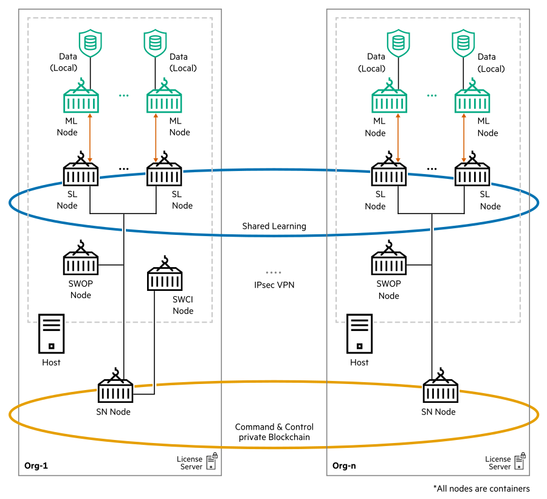

# <d></d>  SWARM LEARNING
Swarm Learning is a decentralized, privacy-preserving Machine Learning framework. This framework utilizes the computing power at, or near, the distributed data sources to run the Machine Learning algorithms that train the models. It uses the security of a blockchain platform to share learnings with peers in a safe and secure manner. In Swarm Learning, training of the model occurs at the edge, where data is most recent, and where prompt, data-driven decisions are mostly necessary. In this completely decentralized architecture, only the insights learned are shared with the collaborating ML peers, not the raw data. This tremendously enhances data security and privacy.

-   Swarm Learning \(SL\) nodes run the core of Swarm Learning. An SL node works in collaboration with all the other SL nodes in the network. It regularly shares its learnings with the other nodes and incorporates their insights. SL nodes act as an interface between the user model application and other Swarm Learning components. SL nodes take care of distributing and merging model weights in a secured way.

-   Swarm Network \(SN\) nodes form the blockchain network. The current version of Swarm Learning uses an open-source version of Ethereum as the underlying blockchain platform. The SN nodes interact with each other using this blockchain platform to maintain and track progress. The SN nodes use this state and progress information to co-ordinate the working of the other swarm learning components.

    **Sentinel Node** is a special SN node. The Sentinel node is responsible for initializing the blockchain network. This is the first node to start.

<blockquote>
    NOTE:Only metadata is written to the blockchain. The model itself is not stored in the blockchain.

</blockquote>

-   Swarm Learning Command Interface \(SWCI\) node is the command interface tool to the Swarm Learning framework. It is used to monitor the Swarm Learning framework. SWCI nodes can connect to any of the SN nodes in a given Swarm Learning framework to manage the framework. 
For more information on SWCI, see [Swarm Learning Command Interface](./docs/User/Swarm_Learning_Command_Interface.md).

-   Swarm Operator node \(SWOP\) is an agent that can manage Swarm Learning operations. SWOP is responsible to execute tasks that are assigned to it. A SWOP node can execute only one task at a time. SWOP helps in executing tasks such as starting and stopping Swarm runs, building and upgrading ML containers, and sharing models for training. For more information about SWOP, see [Swarm Operator node \(SWOP\)](./docs/User/Swarm_Operator_node_(SWOP).md).

-   Swarm Learning security and digital identity aspects are handled by X.509 certificates. Communication among Swarm Learning components are secured using X.509 certificates. User can either generate their own certificates or directly use certificates generated by any Standard Security software such as SPIRE. For more information on SPIRE, see [https://thebottomturtle.io/Solving-the-bottom-turtle-SPIFFE-SPIRE-Book.pdf](https://thebottomturtle.io/Solving-the-bottom-turtle-SPIFFE-SPIRE-Book.pdf) and [https://spiffe.io/](https://spiffe.io/).

<blockquote>
    NOTE:Swarm Learning framework does not initialize if certificates are not provided.
</blockquote>

-   Swarm Learning components communicate with each other using a set of TCP/IP ports.

<blockquote>
NOTE:The participating nodes must be able to access each other's ports.

</blockquote>

For more information on port details that must be opened, see Exposed Ports in ***HPE Swarm Learning Installation and Configuration Guide***.

-   License Server installs and manages the license that is required to run the Swarm Learning framework. The licenses are managed by the AutoPass License Server \(APLS\) that runs on a separate node. For more information on APLS, see ***HPE Swarm Learning Installation and Configuration Guide***.

**NOTE**: All the Swarm Learning nodes must use the same ML platform – either Keras (based on TensorFlow 2) or PyTorch. Using Keras for some of the nodes and PyTorch for the other nodes is not supported.

Swarm Learning nodes works in collaboration with other Swarm Learning nodes in the network. It regularly shares its learnings with the other nodes and incorporates their insights. This process continues until the Swarm Learning nodes train the model to desired state.

You can transform any Keras or PyTorch based ML program that has been written using Python3 into a Swarm Learning ML program by making a [few simple changes](docs/ml_algorithm.md) to the model training code, such as updating the paths from where the program reads and writes data; and including the `SwarmCallback` object. See the [examples](examples) included with the Swarm Learning package for sample code.

## Getting Started
  - [Prerequisites](docs/Prerequisites.md) for Swarm Learning
  - Clone this repository 
  - [Download and setup](docs/setup.md) docker images and evaluation licenses
  - Execute [MNIST example](examples/mnist-keras) 
  - [Frequently Asked Questions](docs/FAQ.md)
  - [Troubleshooting](docs/Troubleshooting.md)

## Documentation
  - [How Swarm Learning Components interact](docs/Component_interactions.md)
  - [Adapting ML programs for Swarm Learning](docs/ml_algorithm.md)
  - [Configuring and Running Swarm Learning Components](docs/RunningSL.md)
  - [Using SWCI Tool](docs/swci_tool.md)
  
## References
  - [Papers](docs/papers-and-articles.md)
  - [Videos](docs/videos.md)
  - [URLs](docs/URL.md)

## Acronyms and Abbreviations
  Refer to [Acronyms and Abbreviations](docs/acronyms.md) for more information.

## Getting in touch 
  Feedback and questions are appreciated. You can use the issue tracker to report bugs on GitHub.
  
  or
  
  Join below Slack channel to communicate with us. 
  
  [hpe-ai-swarm-learning](https://hpe-external.slack.com/archives/C02PWRJPWVD)

## Contributing
  Refer to [Contributing](CONTRIBUTING.md) for more information.

## License
  The distribution of Swarm Learning in this repository is for non-commercial and experimental use under this [license](LICENSE.md). 
  
  See [ATTRIBUTIONS](ATTRIBUTIONS.md) and [DATA LICENSE](DATA_LICENSE.md) for terms and conditions for using the datasets included in this repository.
