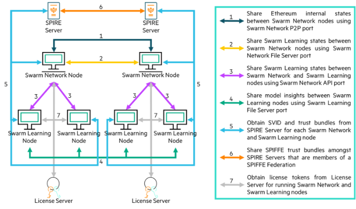

# Component interactions

The Swarm Network and Swarm Learning nodes interact with each other in
many ways using network ports that are dedicated for each purpose:

1.  The ***Swarm Network Peer-to-Peer Port*** is used by each Swarm
    Network node to share Ethereum\'s internal state information with
    the other Swarm Network nodes.

2.  The ***Swarm Network File Server Port*** is used by each Swarm
    Network node to run a file server. This file server is used to share
    state information about the Swarm Learning platform.

3.  The ***Swarm Network API Port*** is used by each Swarm Network node
    to run a REST-based API server. This API server is used by the Swarm
    Learning nodes to send and receive state information from the Swarm
    Network node that they are registered with. It also used by SWCI
    nodes to manage and view of the status of the Swarm Learning
    framework.

4.  The ***Swarm Learning File Server Port*** is used by each Swarm
    Learning node to run a file server. This file server is used to
    share insights learned from training the model with the other Swarm
    Learning nodes in the network.

5.  The ***SPIRE Server API Port*** is used by each SPIRE Server to run
    a gRPC-based API server. This API server is used by the Swarm
    Network and Swarm Learning nodes to connect to the SPIRE Server and
    acquire SVIDs.

6.  The ***SPIRE Server Federation Port*** is used by each SPIRE Server
    to connect with other SPIRE Servers in the federation and send and
    receive trust bundles.

7.  The ***License Server API Port*** is used by the License Server to
    run a REST-based API server and a management interface. The API
    server is used by the Swarm Network and Swarm Learning nodes to
    connect to the License Server and acquire licenses. The management
    interface is used by Swarm Learning platform administrators to
    connect to the License Server from browsers and administer licenses.

## Working of a Swarm Learning node

A Swarm Learning node works as follows:

1.  It starts by acquiring a license to run.

2.  Acquires a SVID from the SPIRE server.

3.  Registers itself with a Swarm Network node.

4.  Starts a file server and announces to the Swarm Network node that it
    is ready to run the training program.

5.  Then, starts the user-specified model training program.

A Swarm Learning node works in collaboration with all the other Swarm
Learning nodes in the network. It regularly shares its learnings with
the other nodes and incorporates their insights. Users can control the
periodicity of this sharing by defining a ***Sync***hronization
***Interval*** (hereafter referred to as, \"***sync interval***\".) This
interval specifies the number of training batches after which the nodes
will share their learnings.

  >**NOTE**: Specifying a large value reduces the frequency of synchronization;
specifying a small value increases the synchronization rate. Frequent
synchronization slows down the training process while infrequent ones
reduce the accuracy of the final model. Therefore, the sync interval
must be treated as a hyper-parameter and chosen with some caution.

Swarm Learning can vary the sync interval &mdash; this feature is called
***Adaptive Sync***hronization ***Interval***. This feature judges the
training\'s progress by monitoring the mean loss. A reduction in the
mean loss infers that the training is progressing well. As a response,
it increases the sync interval and allows more batches to run before
sharing the learnings. This makes the training run faster. In contrast,
when the loss does not improve, *Adaptive Sync Interval* reduces the
sync interval and synchronizes the models more frequently.

At the end of every sync interval, when it is time to share the
learnings from the individual models, one of the Swarm Learning nodes is
designated as an \"*admin*\". This admin node collects the individual
models from each peer node and merges them into a single model by
combining the insights of all the individuals. Each peer Swarm Learning
node then uses this merged model to start the next training batch. This
process is coordinated by the Swarm Network node. The models are
exchanged using the Swarm Learning File Server.

A Swarm Learning ML program can specify a ***Minimum Number of Peers***
that are required to perform the synchronization. If the actual number
of peers is less than this threshold value, the platform will block the
synchronization process until the required number of peers become
available and reach the synchronization point.

A Swarm Learning node works with two directories for input and output &mdash;
a ***Data Directory*** and a ***Model Directory***.

The ***data directory*** is an input directory for a Swarm Learning
node. For a Swarm Learning ML program, this directory is always
represented by the path, ``/platform/swarmml/data``. This directory contains
all the training and validation data for the Swarm Learning ML program.
The data can be placed in files that are either directly under the data
directory or inside subdirectories.

The ***model directory*** is an input-output directory for a Swarm
Learning node. For a Swarm Learning ML program, this directory is always
represented by the path, ``/platform/swarmml/model``. This directory
contains the following input files:

-   The Swarm Learning ML program to run

-   Additional input files for the Swarm Learning ML program. For
    example, configuration files and data preprocessing logic can be
    placed here.

The Swarm Learning ML program can use this directory to write out new
model files, log files, and any other output data.
