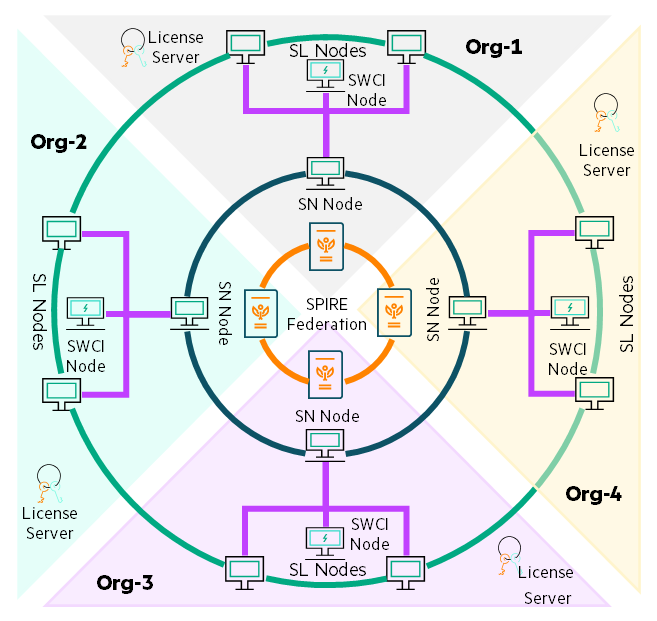

# Swarm Learning concepts

## Components

Swarm Learning has five components, connected to form a network: Swarm Learning nodes,
Swarm Network nodes, SWCI nodes, SPIFFE SPIRE Server nodes, and License
Servers.

1.  ***Swarm Learning (SL)*** nodes -- These nodes run a user-defined
    Machine Learning algorithm. This algorithm is called the ***Swarm
    Learning ML Program***. This program is responsible for training and
    updating the model in an iterative fashion. The Swarm Learning ML
    program should be either a Keras (TensorFlow 2 backend) or PyTorch
    based Machine Learning algorithm that is implemented using Python3.
    It can also be configured to run on NVIDIA GPUs.
  
  >**NOTE**: All the Swarm Learning nodes must use the same ML platform --
  either Keras (based on TensorFlow 2) or PyTorch. Using Keras for some
  of the nodes and PyTorch for the other nodes is not supported.
  
2.  ***Swarm Network (SN)*** nodes -- These nodes form the blockchain
    network. The current version of Swarm Learning uses an open-source
    version of Ethereum as the underlying blockchain platform. The Swarm
    Network nodes interact with each other using this blockchain
    platform to maintain global state information about the model that
    is being trained and to track progress (note that only metadata is
    written to the blockchain. The model itself is not stored in the
    blockchain.) The Swarm Network nodes use this state and progress
    information to coordinate the working of the Swarm Learning nodes.
    Each Swarm Learning node registers itself with a Swarm Network node
    as a part of its startup and initialization.

    1.  ***Sentinel*** node: This is a special Swarm Network node. The
        *Sentinel node* is responsible for initializing the blockchain
        network. This should be the first node to start.

3.  ***Swarm Learning Command Interface node (SWCI)*** - SWCI node is
    the command interface tool to the Swarm Learning framework. It is
    used to view the status, control and manage the swarm learning
    framework. It uses a secure link to connect to the Swarm Network
    node, using the API port. SWCI node can connect to any of the SN
    nodes in a given Swarm Learning framework to manage the framework.

4.  ***SPIFFE SPIRE Server*** nodes -- These nodes provide the security
    for the whole network. The platform can run one or more SPIRE Server
    nodes that are connected together to form a federation. The platform
    includes a SPIRE Agent Workload Attestor plugin (not shown in the
    figure) that communicates with the SPIRE Servers to attest the
    identities of the Swarm Network and Swarm Learning nodes, acquire
    and manage a SPIFFE Verifiable Identity Document (SVID). A
    discussion on SPIFFE, SPIRE and their capabilities is outside the
    scope of this document -- see the [resources](URL.md) from 8 to 14, and
    several more online to learn more.

5.  ***License Server*** node -- The license to run the Swarm Learning
    platform is installed and managed by the *License Server* node.
