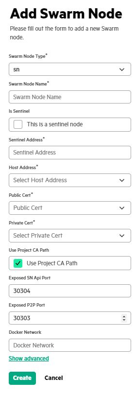

# <a name="GUID-F6B6ABE2-E83D-4C12-94AF-4B11AE64A3EA/"> Adding Swarm Nodes

The following procedure can be used to add the SN node and the SWOP node.

1.  In the **Projects** tab, click the created Project name which is displayed under **Project name** field.

    The system displays the **Project Nodes**, **Tasks**, **Task Runners**, **Contracts** and **Settings** tabs.

2.  Click **Add nodes** under **Project Nodes** tab.

3.  Add the Swarm Node by providing the following details.

    

    **NOTE:**

    1.  In a two node example, the network names must be `host-1-net` for the sentinel node and `host-2-net` for the non-sentinel node, respectively as this are as specified in the associated SWOP profile.
    2.  The node launch may fail if the correct Cert is not provided for each sub-type of the certificate option.
    3.  For SWOP nodes, user can specify the correct proxy server ENV variables as part of **Show Advanced** \> **Node parameters**. Otherwise, ML application may not build and/or model related data files would NOT be downloaded correctly.

        For example,

        ``` {#CODEBLOCK_K13_V5V_YWB}
        -e https_proxy=http://web-proxy.XYZ.net:8080 -e http_proxy=http://web-proxy.XYZ.net:8080
        ```

4.  Click **Create** to add the swarm node.


**Parent topic:**[Running Swarm Learning examples using SLM-UI](Running_Swarm_Learning_examples_using_SLM-UI.md)

