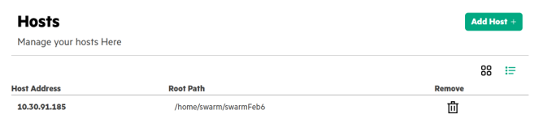

# <a name="GUID-0C3D027B-C9F0-4EFE-B1FD-1B690EECD32D/"> Adding a Swarm Host in SLM-UI

1.  In the **Hosts**, click **Add Host**.

    **NOTE:** User needs to repeat these steps for all the hosts on which the Swarm Learning needs to be installed.

2.  Enter the Host address.

3.  Select the Swarm version number from the drop-down menu.

4.  Enter the Swarm Install Path.

    The default installation directory is `/opt/hpe/swarm-learning`. This directory path must have write permission.

5.  Enter the Host username and password.

6.  Enter the HPE Passport username.

7.  Click **Create** to create the Swarm host.

    

**Parent topic:**[Running Swarm Learning examples using SLM-UI](Running_Swarm_Learning_examples_using_SLM-UI.md)

