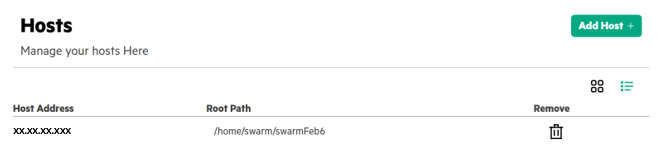

# <a name="GUID-0C3D027B-C9F0-4EFE-B1FD-1B690EECD32D/"> Installing Swarm Learning using SLM-UI

1.  In the **SLM-UI Hosts** tab, click **Add Host**. 
    User can install Swarm Learning on any host or VM using this step.
 
    **NOTE**:
    
    a. User needs to repeat these steps for all the hosts on which the Swarm Learning needs to be installed. 
    
    b. The host needs to have a Docker container runtime. Podman as a container runtime is not supported using SLM-UI.
    
    

2.  Enter the Host address or Range of IPs. 
   Multiple host addresses can be added by providing comma seperated IPs or range of IPs. Range is supported only for
    last octet. For example, 
    Format 1: 127.1.1.11-20, 127.2.1.1 
    Format 2: 127.1.1.11-20, 127.2.1.15-20 
    Format 3: 127.1.1.1, 127.2.1.1, 128.1.2.2

    **NOTE:**
    The Host installation popup displays the status of the host installation. If any of the hosts fail to install,
    retry the host installation process.
   
3.  Select the Swarm version number from the drop-down menu.

4.  Enter the Swarm Install Path.

    The default installation directory is `/opt/hpe/swarm-learning`. This directory path must have write permission.

5.  Enter the Host username and password.

6.  Enter the HPE Passport username.

7.  Click **Create** to create the Swarm host.

**Parent topic:**[HPE Swarm Learning installation](HPE_Swarm_Learning_installation.md)

