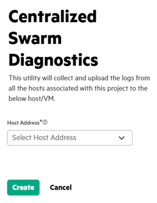
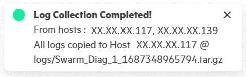

# Centralized Swarm diagnostic

Centralized Swarm diagnostics utility can be used to collect and upload the logs from all the hosts associated with a project. This can be sent to HPE to report Swarm issues.

1.  In the **Projects** tab, click **Collect Log** icon.

    

2.  Select **Host Address** from the Host Address drop-down menu.

    

    **NOTE:**

    The sshpass utility must be installed in the VM. `\(apt install sshpass\)`.

3.  Click **Create** to complete the Log Collection.

    

**Parent topic:**[Running Swarm Learning examples using SLM-UI](Running_Swarm_Learning_examples_using_SLM-UI.md
)

