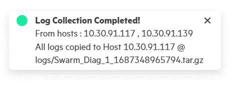

# Centralized Swarm diagnostic {#GUID-37B42288-C9EB-4E15-9D28-4642E7983B07 .task}

Centralized Swarm diagnostic utility will collect and upload the logs from all the hosts associated with a project to the host or VM provided by user via the utility.

The utility will show all the hosts where swarm learning installed in the drop down and user can choose one among them. Note that in that VM the sshpass utility should be installed. \(apt install sshpass\).

1.  In the **Projects** tab, click **Collect Log** icon.

    

2.  Select **Host Address** from the Host Address drop-down menu.

    

3.  Click **Create** to complete the Log Collection.

    

**Parent topic:**[Running Swarm Learning examples using SLM-UI](GUID-A2B92980-7281-4B0A-989F-33097B7C96A5.md)

