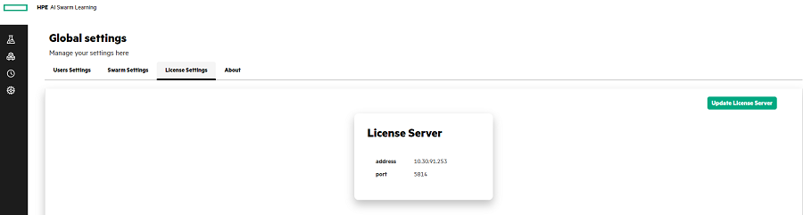

# <a name="GUID-9BBCF1CF-5BC3-4E66-82C5-EB2A958485B7"/> Configuring the License Settings

1.  In the **License Settings**, click **Update License Server**.

2.  Enter the License Server Address and the License Server Port.

3.  Click **Update** to update the License server.

    

**Parent topic:**[Managing the Global Settings](Managing_the_Global_Settings.md)

