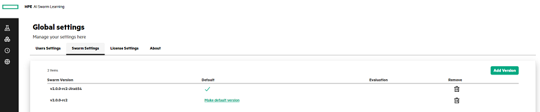

# <a name="GUID-8D0B6FA0-E953-4186-ABF3-9C1F932A263F"/> Configuring the Swarm Settings

1.  In the **Swarm Settings**, click **Add Version**.

2.  Enter the Swarm Version number.

3.  In the **Swarm Bundle**, select the Swarm version files from your local drive or drag and drop the Swarm version files.

4.  Select the **Set as default** checkbox if you want to set this Swarm version as the default version number in the SLM-UI.

5.  Select the **Set as evaluation** checkbox if you are using the community version of Swarm Learning.

    For more information, see [Versioning and upgrade](Versioning_and_upgrade.md) section.

6.  Click **Create** to create the Swarm version.

    

**Parent topic:**[Managing the Global Settings](Managing_the_Global_Settings.md)

