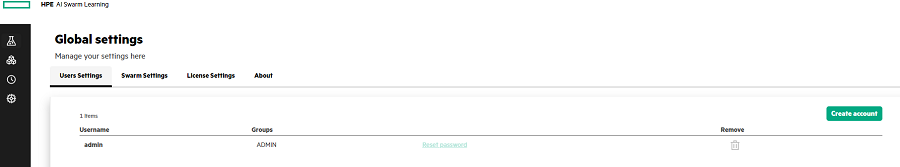

# Configuring the User Settings {#GUID-09412B21-518E-4278-8906-DAEE83474F58 .task}

1.  In the **User Settings**, click **Create Account**.

2.  Enter the Username and the Password.

    You can also generate the password by clicking the **Generate Password** link.

3.  Click **Create** to create the User account.

    

**Parent topic:**[Managing the Global Settings](GUID-15129C81-8774-4B60-85F8-EC618677D51C.md)

