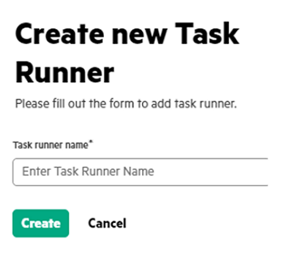
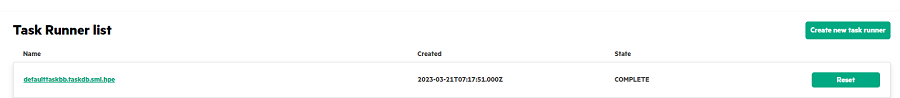

# <a name="GUID-CAD82E68-9A3A-465E-9DC2-06BBDCD1DC55"/> Creating Task Runners

1.  In the **MyProjects**, click the **Project name** link.

2.  In the **Task Runners** tab, click **Create new task runner**.

    If you are running concurrent Swarm training, you need to create multiple task runners. If you are running a single training, the default task runner would be good enough and this step is optional.

3.  Create new Task Runner by providing the following details.

    

4.  Click **Create**. The Task Runner id created and displayed under **Task Runner** list.

    

**Parent topic:**[Running Swarm Learning examples using SLM-UI](GUID-A2B92980-7281-4B0A-989F-33097B7C96A5.md)

