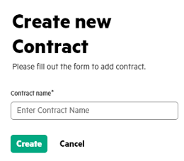
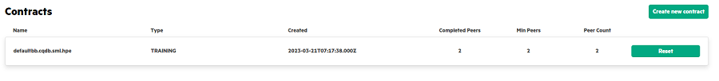

# <a name="GUID-5EBE2D57-5A69-4C12-996B-AB854DF657C2"/> Creating a Contract

1.  In the **MyProjects**, click the **Project name** link.

2.  In the **Contracts** tab, click **Create new contract**.

    If you are running concurrent Swarm training, you need to create multiple contracts. If you are running a single training, the default contract would be good enough and this step is optional.
    <blockquote>
    
    **Note:**
      This feature is available for enterprise customers ONLY.
    
    </blockquote>

3.  Create new contract by providing the following details.

    

4.  Click **Create**. The contract is created.

    

**Parent topic:**[Running Swarm Learning examples using SLM-UI](Running_Swarm_Learning_examples_using_SLM-UI.md)

