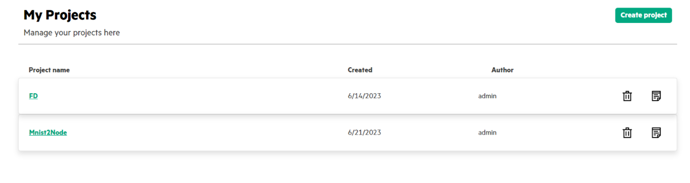

# <a name="GUID-7FB7EDEC-F359-4ABF-A623-348EF665D8DC"/> Creating a Project in SLM-UI 

1.  In the **My Projects**, click **Create Project**.

    

    Project in SLM-UI is a logical representation of a particular Swarm training.

    Projects help to view deployment topology and monitor the progress for the given Swarm training. They define what all Swarm nodes \(and associated host nodes\) a training will run, the model being used, the x.509 certificates, SWOP and Task yaml files for a particular training. Multiple Projects can be defined in a single instance of SLM-UI.

    Project artifacts are created under the swarm-learning/slm-ui/projects/<project number\> automatically once the project is saved.

    **NOTE:**

    HPE recommends that users avoid editing these files directly on the host machine.

2.  Enter the project name.

3.  Select the Swarm version number from the drop-down menu.

4.  Upload the following files:

    1.  Upload your Certificate and CA Certificate files to be used with your swarm nodes.

    2.  Upload your Certificate and CA Certificate files to be used with SWCI node used by the SLM-UI.

        

    3.  Upload the Machine Learning model file.

        

    4.  Upload the SWOP Profile schema file.

        

    5.  Upload the SWCI tasks file.

    

    **NOTE:**

    -   For standard examples, this artifacts are available as part of tar file. User can extract the examples on their laptop.
    -   In a two node example, the network names should be `host-1-net` for the sentinel node and `host-2-net` for the non-sentinel node, respectively.
5.  Click **Save Project** to create the Project.

    

**Parent topic:**[Running Swarm Learning examples using SLM-UI](Running_Swarm_Learning_examples_using_SLM-UI.md)

