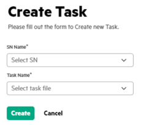

# <a name="GUID-4760825E-0F95-4843-B806-4CBF9780AFDA"/> Creating a task

1.  In the **Tasks** tab, click **Create new task**.

2.  Create a task by providing the following details.

    

3.  Click **Create** to create the task. The created task is displayed under the Task List.

**Parent topic:**[Running Swarm Learning examples using SLM-UI](Running_Swarm_Learning_examples_using_SLM-UI.md)

