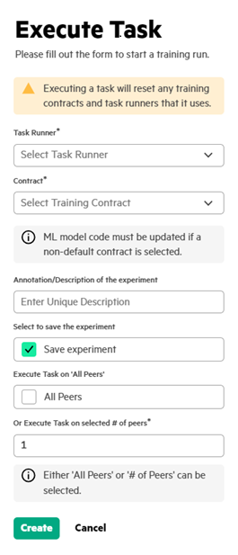

# Execute task

User can use the **Execute Task** to initiate execution of various types of Swarm tasks on a task runner and see the progress of the execution of the task.

1.  In the **Task List**, click **Execute**.

2.  Execute the task by providing the following details.

    The following screenshot shows typical training task’s Execute panel.

    

    User can select either **All Peers** or **\# of Peers** to execute the task. If user selects **All Peers** option, it schedules the task on all the SWOPs listening on the selected Task Runner.

3.  Enter unique description and select **Save Experiment** to save a particular execution of an experiment.

    **NOTE:**

    The **Contract\*** field is displayed only if the **Task Type** is set as **RUN\_SWARM**.

4.  Click **Create** to execute the task.

**Parent topic:**[Executing a task](GUID-5F64446D-CE0E-4465-A33D-F307BF266DAD.md)

