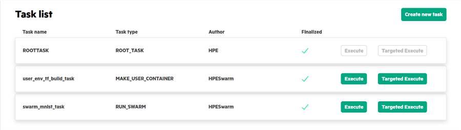

# Executing a task

Once you create the task, there are two options \(**Execute** and **Targeted Execute**\) available to execute the task as follows.

-   **[Execute task](/docs/Install/Execute_Task.md)**  

-   **[Targeted execute](/docs/Install/Targeted_Execute.md)**  

**Parent topic:**[Running Swarm Learning examples using SLM-UI](/docs/Install/Running_Swarm_Learning_examples_using_SLM-UI.md)

