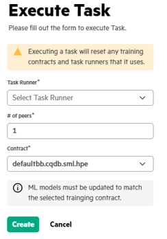

# <a name="GUID-3469F96B-6670-4E3B-B786-798CF4B4E205"/> Executing a Task

After you create the task, perform the following steps to execute the task. User can use the Execute Task to execute various types of Swarm tasks on a task runner and see the progress of the execution of the task.

1.  In the **Task List**, click **Execute**.

2.  Execute the task by providing the following details.

    

    **NOTE:**

    The **Contract\*** field is displayed only if the **Task Type** is set as **RUN\_SWARM**.

3.  Click **Create** to execute the task.

**Parent topic:**[Running Swarm Learning examples using SLM-UI](Running_Swarm_Learning_examples_using_SLM-UI.md)

