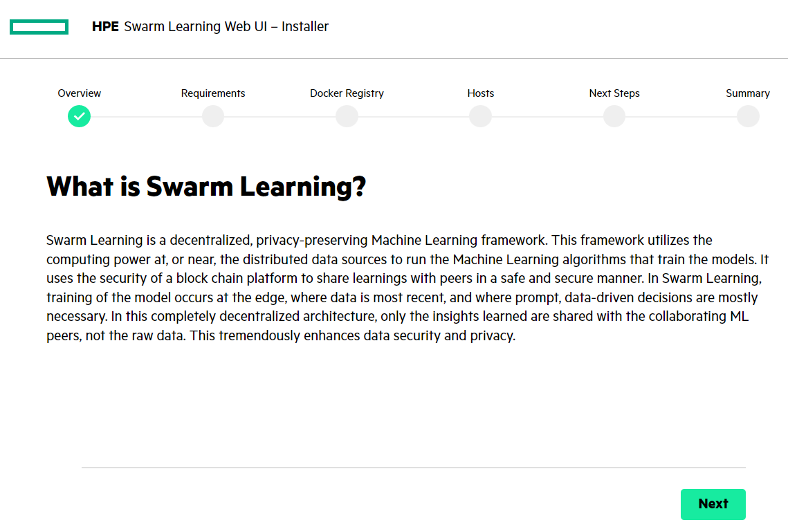
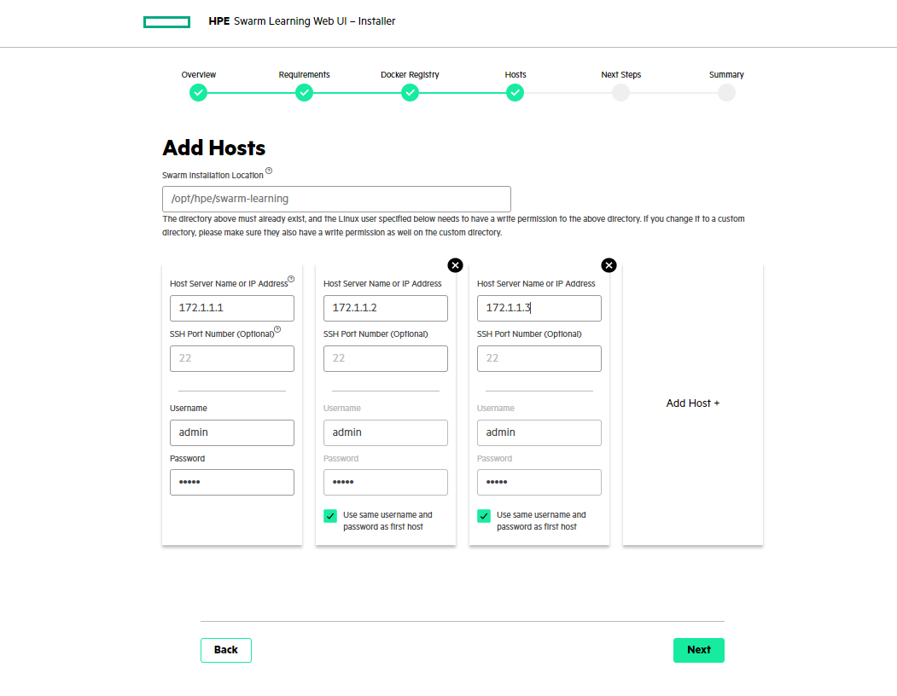
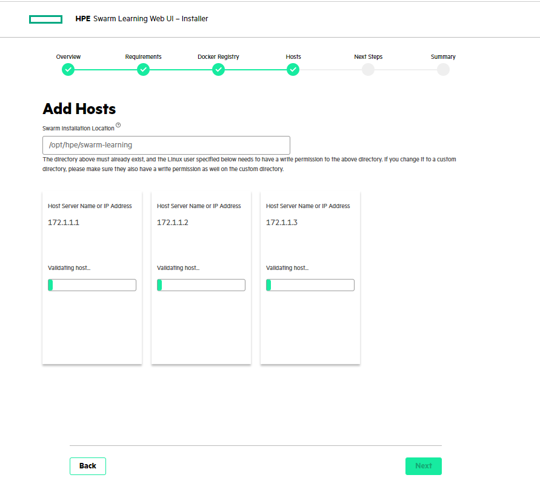

# <a name="GUID-60017971-B0A9-4119-AEAF-A21594EE5C1E"/> Install HPE Swarm Learning

1.   After [completing installation of license server and downloading of the Swarm Learning installation files](/docs/Install/Install_the_License_Server.md), you must
run one of the Swarm Learning installer based on your platform (Linux, Windows, or Mac as listed below). 

     - HPE_SWARM_LEARNING_INSTALLER_LINUX_Q2V41-11036
     - HPE_SWARM_LEARNING_INSTALLER_WINDOWS_Q2V41-11038.exe
     - HPE_SWARM_LEARNING_INSTALLER_MAC_Q2V41-11039

2.   The Swarm Learning Web App is launched in a web browser.

     <blockquote>
          IMPORTANT: HPE recommends you to run the downloaded Swarm Learning installer from the terminal window only.
     </blockquote>

     The installer has a few configurable options. To change the default options, run the installer from a command prompt. Use the following optional flags to
     customize the configuration or behavior of the installer:

     **-port**
     :    Defines the port for the application to run. The default value is 30302.  Example, `-port 30355`

     **-logs**
     :    If enabled, displays the detail message on the CLI during the installation.  To enable, use the command, `-logs verbose`.

     **-version**
     :    This option defines the version of docker images that must be installed. The default value is 1.1.0.  Example, `-version 0.3.0`

     **-timeoutDuration**
     :    Defines installer timeout duration for individual installation tasks. The default value is 300 seconds.  Example, `-timeoutDuration 600`

     
     
   

3.   Click **Next** in the **Overview** screen. 
4.   Review the **Requirements** and ensure each of the hosts satisfies the prerequisites, and click **Next.** 
5.   In the **Docker Registry Access**, enter your HPE Passport credentials and click **Next**. 
6.   Add hosts:

     1. Provide a unique **Host Server Name** or **IP Address** for each host. If it is not unique, the message *Duplicated host* is displayed. 
     2. Enter **Port Number**, **Username**, and **Password**. They can be reused for all hosts. If you want to use a different username and password, clear the check box. 
     
     NOTE: If you want to delete any host, click “X” and click **Delete**.
     3. Click **Next.**.
          - It initiates and displays the connection process for all hosts.
          - On a successful connection, the installer copies the required Swarm Learning files to the default Swarm installation location \(`/opt/hpe/swarm-learning`\) on each host.
          - It also pulls the Swarm Docker images from HPE's Docker Trust Registry \(DTR\).
          - If a host fails to connect, an error message is displayed.
          
     5. If there is an error message, click **Click here for more info**. Close the error message dialog, **Retry** or **Configure** the host, and click **Next**.
     6. A success message is displayed for all installed hosts. Click **Next**.
     
     <blockquote>
        NOTE: Unless you configure all the hosts successfully, you cannot go to the next screen.
     </blockquote>

7.   Review **Next Steps** and click **Next**. 
8.   Review the **Summary** screen, which displays all the installed hosts. Click **Finish**. 
9.   An installation confirmation message is displayed. Click **Close Window**. 

