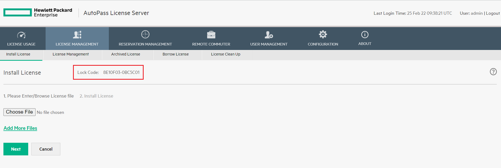
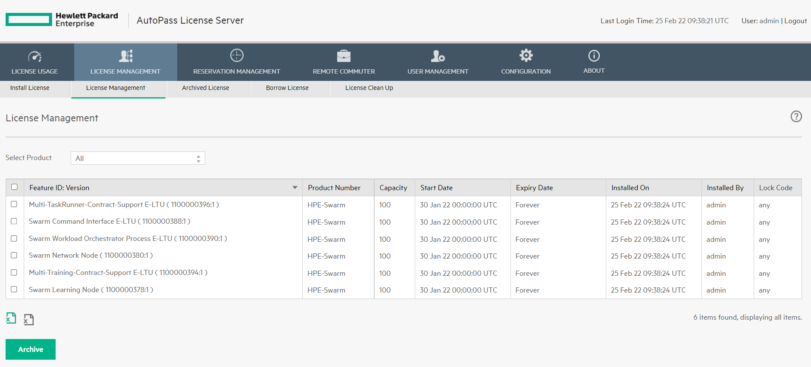

# <a name="GUID-CCE936EF-FB0D-4BF1-B002-3CB9125C55B9"/> Installing the License Server

1.  After purchasing Swarm Learning from HPE, you will receive an email with a download link **Access Your Products**.

2.  From the email, click **Access Your Products**. You are redirected to [MY HPE SOFTWARE CENTER](https://myenterpriselicense.hpe.com/cwp-ui/auth/login).

3.  If you have the HPE Passport account, enter the credentials and **Sign In**. If you do not have it, create the HPE Passport Account and **Sign In**.

    After signing in, you should see the Software Notification Message Receipt page listing the products.

4.  Download APLS container and run it using the following procedures.

    1.  Login to the HPE docker registry using your HPE Passport email id and password `hpe_eval`.

        ``` 
        docker login hub.myenterpriselicense.hpe.com -u <HPE-PASSPORT-EMAIL-ID> -p hpe_eval
        ```

    2.  Enable Docker content trust.

        ```
        export DOCKER_CONTENT_TRUST=1
        ```

    3.  Pull the image with a tag.

        ```
        docker pull hub.myenterpriselicense.hpe.com/hpe_eval/autopass/apls:9.14
        ```

    4.  Configure Data persistence.

        In order to retain configurations and installed licenses across containers, HPE recommends you to create a volume to persist the /hpe directory. This directory contains the following details:

        |Image Directory                 |Subdirectories    |Description                                                                                                                                                                                                |
        |--------------------------------|------------------|-----------------------------------------------------------------------------------------------------------------------------------------------------------------------------------------------------------|
        |/hpe|AutoPass/LicenseServer/data|..data/conf       |License server configuration directory. Contains database, logs and configuration files required to persist setup across containers transactions such as restarts, deletion or upgrades to new image tags. |
        |                                |..data/log        |                                                                                                                                                                                                           |
        |                                | ..data/database  |
 
        HPE recommends you to create the volume using the docker volume create command and assign a volume name such as `apls-volume`, as follows:

        ```
        docker volume create apls-volume
        ```

    5.  Create and run the APLS container.

    To run the APLS Docker container, user can use `docker cli` using the following instructions:

    **Docker CLI**

    ```
    docker run -d \
    --name apls \
    -v apls-volume:/hpe \
    -p 5814:5814 \
    --restart unless-stopped \
    hub.myenterpriselicense.hpe.com/hpe_eval/autopass/apls:9.14
    ```

    **NOTE:** In case the APLS container does not work, then user can choose to install APLS software using the APLS installer. User can select the AutoPass License Server \(APLS\) Installer link under 'Additional Notes' and download the [APLS](https://myenterpriselicense.hpe.com/cwp-ui/free-software/APLS) software. To install the APLS software on a host machine \(Linux or Windows\), see *AutoPass License Server User Guide*, which is part of the downloaded APLS software.

5. From a browser, access the APLS management console using the URL `https://<localhost>:5814` on the host machine where you installed the license server. 

   The default user name is admin, and the password is password.

<blockquote>
    NOTE: These instructions assume that the host IP of license server is <localhost\> and the external port is 5814. Host IP is the IP of the system where the license server is running. Modify these values to match the actual IP and external port on your system.

</blockquote>
    
   If the web browser cannot connect to the APLS management console, check your network proxy settings and firewall policies. Consider techniques like port forwarding to work around firewall policies. If necessary, work with your network administrator to diagnose and resolve connectivity problems.

6. In the APLS web GUI, go to **License Management** -\> **Install License** and note down the lock code. 
   
   

7.  Go to the Software Notification Message Receipt page and click **Access Your Products**.

    You will be navigated to the [MY HPE SOFTWARE CENTER](https://myenterpriselicense.hpe.com/cwp-ui/auth/login) home page. After signing in with your HPE Passport credentials, you will see the **Activate** page.

8.  Activate the license:

    1.  Select the number of licenses to activate and click **Next**.

        **NOTE:** You can select the number of licenses to be installed on the host machines. For example, if you have 5 licenses, you can install 2 on Windows, and 3 on Linux machines.

    2.  Designate yourself or for another user for activation. Click **Next**.

    3.  Enter the lock code you got from the **Install Licenses** page in the HPE Serial Number field and click **Activate**.

9. Once you activate the licenses, you will see the **Download Files** page. Select the keys and the software and download them. 

10. Install and manage the Swarm Learning license:
    
   1. Open the APLS management console. 
   2. Select **License Management** -\> **Install License**. 
   3. Select **Choose** file to upload the license file that you downloaded and click **Next**. 
   4. Select the required feature IDs and click **Install Licenses**.
  
    

    For more information on installing and managing licenses, see the chapter *HPE AutoPass License Server License Management* in *AutoPass License Server User Guide*.


**Parent topic:**[HPE Swarm Learning Installation](HPE_Swarm_Learning_installation.md)
