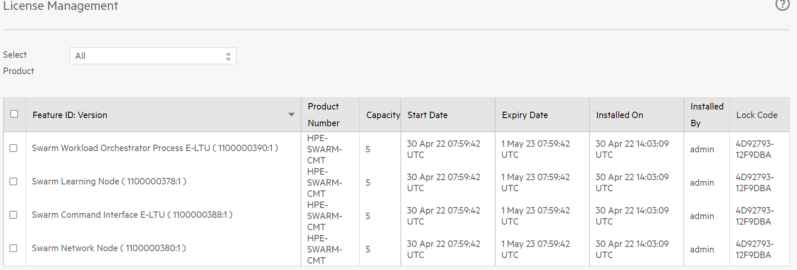

# <a name="GUID-CCE936EF-FB0D-4BF1-B002-3CB9125C55B9"/> Install the License Server and download Swarm Learning

1. Download the [APLS](https://myenterpriselicense.hpe.com/cwp-ui/free-software/APLS) software. 
2. To install the APLS software on a host machine \(Linux or Windows\), see *AutoPass License Server User Guide*, which is part of the downloaded APLS software. 
3. From a browser, access the APLS management console using the URL `https://<localhost>:5814` on the host machine where you installed the license server. 

   The default user name is admin, and the password is password.

<blockquote>
    NOTE: These instructions assume that the host IP of license server is <localhost\> and the external port is 5814. Host IP is the IP of the system where the license server is running. Modify these values to match the actual IP and external port on your system.

</blockquote>
    
   If the web browser cannot connect to the APLS management console, check your network proxy settings and firewall policies. Consider techniques like port forwarding to work around firewall policies. If necessary, work with your network administrator to diagnose and resolve connectivity problems.

4. In the APLS web GUI, go to **License Management** -\> **Install License** and note down the lock code. 
   
   

## Download Swarm Learning

5. Navigate to the [MY HPE SOFTWARE CENTER](https://myenterpriselicense.hpe.com/cwp-ui/auth/login) home page. After signing in with your HPE Passport credentials and perform the following actions:
   
   Click **Software** (left pane) -> Under **Search** Select "Product Info" -> enter the string "Swarm Learning".

   Under the search results, For the product "HPE-SWARM-CMT 2.0.0"-> Click on **Action** -> **Get License**

6. Enter the lock code you got from the **Install Licenses** page in the HPE Serial Number field and click **Activate**. 

7. Once you activate the licenses, you will see the **Download Files** page. 
8. Select and download the **keys and all the listed software files** (7 files). 
9. Install and manage the Swarm Learning license:
    
   1. Open the APLS management console. 
   2. Select **License Management** -\> **Install License**. 
   3. Select **Choose** file to upload the license file that you downloaded and click **Next**. 
   4. Select the required feature IDs and click **Install Licenses**.
   5. On a successfull installation, you will see the following screen.

  

    
For more information on installing and managing licenses, see the chapter *HPE AutoPass License Server License Management* in *AutoPass License Server User Guide*.
