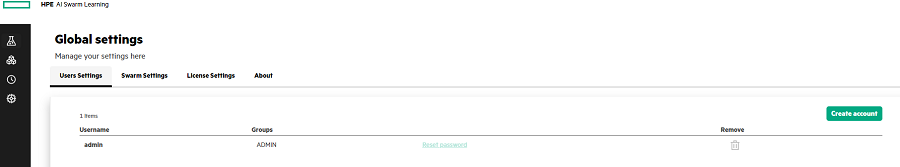

# <a name="GUID-15129C81-8774-4B60-85F8-EC618677D51C"/> Managing the Global Settings

The Global settings feature allows the user to create multiple custom user accounts, configure swarm settings and configure License server settings. It also displays the version number of swarm software.

-   **[Configuring the User Settings](Configuring_the_User_Settings.md)**  

-   **[Configuring the Swarm Settings](Configuring_the_Swarm_Settings.md)**  

-   **[Configuring the License Settings](Configuring_the_License_Settings.md)**  

**Parent topic:**[Running Swarm Learning examples using SLM-UI](Running_Swarm_Learning_examples_using_SLM-UI.md)

