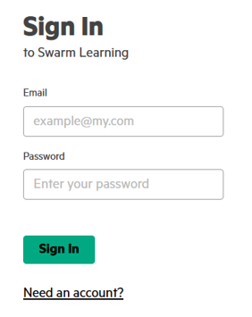

# <a name="GUID-0256BC04-3EDD-4044-91C9-74372B0B8E1F/"> Running SLM-UI Installer

1.  Run the SLM-UI Installer Web App. This is launched in a web browser.

    **IMPORTANT:** For Mac users, HPE recommends you to run the downloaded SLM-UI installer from the terminal window only.

    When you run the SLM-UI installer on Windows, web browsers such as Google Chrome and Microsoft Edge, are only supported. Internet Explorer browser is not supported.

    The installer has a few configurable options. To change the default options, run the installer from a command prompt. Use the following optional flags to customize the configuration or behavior of the installer:

    **-port**
          Defines the port for the application to run. The default value is 30302.
        Example, `-port 30355`

    **-logs**
          If enabled, displays the detailed message. To enable, use the command, `-logs verbose`.

    **-version**
          Defines the version of SLM-UI to be installed. Default value: 2.0.0.

        Example, `-version 2.0.0`

    **-timeoutDuration**
         Defines installer timeout duration for individual installation tasks. The default value is 300 seconds.

        Example, `-timeoutDuration 600`

    

2.  Click **Next** in the **Overview** screen.

3.  Review the **Requirements** and ensure that you have the hosts identified with required configuration, and click **Next**.

4.  In the **Docker Registry Access**, enter your HPE Passport credentials and click **Next**.

5.  In the **Database**, click **Next** if you want to use the default values.

    **NOTE:**

    

    If you want to configure the database with customized values, then make sure that those customized field values are valid.

6.  Install the SLM-UI by providing the following details.

    

7.  Click **Run**.

    A success message is displayed as **SLM-UI install successful**.

8.  Click **Next**.

9.  Review **Next Steps** and click **Next**.

    

10. Review the **Summary** screen, which displays all the installed hosts. Click **Finish**.

    This concludes the installation of SLM-UI installer. The SLM-UI will be launched in a separate browser window.

    

    User can login into the SLM-UI using default account \(Username: admin; Password: admin\).

    After logging in to the SLM-UI, user can run the examples. User can also create the custom account.

