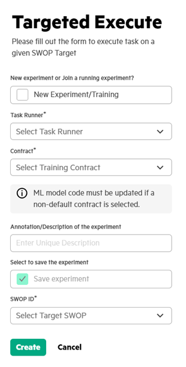
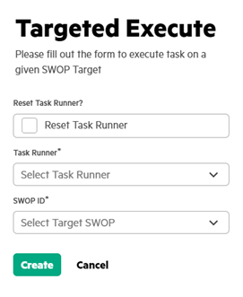

# Targeted execute

User can use **Targeted Execute** to initiate execution of various types of Swarm tasks on a specific SWOP or to add a specific SWOP to an already executing task runner. This targeted execute command helps in retrying a failed task on a particular SWOP.

1.  In the **Task List**, click **Targeted Execute**.

2.  Execute the task by providing the following details.

    The following screenshot displays the typical training task’s Execute panel.

    

    a.  Enter unique description and select **Save Experiment**.

        The save experiment will be enabled only if it is a new experiment.

    b.  Select SWOP ID to execute the task on that SWOP.

        Targeted Execute on a SWOP can be used to add the selected SWOP to an already executing Task runner or to initiate a new execution of the selected SWOP.

    c.  Select **New Experiment/Training** checkbox if this is a new training task targeting SWOP.

        NOTE:

        The **Contract\*** field is displayed only if the **Task Type** is set as **RUN\_SWARM**.

        If the **Task Type** is selected other than **RUN\_SWARM**, Targeted Execute panel is shown as follows.

        

    d.  Select **Reset Task Runner** only if this is the first task on the taskrunner.

3.  Click **Create** to execute the task.

**Parent topic:**[Executing a task](GUID-5F64446D-CE0E-4465-A33D-F307BF266DAD.md)

