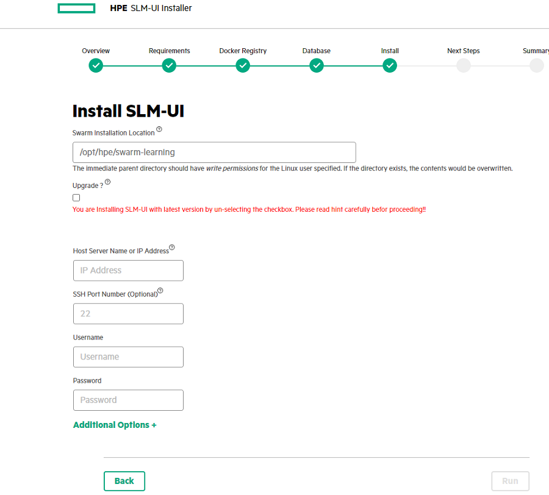

# <a name="GUID-2E350669-7E5A-47BC-AB15-58AC4CFAD9C1"/> Upgrading Swarm Learning
To upgrade to a latest version:

-   Delete the existing host from the SLM-UI. Click the remove icon in host page to delete the host.

    This step deletes all swarm artifacts \(docs, examples, lib, and scripts\), but not the user created artifacts like workspace folder or SLM-UI project folder, and hence preserving user generated artifacts.

    This step is not applicable, if you are running any older version of Swarm Learning \(version < 2.0.0 \).

-   Add the host again with new Swarm version on the same install location that was used earlier. If user selects the same installation location, the system overwrites the earlier version artifacts. If user needs both older and newer versions of Swarm Learning on the same host, they need to set a new installation location. User must restart the training with new images if needed. For more information, see [Installing Swarm Learning using SLM-UI](Installing_Swarm_Learning_using_SLM-UI.md).

SLM-UI can handle multiple hosts each with their own version of Swarm and hence supporting a manual rolling upgrade, where users can upgrade one host at a time. However on a given host machine, if multiple versions are installed, only the last installed version is seen active. All nodes in a Swarm Learning running cluster must be running the same version of the product.

For example, Hosts A, B, C can have Swarm 1.1.0 version and a training can be started using these hosts. Simultaneously, Hosts E and D can have Swarm 2.0.0 version installed and an independent training can be started within the E and D hosts. SLM-UI can support both these multi-version configurations and trigger the training.

## Upgrading SLM-UI

If user checks the **Upgrade** checkbox, all the previous projects and the created host artifacts are retained. While adding new hosts using SLM-UI, user gets the flexibility to choose the latest installed version or the previously installed version of Swarm. It also displays all projects, hosts, license servers, etc., which were added previously.

The following image shows the SLM-UI installer with **Upgrade** option:

**Parent topic:**[HPE Swarm Learning Installation](HPE_Swarm_Learning_installation.md)

