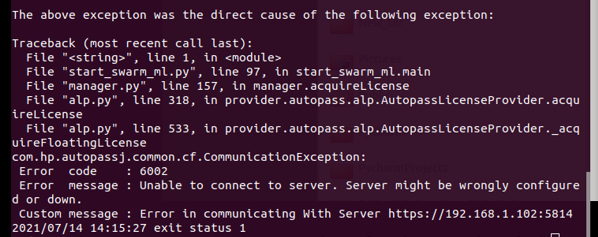

## Troubleshooting ##

Troubleshooting provides solutions to commonly observed issues during Swarm Learning set up and execution.

### 1. Error code : 6002
####    ``Error message: Unable to connect to server. Server might be wrongly configured or down.`` #### 
####    ``Custom message: Error in communicating with server https://HOST_SYSTEM_IP:5814 (default port)`` #### 

#### Problem Description 
Error code: 6002, as shown in below screenshot happens when Swarm Learning components are not able to connect to the APLS server. 

   
   
   
#### Resolution
Fix for above issue requires to make sure following two things.

##### 1. Verify APLS is running 
Run ``docker ps`` and check whether APLS is running. If apls container is not running, then license server is not running, and you need to start it using  
``swarm-learning-install-dir/swarm-learning/bin/run-apls`` 

Access APLS management console.
If the browser cannot connect, verify the network proxy settings, firewall policies, etc. that are in effect. If required, work with your network administrator to resolve them.

##### 2. Setting up Swarm License
Download the Swarm License.
Install the license using APLS management console. 

For detailed instructions - refer [Installing licenses and starting license server](setup.md#installing-licenses-and-starting-license-server)

 

### 2. ssh: connect to host \<IP or FQDN\> port 22: Connection refused.

#### Problem Description
Startup scripts fail to establish SSH connection to hosts in a multi-system cluster environment. The SSH servers have been configured to listen on a custom port and not on the default port of 22.

#### Resolution
Use the ``--ssh-port`` option to pass the custom port number to the startup scripts. For details, refer [Running Swarm Learning](RunningSL.md#running-swarm-learning) 
