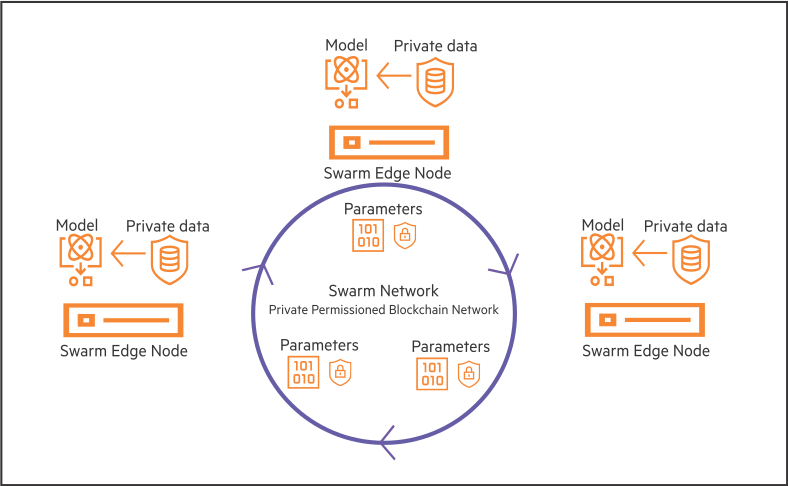

# <a name="GUID-753C1D0C-65F5-4A81-A8CA-3E0250255E3F"/> Introduction to HPE Swarm Learning

HPE Swarm Learning extends the concept of federated learning to decentralized learning by adding functionality that obviates the need for a central leader. It combines the use of AI, edge computing, and blockchain.

HPE Swarm Learning is a decentralized, privacy-preserving Machine Learning \(ML\) framework. Swarm Learning framework uses the computing power at, or near, the distributed data sources to run the ML algorithms that train the models. It uses the security of a blockchain platform to share learnings with peers safely and securely. In Swarm Learning, training of the model occurs at the edge, where data is most recent, and where prompt, data-driven decisions are mostly necessary. In this decentralized architecture, only the insights learned are shared with the collaborating ML peers, not the raw data. This tremendously enhances data security and privacy.

The following image provides an overview of the Swarm Learning framework. Only the model parameters \(learnings\) are exchanged between the various edge nodes, and not the raw data. This ensures that the privacy of data is preserved.

