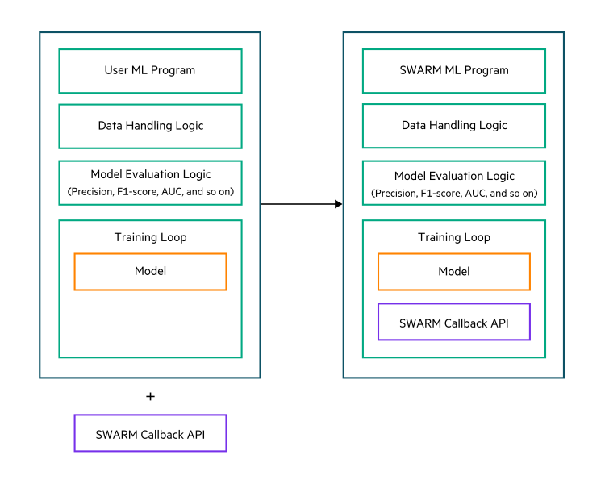

# <a name="GUID-06917027-B029-400D-B9B0-9D2D5A9F29DB"/> Adapting an ML program for Swarm Learning

You can transform any Keras \(with TensorFlow 2 backend\) or PyTorch based ML program that has been written using Python3 into a Swarm Learning ML program by making a few simple changes to the model training code by including the `SwarmCallback` API object. See the examples included with the Swarm Learning package for a sample code.

Your ML program algorithm can be any parametrized supervised learning model. It can be fully trainable model or a partially trainable model when using transfer learning.

