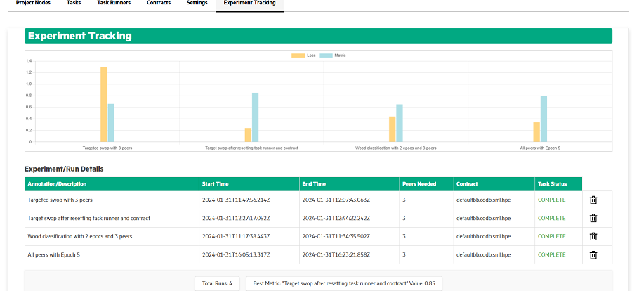

# Experiment tracking

In 2.2.0 release, experiment tracking feature is introduced to compare different python models ran as part of same experiment. SLM-UI introduces a formal metadata collection and experiment tracking framework.

To get the hyper parameter used and compare the test accuracy of different runs of experiment \(SLM-UI project\), user needs to provide a mechanism to save the runs of a particular experiment via a template. This template includes the following fields:

-   **Annotation/Description of the experiment** – This field allows user to enter the description of the experiment.
-   **Select to save the experiment** – This field allows users to select the checkbox to save the experiment.

