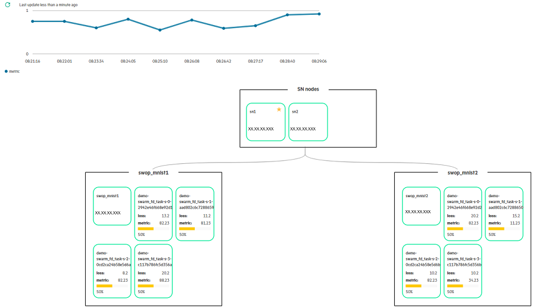

# Monitoring Swarm Learning training using SLM-UI 

Once the Swarm training has started, user can monitor the progress of the current training as shown in the following image.

This image shows all running swarm nodes associated with the project. It also shows loss, model metric \(for example, accuracy\) and overall training progress for each SL-ML pair node. On hovering over the mouse on progress bar, user can view the total number of epochs and the total number of completed epochs.

<blockquote>

  **Note:** 
  Post training completion, the completed nodes are still displayed for approx. 7 to 10 mins, before being cleaned up in SLM-UI.

</blockquote>

# Experiment tracking

In 2.2.0 release, experiment tracking feature is introduced to compare different model training/experimental runs of a ML application. This would be useful
for doing hyper-parameter tuning and choosing the best run.

To know the hyper parameters used and compare the training metrics (like accuracy) and loss of different training runs of
an SLM-UI project, user needs to annotate & provide the details of a particular experiment before starting it. User can do this
under Project > Tasks > Execute task panel of SLM-UI using the following fields.

-   **Annotation/Description of the experiment** – This field allows user to enter the description of the experiment. User
can provide verbose details and annotate a given experimental run with details of the hyper parameters used in this
particular run.
-   **Select to save the experiment** – This field allows users to select the checkbox to save the experiment. If this option
   is not chosen, then the details of this particular experiment is not saved in experiment tracking table
