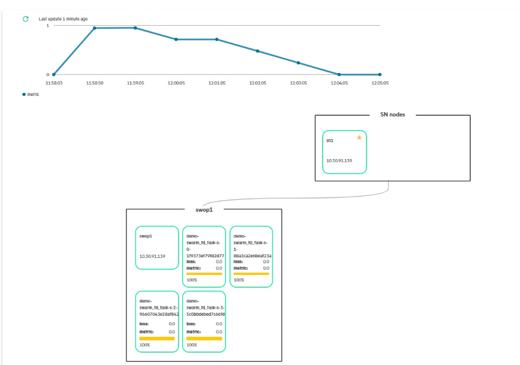

# Monitoring Swarm Learning training using SLM-UI 

Once the Swarm training has started, user can monitor it as shown in the following image.

This image shows all running swarm nodes associated with the project. It also shows loss, model metric \(for example, accuracy\) and overall training progress for each SL-ML pair node. On hovering over the mouse on progress bar, user can view the total number of epochs and the total number of completed epochs.

<blockquote>

  **Note:** 
  Post training completion, the completed nodes are still displayed approximately 7 to 10 minutes prior they are
cleaned up in the SLM-UI.

</blockquote>

