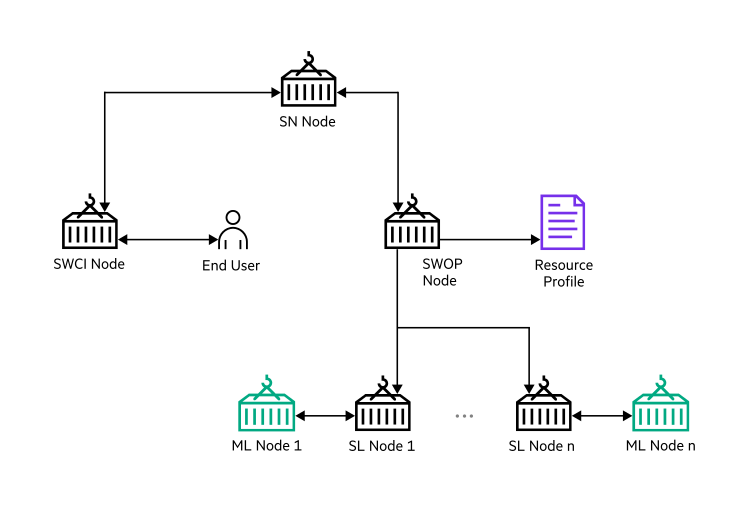

# <a name="GUID-EE49FF99-C9DD-401F-861C-C66CB94965D6"/> SWOP architecture overview

The following is the architectural overview of the SWOP \(**SWarm OPerator**\) component:

SWOP container builds or pulls the user container to match the workload configuration requirements. It builds volumes that the user containers use as specified in the workloads configuration. Initiates the Swarm Learning training sessions by launching user ML and SL container pairs.

<blockquote>
NOTE:HPE recommends users to start their user ML and SL container pairs automatically through SWOP.

</blockquote>
