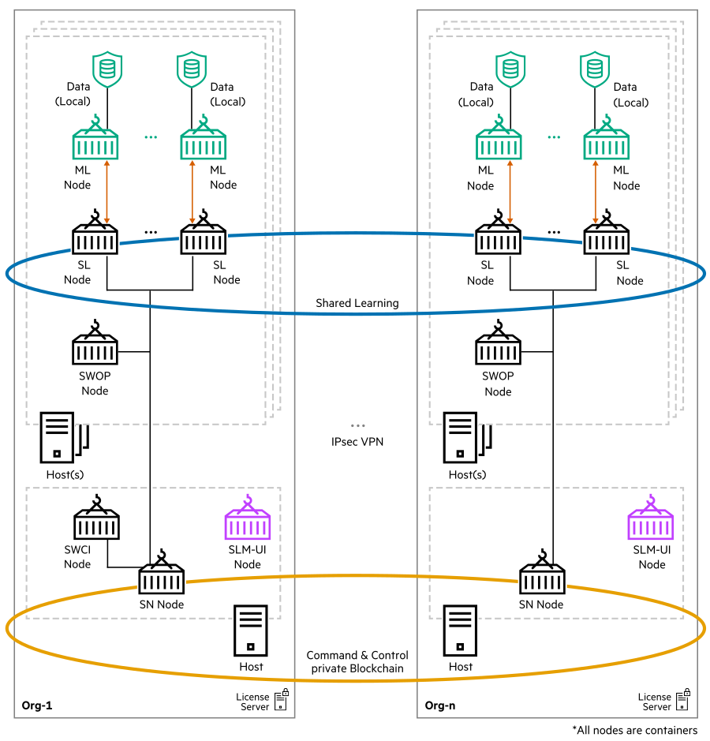

# <a name="GUID-5924CFDA-389E-40ED-94C1-543FEDDFE872"/> Swarm Learning architecture

Swarm Learning is made up of various components known as nodes, such as Swarm Learning (SL) nodes, Swarm Network (SN) nodes, Swarm Learning Command Interface (SWCI) nodes, and Swarm Operator (SWOP) nodes. Each node of Swarm Learning is modularized and runs in a separate container. The nodes in this illustration represent different Swarm Learning functionality rather than physical server nodes.

For more information on how these components interact, see [Swarm Learning component interactions](Swarm_Learning_component_interactions.md#-swarm-learning-component-interactions).

The following illustration is the architecture of Swarm Learning components:

-   SL nodes run the core of Swarm Learning. An SL node works in collaboration with all the other SL nodes in the network. It regularly shares its learnings with the other nodes and incorporates their insights. SL nodes act as an interface between the user model application and other Swarm Learning components. SL nodes take care of distributing and merging model weights in a secured way.

-   SN nodes form the blockchain network. The current version of Swarm Learning uses an open-source version of Ethereum as the underlying blockchain platform. The SN nodes interact with each other using this blockchain platform to maintain and track progress. The SN nodes use this state and progress information to co-ordinate the working of the other swarm learning components. Blockchain can be persisted across SN restart to preserve the past training history. User can lookup blockchain and see all history of operations. Users have the flexibility to stop Swarm after training is completed. Once user restarts the SN network, the existing history can be accessed using the `get` or `list` command of SWCI management interface.

    **Sentinel Node** is a special SN node. The Sentinel node is responsible for initializing the blockchain network. This is the first node to start.

<blockquote>
    NOTE:Only metadata is written to the blockchain. The model itself is not stored in the blockchain.

</blockquote>

-   SWCI node is the command interface tool to the Swarm Learning framework. It is used to monitor the Swarm Learning framework. SWCI nodes can connect to any of the SN nodes in a given Swarm Learning framework to manage the framework. 
For more information on SWCI, see [Swarm Learning Command Interface](Swarm_Learning_Command_Interface.md).

-   SWOP node is an agent that can manage Swarm Learning operations. SWOP is responsible to execute tasks that are assigned to it. A SWOP node can execute only one task at a time. SWOP helps in executing tasks such as starting and stopping Swarm runs, building and upgrading ML containers, and sharing models for training. For more information about SWOP, see [Swarm Operator node \(SWOP\)](Swarm_Operator_node_(SWOP).md).

-   Swarm Learning security and digital identity aspects are handled by X.509 certificates. Communication among Swarm Learning components are secured using X.509 certificates. User can either generate their own certificates or directly use certificates generated by any Standard Security software such as SPIRE. For more information on SPIRE, see [https://thebottomturtle.io/Solving-the-bottom-turtle-SPIFFE-SPIRE-Book.pdf](https://thebottomturtle.io/Solving-the-bottom-turtle-SPIFFE-SPIRE-Book.pdf) and [https://spiffe.io/](https://spiffe.io/).

<blockquote>
    NOTE:Swarm Learning framework does not initialize if certificates are not provided.

</blockquote>

-   Swarm Learning components communicate with each other using a set of TCP/IP ports.

<blockquote>
NOTE:The participating nodes must be able to access each other's ports.

</blockquote>

For more information on port details that must be opened, see Exposed Ports in ***HPE Swarm Learning Installation and Configuration Guide***.

-   License Server installs and manages the license that is required to run the Swarm Learning framework. The licenses are managed by the AutoPass License Server \(APLS\) that runs on a separate node. For more information on APLS, see ***HPE Swarm Learning Installation and Configuration Guide***.

