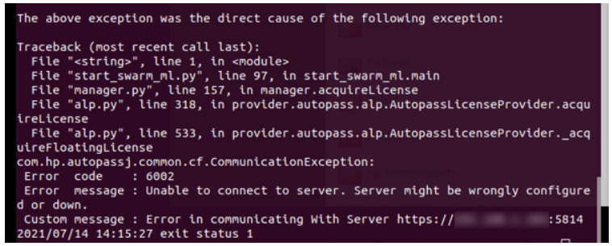
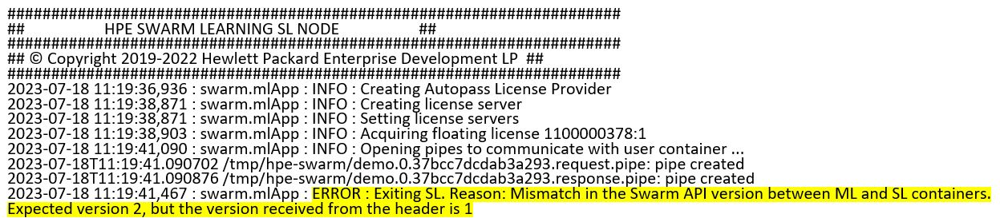

# Generic troubleshooting tips

- x.509 certificates are not configured correctly – See [https://www.linuxjournal.com/content/understanding-public-key-infrastructure-and-x509-certificates](https://www.linuxjournal.com/content/understanding-public-key-infrastructure-and-x509-certificates).
- License server is not running or Swarm licenses are not installed - See chapter "HPE AutoPass License Server License Management" in **AutoPass License Server User Guide** for details of the web GUI management interface and how to install license.
- Swarm core components (Docker containers) are not started or errors while starting. – For more information on how to start Swarm Learning, see [Running Swarm Learning using CLI](/docs/Install/Running_Swarm_Learning_using_CLI.md).
- Swarm components are not able to see each other - See the [Exposed Ports](/docs/Install/Exposed_port_numbers.md) to see if the required ports are exposed.
- User is not using the Swarm APIs correctly – See [Swarm Wheels Package](/docs/User/Swarm_client_interface-wheels_package.md) for details of API.
- Errors related to SWOP task definition, profile schema, or SWCI init script – These are user defined artifacts. Verify these files for correctness.
- Any experimental release of Ubuntu greater than LTS 22.04 may result in the following error message when running SWOP tasks.
  ```SWOP MAKE_USER_CONTAINER fails.```
  This occurs as SWOP is not able to obtain image of itself because of Docker setup differences in this experimental Ubuntu release. Switch to 22.04 LTS to resolve  this issue.
- On the OS platform (or base images), some of the dependent open-source packages (for example, apt packages) may get absolete or updated. In such cases, users must update their deployment environment with compatible and/or latest packages.
- While running through SLM-UI, for a multi host example the Docker network names should match with the associated Docker network names in the SWOP profiles.
- In SLM-UI while creating SN and SWOP nodes, you must specify the proxy, if any, under Show advanced option.
- While running a multi host example through SLM-UI, you cannot use the <SWARM-NETWORK> macro in the SWOP profile.
- While using SLM-UI any Upload dialogue box expects the files to be present on the laptop.

# <a name="GUID-96BB1337-2B99-45C7-BA9F-3D7D3B76663E"/> Troubleshooting

Troubleshooting provides solutions to commonly observed issues during Swarm Learning set up and execution.

## 1. <a name="GUID-EDAB2731-9CF3-4770-B54C-40C56D2FFDAC"/> Error code: 6002

```
> Error message: Unable to connect to server. Server might be wrongly configured or down.
> Custom message: Error in communicating with server https://HOST_SYSTEM_IP:5814 (default port)
```

**Problem description**

Error code: 6002, as shown in the following screenshot occurs when Swarm Learning components are not able to connect to the APLS server.

**Resolution**

1.  Verify if License Server is running.

    On the License Server host, verify if it is running, if not, restart the License Server.

    For more information about restarting the License Server, see *AutoPass License Server User Guide*.

2.  Access the APLS web management console. If the browser cannot connect, verify the network proxy settings, firewall policies, that are in effect. If required, work with your network administrator to resolve.

3.  Verify if the Swarm licenses are installed using APLS web management console. For more information, see APLS User Guide.


## 2. Installation of HPE Swarm Learning on air-gaped systems or if the SLM-UI Installer runs into any issue and not able to install

- Download the following from [HPE My Support Center(MSC)](https://myenterpriselicense.hpe.com/cwp-ui/auth/login) on a host system that has internet access - tar file (HPE_SWARM_LEARNING_DOCS_EXAMPLES_SCRIPTS_Q2V41-110*.tar.gz) containing docs, scripts and examples, and the signature file for the above tar file.
- Untar the tar file under `/opt/hpe/swarm-learning`.
- Do a docker login from your host:
   `docker login hub.myenterpriselicense.hpe.com –u <YOUR-HPE-PASSPORT-EMAIL> -p hpe`
- Pull the signed Swarm Learning images from HPEs Docker Trust Registry (DTR):
   ```
   docker pull hub.myenterpriselicense.hpe.com/hpe/swarm-learning/sn:<latest Swarm Learning Version>
   docker pull hub.myenterpriselicense.hpe.com/hpe/swarm-learning/sl:<latest Swarm Learning Version>
   docker pull hub.myenterpriselicense.hpe.com/hpe/swarm-learning/swci:<latest Swarm Learning Version>
   docker pull hub.myenterpriselicense.hpe.com/hpe/swarm-learning/swop:<latest Swarm Learning Version>
   docker pull hub.myenterpriselicense.hpe.com/hpe/swarm-learning/slm-ui:<latest Swarm Learning Version>
   docker pull hub.myenterpriselicense.hpe.com/hpe/swarm-learning/slm-ui-postgres:<latest Swarm Learning Version>
   docker pull hello-world
   
   For eg: docker pull hub.myenterpriselicense.hpe.com/hpe/swarm-learning/sn:2.0.0
   ```
- Copy the tar file and Docker images to the air-gaped Linux systems.
- Contact HPE for further instructions on manually starting the SLM-UI.

## 3. System resource issues if too many SLs are mapped to the same SN

When configuring Swarm Learning you may encounter system resource issues if too many SLs are mapped to same SN. For example:
    ```
    “swarm.blCnt : WARNING: SLBlackBoardObj : errCheckinNotAllowed:CHECKIN NOT ALLOWED”
    ```
The suggested workaround is to start with mapping 4 SL to 1 SN. Then after, slowly scale no of SLs to SN

## 4. SWCI waits for task-runner indefinitely even after task completed or failed

User to ensure no failure in ML code before Swarm training starts. Check using `SWARM_LOOPBACK ENV` and ensure, user coderuns fine and local training completes successfully.

## 5. Error while docker pull Swarm Learning images: 'could not rotate trust to a new trusted root'

Please remove below directories and re-try pull images: <br> </br>
~/.docker/trust/tuf/hub.myenterpriselicense.hpe.com/hpe/swarm-learning/swci/
~/.docker/trust/tuf/hub.myenterpriselicense.hpe.com/hpe/swarm-learning/sn/
~/.docker/trust/tuf/hub.myenterpriselicense.hpe.com/hpe/swarm-learning/swop/
~/.docker/trust/tuf/hub.myenterpriselicense.hpe.com/hpe/swarm-learning/sl/
~/.docker/trust/tuf/hub.myenterpriselicense.hpe.com/hpe/swarm-learning/slm-ui/
~/.docker/trust/tuf/hub.myenterpriselicense.hpe.com/hpe/swarm-learning/slm-ui-postgres/

## 6. SWOP may not launch SL containers correctly on some versions of Docker. It would incorrectly report completion of run task within a few seconds

The suggested workaround is to run the following command and then re-run the task:
<br><br>docker tag hub.myenterpriselicense.hpe.com/hpe/swarm-learning/sl:2.0.0 hub.docker.hpecorp.net/swarm-learning/sl:2.0.0

## 7. Mismatch in the Swarm API version between ML and SL containers

```
Mismatch in the Swarm API version between ML and SL containers. Expected version 2, but the version received from the header is 1.
```

**Problem description**

Error occurs as shown in the following screenshot when there is a mismatch in the Swarm API version between ML and SL containers.

SL and ML containers use Google's Protobuf protocol to verify the request and response parameters. Upon request from ML to SL container, SL checks the proto API version against the version in the ML container and vice versa. If it does not match, then this error message is displayed. When ML acts as a client and SL acts as a server \(for example, when a callback session creates a request from ML to SL node\) and there is a mismatch in the API version, this error is displayed in the SL container. When SL acts as a client and ML acts as a server \(for example, when a global loss is transferred from SL to ML container\) and there is a mismatch in API version, this error is displayed in the ML container.

|Proto API version|Compatible releases|
|-----------------|-------------------|
|1|2.0.0 and lower versions|
|2|2.1.0|

**Resolution**

1.  If Swarm Learning images are latest, then verify if the Swarm Learning wheel file used to build the ML image is also latest or not. If not, then update to the latest Swarm Learning wheel file.

2.  Generally, HPE recommends you to match the version of Swarm Learning images with the same version of Swarm Learning wheel file before starting the model training.

## 8. Unable to contact API-Server

`Unable to contact API-Server`

### Resolution
A swarm container could be unable to reach an SN node for several reasons.
1. SN is not running. To confirm, check the Docker running state of the SN container.
2. SN node can be reached via SN container FQDN only in a single host custom bridge network. But for all other scenarios, IP address of the host machine must be used. Ensure the correctness of `--sn-ip` and `--sn-api-port` parameters.
3. Ensure that SN-API-port is allowed in your firewall settings. User can check this by running `sudo ufw status`. If the SN-API-port is not in the list, then add it by using sudo `ufw allow <SN-API-port>`. The same configuration is applicable for all other Swarm ports. Ignore this step if the `ufw status` is inactive, as this state allows all ports.
4. If the certificates get expired, then the other swarm components including non-sentinel SN are not able to reach SN. User can check the expiry date of their certificates and update them accordingly.
5. When network proxy is not set correctly, both `http_proxy` and `https_proxy` ENV variables need to be set as
per the customers network policy.

## 9. API server is down

```
API server is down
```

**Problem description**

If sentinel SN dies, SLM-UI stops working.

**Resolution**

If sentinel SN crashes, it is better to delete SWCI container that is implicitly started (named as `slm-ui-<>-swci` and recreate SN to ensure SLM-UI continues to work. SLM-UI automatically spawns a new SWCI to work with the new SN.

## 10. Failed to start thread "GC Thread\#0" - pthread\_create failed

```
Failed to start thread "GC Thread#0" - pthread_create failed
```

**Problem description**

This error is displayed in the container logs when the Swarm containers are not able to start.

**Resolution**

User needs to upgrade the Docker version to the latest version.
