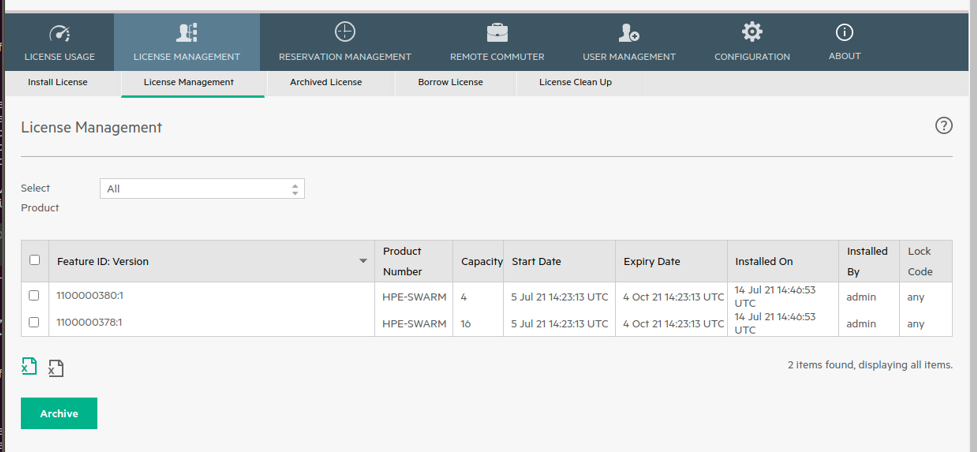

# How to setup Swarm Learning

The Swarm Learning package contains docker container images for each Swarm Learning component. The Swarm Learning container images are available in a docker registry as described in section [Pulling docker images](#pull-docker-images).

Create login credentials to access [My HPE Software Center (MSC)](https://myenterpriselicense.hpe.com/cwp-ui/evaluation/HPE-SWARM/0.3.0/null). The email address used to access MSC is called as HPE passport account. 

The evaluation license for running the Swarm Learning components are available at [My HPE Software Center (MSC)](https://myenterpriselicense.hpe.com/cwp-ui/evaluation/HPE-SWARM/0.3.0/null). Use your HPE Passport account to access MSC and download evaluation license file.

## Pulling docker images

Swarm Learning docker images are available on HPE docker registry - ``hub.myenterpriselicense.hpe.com.`` Docker registry access is password
protected. User needs to login to docker registry using HPE Passport email id and password 'hpe_eval'. All Swarm Learning images are signed by HPE with the name as 'hpe-ai-swarm-learning'. Users can inspect and pull these images after enabling docker content trust by setting the environment variable as 'DOCKER_CONTENT_TRUST=1'. See [Content trust in Docker](URL.md#21-content-trust-in-docker-httpsdocsdockercomenginesecuritytrust) for details.

The following Swarm Learning images are available on HPE docker registry:

1.  ``hub.myenterpriselicense.hpe.com/hpe_eval/swarm-learning/apls:0.3.0`` -- this is the docker image for the License Manager component.

2.  ``hub.myenterpriselicense.hpe.com/hpe_eval/swarm-learning/spire-server:0.3.0``-- this is the docker image for the SPIRE Server component.

3.  ``hub.myenterpriselicense.hpe.com/hpe_eval/swarm-learning/sn:0.3.0`` -- this is the docker image for the Swarm Network component.

4.  ``hub.myenterpriselicense.hpe.com/hpe_eval/swarm-learning/sl-tf:0.3.0``-- this is the docker image for the TensorFlow-based Swarm Learning component.

5.  ``hub.myenterpriselicense.hpe.com/hpe_eval/swarm-learning/sl-pyt:0.3.0``-- this is the docker image for the PyTorch-based Swarm Learning component.

6.  ``hub.myenterpriselicense.hpe.com/hpe_eval/swarm-learning/swci:0.3.0`` -- this is the docker image for Swarm Learning Command Interface component.

The steps to be followed to download Swarm Learning docker images on the Linux environment.
    
1. Use HPE Passport email id as username and 'hpe_eval' as password to login to registry
  
       docker login hub.myenterpriselicense.hpe.com -u <HPE-PASSPORT-EMAIL> -p hpe_eval

2. Enable docker content trust
     
       export DOCKER_CONTENT_TRUST=1

3. Optionally, inspect repos and validate HPE signer name for all the Swarm Learning images is ``hpe-ai-swarm-learning``
   For example
       
       docker trust inspect --pretty
       
       hub.myenterpriselicense.hpe.com/hpe_eval/swarm-learning/apls

  Sample output

    Signatures for hub.myenterpriselicense.hpe.com/hpe_eval/swarm-learning/apls
    
    SIGNED TAG   DIGEST                                                            SIGNERS
    
    0.3.0        4d889c26c9e583b0c0e394e8876047133ed6ce487188c88827c82451fdc75885  hpe-ai-swarm-learning
    
    List of signers and their keys for hub.myenterpriselicense.hpe.com/hpe_eval/swarm-learning/apls
    
    SIGNER                 KEYS
    
    hpe-ai-swarm-learning  cba8a8726e82
    
    Administrative keys for hub.myenterpriselicense.hpe.com/hpe_eval/swarm-learning/apls
    
    Repository Key:       26ec79d1aa6d2338ea7ab6ca498e46d1948e38e668cfa9899c7c4d1c8a23aa45
    
    Root Key:             43af4d638af9c5d0202318c951049719ce3f82181447c9f4f1c1bb6c02799f83

4. Pull all signed images with tag '0.3.0'

       docker pull hub.myenterpriselicense.hpe.com/hpe_eval/swarm-learning/apls:0.3.0
       
       docker pull hub.myenterpriselicense.hpe.com/hpe_eval/swarm-learning/spire-server:0.3.0
       
       docker pull hub.myenterpriselicense.hpe.com/hpe_eval/swarm-learning/sn:0.3.0
       
       docker pull hub.myenterpriselicense.hpe.com/hpe_eval/swarm-learning/sl-tf:0.3.0
       
       docker pull hub.myenterpriselicense.hpe.com/hpe_eval/swarm-learning/sl-pyt:0.3.0
       
       docker pull hub.myenterpriselicense.hpe.com/hpe_eval/swarm-learning/swci:0.3.0

## Starting license server and installing licenses

#### 1. Starting AutoPass License Server (APLS)
 Start the APLS container using
``swarm-learning-install-dir/swarm-learning/bin/run-apls --apls-port=5814`` 

>NOTE: APLS port(5814) should be accessible from web browser. This is required for installing licenses. 

##### - Access APLS Management console:  

Access the License Server's management console by using a web browser to connect to https://172.7.7.7:5814/.
The default username is "admin", and the password is "password".

>NOTE:
>These instructions assumes the host IP of License Server is 172.7.7.7 and external port is 5814. 
>Host IP is the IP of the system where the License Server container is running and not the containers IP. 
>
>Modify these values to match the actual IP and external port on your system.
>
>If the web browser cannot connect to the management console, check your network proxy settings and firewall policies. Consider techniques like port forwarding to workaround firewall policies. If necessary, work with your network administrator to diagnose and resolve connectivity problems.

   
#### 2. Installing Swarm License

##### - Download the License: 
If you don’t have Swarm License downloaded already, then get the License file as described [above](setup.md#how-to-setup-swarm-learning). 

##### - Install License: 

Use the management interface to install licenses and manage them. 

- See chapter "HPE AutoPass License Server License Management" in [AutoPass License Server User Guide](HPE%20AutoPass%20License%20Server%20User%20Guide.pdf) for details of the web GUI management interface and how to install license.

##### (or) Following are the quick steps: 

- Open APLS management console. 
- Go to License Management –> Install License
- Select License file.
- Select all feature IDs and install.

## ``Do not stop the License Server once the licenses are installed``

##### - Confirm License setup is successful: 
Refer License installed picture here.

   
 
   If you are seeing the above screenshot in your APLS Management console, it means your license setup is complete. 

# Uninstalling the Swarm Learning package

Use the ``swarm-learning/bin/uninstall`` script to uninstall the Swarm Learning package. This script does not accept any command line parameters. It should be run on every node where Swarm Learning package was installed.

When run, it stops all Swarm Learning components that are running on that host, removes the docker container images, and deletes the "docs", "examples" and "swarm-learning" directories installed under swarm-learning.

>NOTE: If needed, any log output produced by the containers should be saved before invoking the script as they will not be available     after the script is executed. Also output files that have been written under the "examples" directory by previous runs might also       require attention.
