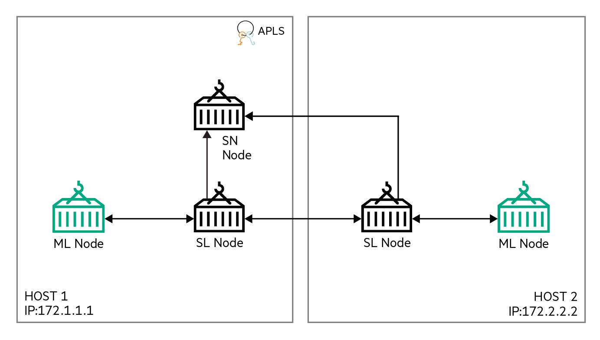

CIFAR-10
========
This example runs CIFAR-10 [1] on the Swarm Learning platform.

The code for this example has been taken from [2] and modified to run on a Swarm Learning platform.

This example uses five training batches and one test batch. These files are in the `swarm-learning/examples/cifar-10/app-data` directory. The ML program, after conversion to Swarm Learning, is in `swarm-learning/examples/cifar-10/model` and is called `cifar-10.py`.

## Cluster Setup

The cluster setup for this example uses 10 nodes, as shown in the figure below:
||
|:--:|
|<b>Figure 1: Cluster setup for the CIFAR-10 example</b>|

1. This example uses two Swarm Network nodes. The names of the docker containers representing these two nodes are **_sn-1_** and _**sn-2**_. _sn-1_ is the Sentinel Node. _sn-1_ runs on host 172.1.1.1. _sn-2_ runs on host 172.4.4.4.
2. Each Swarm Network node has two Swarm Learning nodes connected to it &mdash; Swarm Learning nodes **_sl-1_** and **_sl-2_** connect to **_sn-1_** while **_sl-3_** and **_sl-4_** connect to **_sn-2_**. _sl-1_ runs on host 172.2.2.2. _sl-2_ runs on host 172.3.3.3. _sl-3_ runs on host 172.5.5.5. _sl-4_ runs on host 172.6.6.6.
3. All Swarm Network and Swarm Learning nodes connect to the License Server, **_apls_**, running on host 172.7.7.7.
4. This example uses a _nested SPIRE server_ configuration, with one root and two nested servers.
5. The root server, **_root-spire-server_**, runs on host 172.10.10.10.
6. One nested SPIRE server, **_nested-spire-server-1_**, runs on host 172.8.8.8. This server uses _root-spire-server_ as its upstream authority. It receives its SVID through a SPIRE agent, **_root-spire-agent-1_**. This agent also runs on the same host, 172.8.8.8. The agent is not shown in the figure.
7. The second nested SPIRE server, **_nested-spire-server-2_**, runs on host 172.9.9.9. This server also uses _root-spire-server_ as its upstream authority. It receives its SVID through a SPIRE agent, **_root-spire-agent-2_**. This agent also runs on the same host, 172.9.9.9. The agent is not shown in the figure.
8. Swarm Network node, _sn-1_, and Swarm Learning nodes, _sl-1_ and _sl-2_ connect to _nested-spire-server-1_.
9. Swarm Network node, _sn-2_, and Swarm Learning nodes, _sl-3_ and _sl-4_ connect to _nested-spire-server-2_.

## Running the CIFAR-10 example
1. Start the root SPIRE server on 172.10.10.10
    ```bash
    docker run                                                                                                      \
        -d                                                                                                          \
        --name=root-spire-server                                                                                    \
        --hostname=root-spire-server                                                                                \
        --label spire-node=root-spire-server                                                                        \
        -p 8081:8081                                                                                                \
        -v /path/to/swarm-learning/examples/cifar-10/conf/root-spire-server.conf:/opt/spire/conf/server/server.conf \
        gcr.io/spiffe-io/spire-server:0.12.0
    ```
    
    ---
    A convenience script, `swarm-learning/examples/cifar-10/bin/1-run-root-server`, provides a wrapper over this command:
    ```bash
    bash ./examples/cifar-10/bin/1-run-root-server
    ```
    ---
    
    Note that the SPIRE server image, `gcr.io/spiffe-io/spire-server:0.12.0`, is the standard one. The customized image, `hub.myenterpriselicense.hpe.com/hpe_eval/swarm-learning/spire-server:0.3.0`, that is included in the Swarm Learning package automatically creates registration entries for the Swarm Learning components that constitute the SPIFFE workload. This entries are not required at the root level.

2. Start the root SPIRE agents
   
   a. Start the first root agent on 172.8.8.8
    
      * Create a join token for the agent 
         ```bash
         joinToken=$(ssh 172.10.10.10 docker exec root-spire-server     \
             /opt/spire/bin/spire-server token generate                 \
                 -spiffeID spiffe://swarm.learning/root-spire-agent-1   \
           | cut -d' ' -f2-                                             \
         )
         ```
    
      * Create a registration entry for nested-spire-server-1, the workload for this agent
         ```bash
         ssh 172.10.10.10 docker exec root-spire-server                     \
             /opt/spire/bin/spire-server entry create                       \
                 -downstream                                                \
                 -dns Swarm-Learning-Nested-Spire-Server-1                  \
                 -selector docker:label:spire-node:nested-spire-server-1    \
                 -parentID spiffe://swarm.learning/root-spire-agent-1       \
                 -spiffeID spiffe://swarm.learning/nested-spire-server-1
         ```
    
      * Start the agent
         ```bash
         docker run                                                                                                     \
             -d                                                                                                         \
             --name=root-spire-agent-1                                                                                  \
             --hostname=root-spire-agent-1                                                                              \
             --label spire-node=root-spire-agent-1                                                                      \
             --pid=host                                                                                                 \
             -v /var/run:/var/run                                                                                       \
             -v /path/to/swarm-learning/examples/cifar-10/conf/root-spire-agent-1.conf:/opt/spire/conf/agent/agent.conf \
             -v /path/to/swarm-learning/examples/cifar-10/sockets:/tmp/sockets                                          \
             --entrypoint=/opt/spire/bin/spire-agent                                                                    \
             gcr.io/spiffe-io/spire-agent:0.12.0                                                                        \
                 run                                                                                                    \
                 -serverAddress 172.10.10.10                                                                            \
                 -config /opt/spire/conf/agent/agent.conf                                                               \
             -joinToken ${joinToken}
         ```
         
         ---
         A convenience script, `swarm-learning/examples/cifar-10/bin/2a-run-root-agent-1`, provides a wrapper over these commands:
         ```bash
         bash ./examples/cifar-10/bin/2a-run-root-agent-1 --root-ip=172.10.10.10
         ```
         ---
    
   b. Start the second root agent on 172.9.9.9
    
      * Create a join token for the agent
         ```bash
         joinToken=$(ssh 172.10.10.10 docker exec root-spire-server     \
             /opt/spire/bin/spire-server token generate                 \
                 -spiffeID spiffe://swarm.learning/root-spire-agent-2   \
           | cut -d' ' -f2-                                             \
         )
         ```
        
      * Create a registration entry for nested-spire-server-2, the workload for this agent
         ```bash
         ssh 172.10.10.10 docker exec root-spire-server                     \
             /opt/spire/bin/spire-server entry create                       \
                 -downstream                                                \
                 -dns Swarm-Learning-Nested-Spire-Server-2                  \
                 -selector docker:label:spire-node:nested-spire-server-2    \
                 -parentID spiffe://swarm.learning/root-spire-agent-2       \
                 -spiffeID spiffe://swarm.learning/nested-spire-server-2
         ```
        
      * Start the agent
         ```bash
         docker run                                                                                                     \
             -d                                                                                                         \
             --name=root-spire-agent-2                                                                                  \
             --hostname=root-spire-agent-2                                                                              \
             --label spire-node=root-spire-agent-2                                                                      \
             --pid=host                                                                                                 \
             -v /var/run:/var/run                                                                                       \
             -v /path/to/swarm-learning/examples/cifar-10/conf/root-spire-agent-2.conf:/opt/spire/conf/agent/agent.conf \
             -v /path/to/swarm-learning/examples/cifar-10/sockets:/tmp/sockets                                          \
             --entrypoint=/opt/spire/bin/spire-agent                                                                    \
             gcr.io/spiffe-io/spire-agent:0.12.0                                                                        \
                 run                                                                                                    \
                 -serverAddress 172.10.10.10                                                                            \
                 -config /opt/spire/conf/agent/agent.conf                                                               \
             -joinToken ${joinToken}
         ```
         
         ---
         A convenience script, `swarm-learning/examples/cifar-10/bin/2b-run-root-agent-2`, provides a wrapper over these commands:
         ```bash
         bash ./examples/cifar-10/bin/2b-run-root-agent-2 --root-ip=172.10.10.10
         ```
         ---
    
3. Start the nested SPIRE servers
   
   a. Start the first nested SPIRE server on 172.8.8.8
    
      * Edit `swarm-learning/examples/cifar-10/conf/nested-spire-server-1.conf`. Set `server_address` in the `UpstreamAuthority` section to the actual IP or FQDN of the host running `root-spire-server`
         ```ini
         UpstreamAuthority "spire" {
             plugin_data {
                 server_address = "172.10.10.10"
                 server_port = 8081
                 workload_api_socket ="/tmp/sockets/root-spire-agent-1.sock"
             }
         }
         ```
         
      * Start the nested SPIRE server
         ```bash
         bash ./swarm-learning/bin/run-spire-server                                                    \
             -d                                                                                 \
             --name=nested-spire-server-1                                                       \
             --label spire-node=nested-spire-server-1                                           \
             -p 8081:8081                                                                       \
             -v /path/to/swarm-learning/examples/cifar-10/sockets:/tmp/sockets                  \
             -config /path/to/swarm-learning/examples/cifar-10/conf/nested-spire-server-1.conf
         ```
         
         ---
         A convenience script, `swarm-learning/examples/cifar-10/bin/3a-run-nested-server-1` provides a wrapper over these commands:
         ```bash
         bash ./examples/cifar-10/bin/3a-run-nested-server-1 --root-ip=172.10.10.10
         ```
         ---
    
   b. Start the second nested SPIRE server on 172.9.9.9
    
      * Edit `swarm-learning/examples/cifar-10/conf/nested-spire-server-2.conf`. Set `server_address` in the `UpstreamAuthority` section to the actual IP or FQDN of the host running `root-spire-server`
         ```ini
         UpstreamAuthority "spire" {
             plugin_data {
                 server_address = "172.10.10.10"
                 server_port = 8081
                 workload_api_socket ="/tmp/sockets/root-spire-agent-1.sock"
             }
         }
         ```
         
      * Start the nested SPIRE server   
         ```bash
         bash ./swarm-learning/bin/run-spire-server                                                    \
             -d                                                                                 \
             --name=nested-spire-server-2                                                       \
             --label spire-node=nested-spire-server-2                                           \
             -p 8081:8081                                                                       \
             -v /path/to/swarm-learning/examples/cifar-10/sockets:/tmp/sockets                  \
             -config /path/to/swarm-learning/examples/cifar-10/conf/nested-spire-server-2.conf
         ```
         
         ---
         A convenience script, `swarm-learning/examples/cifar-10/bin/3b-run-nested-server-2` provides a wrapper over these commands:
         ```bash
         bash ./examples/cifar-10/bin/3b-run-nested-server-2 --root-ip=172.10.10.10
         ```
         ---
    
4. Start the Sentinel node on 172.1.1.1
    ```bash
    ./swarm-learning/bin/run-sn            \
        --name=sn-1                 \
        --host-ip=172.1.1.1         \
        --sentinel-ip=172.1.1.1     \
        --apls-ip 172.7.7.7         \
        -serverAddress 172.8.8.8    \
        -genJoinToken
    ```

    ---
    A convenience script, `swarm-learning/examples/cifar-10/bin/4-run-sn-1` provides a wrapper over this command:
    ```bash
    bash ./examples/cifar-10/bin/4-run-sn-1 --apls-ip=172.7.7.7 -serverAddress=172.8.8.8
    ```
    ---

5. Start the Swarm Network node on 172.4.4.4
    ```bash
    bash ./swarm-learning/bin/run-sn       \
        --name=sn-2                 \
        --host-ip=172.4.4.4         \
        --sentinel-ip=172.1.1.1     \
        --apls-ip 172.7.7.7         \
        -serverAddress 172.9.9.9    \
        -genJoinToken
    ```

    ---
    A convenience script, `swarm-learning/examples/cifar-10/bin/5-run-sn-2` provides a wrapper over this command:
    ```bash
    bash ./examples/cifar-10/bin/5-run-sn-2 --sentinel-ip=172.1.1.1 --apls-ip=172.7.7.7 -serverAddress=172.9.9.9
    ```
    ---

6. Start the Swarm Learning nodes
   a. Start the first Swarm Learning node on 172.2.2.2
    ```bash
    bash ./swarm-learning/bin/run-sl                   \
        --name=sl-1                             \
        --host-ip=172.2.2.2                     \
        --sn-ip=172.1.1.1                       \
        --data-dir=examples/cifar-10/app-data   \
        --model-dir=examples/cifar-10/model     \
        --model-program=cifar-10.py             \
        --gpu=0                                 \
        --apls-ip 172.7.7.7                     \
        -serverAddress 172.8.8.8                \
        -genJoinToken
    ```

    ---
    A convenience script, `swarm-learning/examples/cifar-10/bin/6a-run-sl-1` provides a wrapper over this command:
    ```bash
    bash ./examples/cifar-10/bin/6a-run-sl-1 --sn-ip=172.1.1.1 --apls-ip=172.7.7.7 -serverAddress=172.8.8.8
    ```
    ---

   b. Start the second Swarm Learning node on 172.3.3.3
    ```bash
    bash ./swarm-learning/bin/run-sl                   \
        --name=sl-2                             \
        --host-ip=172.3.3.3                     \
        --sn-ip=172.1.1.1                       \
        --data-dir=examples/cifar-10/app-data   \
        --model-dir=examples/cifar-10/model     \
        --model-program=cifar-10.py             \
        --gpu=3,4                               \
        --apls-ip 172.7.7.7                     \
        -serverAddress 172.8.8.8                \
        -genJoinToken
    ```

    ---
    A convenience script, `swarm-learning/examples/cifar-10/bin/6b-run-sl-2` provides a wrapper over this command:
    ```bash
    bash ./examples/cifar-10/bin/6b-run-sl-2 --sn-ip=172.1.1.1 --apls-ip=172.7.7.7 -serverAddress=172.8.8.8
    ```
    ---

   c. Start the third Swarm Learning node on 172.5.5.5
    ```bash
    bash ./swarm-learning/bin/run-sl                   \
        --name=sl-3                             \
        --host-ip=172.5.5.5                     \
        --sn-ip=172.4.4.4                       \
        --data-dir=examples/cifar-10/app-data   \
        --model-dir=examples/cifar-10/model     \
        --model-program=cifar-10.py             \
        --gpu=all                               \
        --apls-ip 172.7.7.7                     \
        -serverAddress 172.9.9.9                \
        -genJoinToken
    ```

    ---
    A convenience script, `swarm-learning/examples/cifar-10/bin/6c-run-sl-3` provides a wrapper over this command:
    ```bash
    bash ./examples/cifar-10/bin/6c-run-sl-3 --sn-ip=172.4.4.4 --apls-ip=172.7.7.7 -serverAddress=172.9.9.9
    ```
    ---

   d. Start the fourth Swarm Learning node on 172.6.6.6
    ```bash
    bash ./swarm-learning/bin/run-sl                   \
        --name=sl-4                             \
        --host-ip=172.6.6.6                     \
        --sn-ip=172.4.4.4                       \
        --data-dir=examples/cifar-10/app-data   \
        --model-dir=examples/cifar-10/model     \
        --model-program=cifar-10.py             \
        --apls-ip 172.7.7.7                     \
        -serverAddress 172.9.9.9                \
        -genJoinToken
    ```

    ---
    A convenience script, `swarm-learning/examples/cifar-10/bin/6d-run-sl-4` provides a wrapper over this command:
    ```bash
    bash ./examples/cifar-10/bin/6d-run-sl-4 --sn-ip=172.4.4.4 --apls-ip=172.7.7.7 -serverAddress=172.9.9.9
    ```
    ---

## References
1. V. N. a. G. H. Alex Krizhevsky, "CIFAR-10 and CIFAR-100 datasets," [Online]. Available: [https://www.cs.toronto.edu/~kriz/cifar.html](https://www.cs.toronto.edu/~kriz/cifar.html)
2. [https://keras.io/examples/cifar10_cnn/](https://keras.io/examples/cifar10_cnn/)
3. Nested SPIRE [Online]. Available: [https://github.com/spiffe/spire-tutorials/tree/master/docker-compose/nested-spire](https://github.com/spiffe/spire-tutorials/tree/master/docker-compose/nested-spire)
