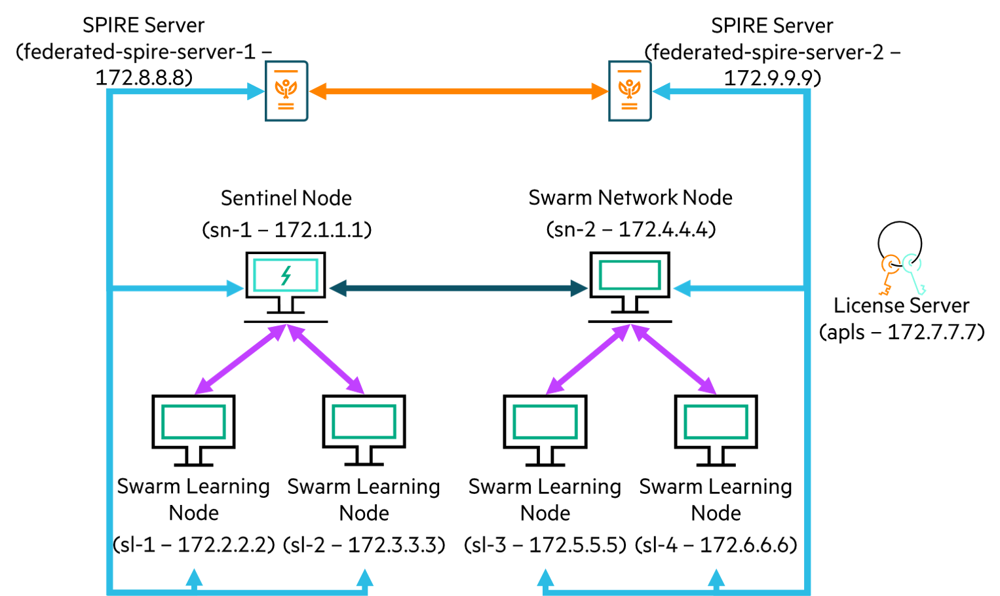

Credit card fraud detection
===========================

This example runs a Credit Card Fraud Detection algorithm [1] on the Swarm Learning platform. It uses Keras and Tensorflow.

This example uses a subset of the data from [1]. This subset is balanced and has been created as a 50:50 data set with equal distribution of fraud and non-fraud cases.
>  **_NOTE :_** Refer [Data license](data-and-scratch/app-data/Data_license.md) associated with this dataset. 


The ML program, after conversion to Swarm Learning, is in `examples/fraud-detection/model` and is called `fraud-detection.py`.

This example shows the Swarm training of Credit Card Fraud Detection model using four Machine Learning (ML) nodes. Machine Learning nodes along with Swarm Learning (SL) nodes are automatically spawned by Swarm Operators (SWOP) nodes - all running on single host. Swarm training gets initiated by Swarm Command Interface (SWCI) node and orchestrated by one Swarm Network (SN) nodes running on the same host. This example also shows how private data, private scratch area and shared model can be mounted to Machine Learning nodes for Swarm training. For details, see the profile files and task definition files placed under `examples/fraud-detection/swop` and `examples/fraud-detection/swci` folders respectively.


## Cluster Setup

The cluster setup for this example uses only one host, as shown in the figure below:  
- host-1: 172.1.1.1  

||
|:--:|
|<b>Figure 1: Cluster setup for the Credit card fraud detection example</b>|

1. This example uses one Swarm Network (SN) nodes. The names of the docker containers representing this node is **sn1**. sn1 is also the Sentinel Node. sn1 runs on host 172.1.1.1.
2. Four Swarm Learning (SL) and four Machine Learning (ML) nodes are automatically spawned by Swarm Operators (SWOP) node during training and removed after training. Example uses one SWOP node that connects to the SN node. The names of the docker containers representing this SWOP node is **swop1**. swop1 runs on host 172.1.1.1. 
3. Training is initiated by SWCI node (**swci1**) that runs on host 172.1.1.1
4. Example assumes that License Server already runs on host 172.1.1.1. All Swarm nodes connect to the License Server, on its default port 5814.


## Running the Credit card fraud detection example

1. *On host-1*:  
   cd to `swarm-learning` folder (i.e. parent to examples directory)
   ```
   cd swarm-learning
   ```

2. *On host-1*:  
   Create a temporary `workspace` directory and copy `fraud-detection` example and `gen-cert` utility there as follows.
   ```
   mkdir workspace
   cp -r examples/fraud-detection workspace/
   cp -r examples/utils/gen-cert workspace/fraud-detection/
   ```

3. *On host-1*:  
   Run the `gen-cert` utility to generate certificates for each Swarm component using the command: `gen-cert -e <EXAMPLE-NAME> -i <HOST-INDEX>`  
   ```
   ./workspace/fraud-detection/gen-cert -e fraud-detection -i 1
   ```  
   
4. *On host-1*:
   Create a network called `host-1-net` using docker network create command. This network will be used for SN, SWOP, SWCI, SL and user containers. Please ignore this step if this network is already created.
   ```
   docker network create host-1-net
   ```
   
5. *On host-1*:
   Declare and assign values to the variables like APLS_IP, HOST_IP, SN_IP and SN_API_PORT. The values mentioned here are for illustration purpose only. Use appropriate values as per your swarm network.
   ```
   APLS_IP=172.1.1.1
   HOST_IP=172.1.1.1
   SN_IP=172.1.1.1
   SN_API_PORT=30304
   ```

6. *On host-1*:  
   Search and replace all occurrences of placeholders and replace them with appropriate values.  
   ```
   sed -i "s+<PROJECT-MODEL>+$(pwd)/workspace/fraud-detection/model+g" workspace/fraud-detection/swci/taskdefs/swarm_fd_task.yaml
   
   sed -i "s+<SWARM-NETWORK>+host-1-net+g" workspace/fraud-detection/swop/swop*_profile.yaml
   sed -i "s+<CURRENT-PATH>/examples+$(pwd)/workspace+g" workspace/fraud-detection/swop/swop*_profile.yaml
   sed -i "s+<LICENSE-SERVER-ADDRESS>+${APLS_IP}+g" workspace/fraud-detection/swop/swop*_profile.yaml
   sed -i "s+<PROJECT-CERTS>+$(pwd)/workspace/fraud-detection/cert+g" workspace/fraud-detection/swop/swop*_profile.yaml
   sed -i "s+<PROJECT-CACERTS>+$(pwd)/workspace/fraud-detection/cert/ca/capath+g" workspace/fraud-detection/swop/swop*_profile.yaml
   ```

7. *On host-1*:  
   Run Swarm Network node (sn1) - sentinel node
   ```
   ./scripts/bin/run-sn -d --rm --name=sn1 --network=host-1-net --host-ip=${HOST_IP} --sentinel --sn-api-port=${SN_API_PORT}     \
   --key=workspace/fraud-detection/cert/sn-1-key.pem --cert=workspace/fraud-detection/cert/sn-1-cert.pem                         \
   --capath=workspace/fraud-detection/cert/ca/capath --apls-ip=${APLS_IP}
   ```
   Use the docker logs command to monitor the Sentinel SN node and wait for the node to finish initializing. The Sentinel node is ready when these messages appear in the log output:  
   `swarm.blCnt : INFO : Starting SWARM-API-SERVER on port: 30304`

8. *On host-1*:  
   Run Swarm Operator node (swop1)  

   Note: If required, modify proxy, according to environment, either in the below command or in the swop profile file under `workspace/fraud-detection/swop` folder.  
   ```
   ./scripts/bin/run-swop -d --rm --name=swop1 --network=host-1-net --usr-dir=workspace/fraud-detection/swop                                    \
   --profile-file-name=swop1_profile.yaml --sn-ip=${SN_IP} --sn-api-port=${SN_API_PORT} --key=workspace/fraud-detection/cert/swop-1-key.pem     \
   --cert=workspace/fraud-detection/cert/swop-1-cert.pem --capath=workspace/fraud-detection/cert/ca/capath                                      \
   -e http_proxy= -e https_proxy= --apls-ip=${APLS_IP}
   ```

9. *On host-1*:  
    Run Swarm Command Interface node (swci1). It will create, finalize and assign below tasks to task-framework for sequential execution –  
    - user_env_tf_build_task: Builds Tensorflow based docker image for ML node to run model training  
    - swarm_fd_task: Create containers out of ML image and mount model and data path to run Swarm training  

    Note: If required, modify SN IP, according to environment, in `workspace/fraud-detection/swci/swci-init` file  
    ```    
    ./scripts/bin/run-swci --rm --name=swci1 --network=host-1-net --usr-dir=workspace/fraud-detection/swci         \
    --init-script-name=swci-init --key=workspace/fraud-detection/cert/swci-1-key.pem                               \
    --cert=workspace/fraud-detection/cert/swci-1-cert.pem --capath=workspace/fraud-detection/cert/ca/capath        \
    -e http_proxy= -e https_proxy= --apls-ip=${APLS_IP}
    ```

10. *On host-1*:  
    Four node Swarm training will be automatically started when the run task (swarm_fd_task) gets assigned and executed. User can open a new terminal on host-1 and monitor the docker logs of ML nodes for Swarm training. Swarm training will end with the following log message at the end –  
    `SwarmCallback : INFO : All peers and Swarm training rounds finished. Final Swarm model was loaded.`  
    
    Final Swarm model will be saved in each user's specific directory inside `workspace/fraud-detection/data-and-scratch/<userN>` directory. All the dynamically spawned SL and ML nodes will exit after Swarm training. The SN and SWOP nodes continue running.

11. *On host-1*:  
    To clean-up, run the `scripts/bin/stop-swarm` script on all the systems to stop and remove the container nodes of the previous run. If needed, take backup of the container logs. Finally remove docker network (`host-1-net`) and docker volume (`sl-cli-lib`) and delete the `workspace` directory.
    


## References
1. M. L. G. - ULB, "Credit Card Fraud Detection," [Online]. Available: [https://www.kaggle.com/mlg-ulb/creditcardfraud](https://www.kaggle.com/mlg-ulb/creditcardfraud)
