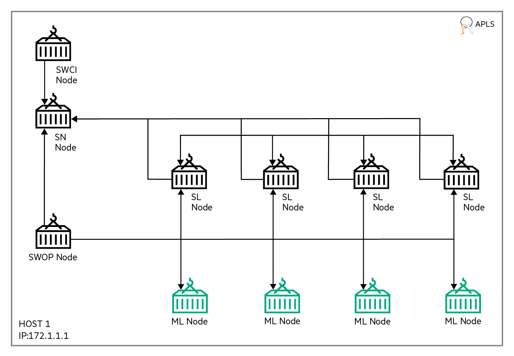

Credit Card Fraud Detection
===========================
This example runs a Credit Card Fraud Detection algorithm [1] on the Swarm Learning platform.

This example uses a subset of the data from [1]. This subset is balanced and has been created as a 50:50 data set with equal distribution of fraud and non-fraud cases.

This example uses four training batches and one test batch. These files are in the `swarm-learning/examples/fraud-detection/app-data` directory. The ML program, after conversion to Swarm Learning, is in `swarm-learning/examples/fraud-detection/model` and is called `fraud-detection.py`.

## Cluster Setup

The cluster setup for this example uses 9 nodes, as shown in the figure below:
||
|:--:|
|<b>Figure 1: Cluster setup for the Credit Card Fraud Detection example</b>|

1. This example uses two Swarm Network nodes. The names of the docker containers representing these two nodes are **_sn-1_** and _**sn-2**_. _sn-1_ is the Sentinel Node. _sn-1_ runs on host 172.1.1.1. _sn-2_ runs on host 172.4.4.4.
2. Each Swarm Network node has two Swarm Learning nodes connected to it &mdash; Swarm Learning nodes **_sl-1_** and **_sl-2_** connect to **_sn-1_** while **_sl-3_** and **_sl-4_** connect to **_sn-2_**. _sl-1_ runs on host 172.2.2.2. _sl-2_ runs on host 172.3.3.3. _sl-3_ runs on host 172.5.5.5. _sl-4_ runs on host 172.6.6.6.
3. All Swarm Network and Swarm Learning nodes connect to the License Server, **_apls_**, running on host 172.7.7.7.
4. This example uses a _federated SPIRE server_ configuration, with two federated servers.
5. One federated SPIRE server, **_federated-spire-server-1_**, runs on host 172.8.8.8. Swarm Network node, _sn-1_, and Swarm Learning nodes, _sl-1_ and _sl-2_ connect to this server.
6. The second federated SPIRE server, **_federated-spire-server-2_**, runs on host 172.9.9.9. Swarm Network node, _sn-2_, and Swarm Learning nodes, _sl-3_ and _sl-4_ connect to this server.

## Running the Credit Card Fraud Detection example
1. Start the federated SPIRE servers
   
   a. Start the first server on 172.8.8.8
   
      * Edit `swarm-learning/examples/fraud-detection/conf/federated-spire-server-1.conf`. Set `address` in the `federates_with` section to the actual IP or FQDN of the host that will run `federated-spire-server-2`
        ```ini
         federates_with "org-2.swarm.learning" {
             bundle_endpoint {
                 address = "172.9.9.9"
                 port = 8443
             }
         }
         ```

      * Start the federated SPIRE server
        ```bash
         bash ./swarm-learning/bin/run-spire-server                                                            \
             -d                                                                                         \
             --name=federated-spire-server-1                                                            \
             --label spire-node=federated-spire-server-1                                                \
             -p 8081:8081                                                                               \
             -p 8443:8443                                                                               \
             -config /path/to/swarm-learning/examples/fraud-detection/conf/federated-spire-server-1.conf
         ```
         
         ---
         A convenience script, `swarm-learning/examples/fraud-detection/bin/1a-run-federated-server-1`, provides a wrapper over these commands:
         ```bash
         bash ./examples/fraud-detection/bin/1a-run-federated-server-1 --their-ip=172.9.9.9
         ```
         ---
    
   b. Start the second server on 172.9.9.9
    
      * Edit `swarm-learning/examples/fraud-detection/conf/federated-spire-server-2.conf`. Set `address` in the `federates_with` section to the actual IP or FQDN of the host running `federated-spire-server-1`
         
         ```ini
         federates_with "org-1.swarm.learning" {
             bundle_endpoint {
                 address = "172.8.8.8"
                 port = 8443
             }
         }
         ```
         
      * Start the federated SPIRE server
         
         ```bash
         bash ./swarm-learning/bin/run-spire-server                                                            \
             -d                                                                                         \
             --name=federated-spire-server-2                                                            \
             --label spire-node=federated-spire-server-2                                                \
             -p 8081:8081                                                                               \
             -p 8443:8443                                                                               \
             -config /path/to/swarm-learning/examples/fraud-detection/conf/federated-spire-server-2.conf
         ```
         
         ---
         A convenience script, `swarm-learning/examples/fraud-detection/bin/1b-run-federated-server-2`, provides a wrapper over these commands:
         ```bash
         bash ./examples/fraud-detection/bin/1b-run-federated-server-2 --their-ip=172.8.8.8
         ```
         ---
    
2. Bootstrap the federation by exchanging trust bundles
   
   a. Register `federated-spire-server-2`'s trust bundle with `federated-spire-server-1` by running these commands on 172.8.8.8
       
      * Fetch the trust bundle from `federated-spire-server-2`
         ```bash
         ssh 172.9.9.9 docker exec federated-spire-server-2     \
             /spire/bin/spire-server bundle show -format spiffe \
           > /tmp/federated-spire-2.bundle
         ```

      * Create a tar archive of the bundle
         ```bash
         tar cf /tmp/federated-spire-2.bundle.tar -C /tmp federated-spire-2.bundle
         ```

      * Copy the tar archive into `federated-spire-server-1`'s container and extract it
         ```bash
         docker cp /tmp/federated-spire-2.bundle.tar federated-spire-server-1:/tmp/
         ```
    
      * Register `federated-spire-server-2`'s trust bundle with `federated-spire-server-1`
         ```bash
         docker exec federated-spire-server-1       \
             /spire/bin/spire-server bundle set     \
             -format spiffe                         \
             -id spiffe://org-2.swarm.learning      \
             -path /tmp/federated-spire-2.bundle
         ```

      * Clean up the host by deleting the copy of `federated-spire-server-2`'s trust bundle and the tar file
         ```bash
         rm /tmp/federated-spire-2.bundle /tmp/federated-spire-2.bundle.tar
         ```
         
         ---
         A convenience script, `swarm-learning/examples/fraud-detection/bin/2a-bootstrap-federation-1`, provides a wrapper over these commands:
         ```bash
         bash ./examples/fraud-detection/bin/2a-bootstrap-federation-1 --their-ip=172.9.9.9
         ```
         ---

   b. Register `federated-spire-server-1`'s trust bundle with `federated-spire-server-2` by running these commands on 172.9.9.9
   
      * Fetch the trust bundle from `federated-spire-server-1`
         ```bash
         ssh 172.8.8.8 docker exec federated-spire-server-1     \
             /spire/bin/spire-server bundle show -format spiffe \
           > /tmp/federated-spire-1.bundle
         ```

      * Create a tar archive of the bundle
         ```bash
         tar cf /tmp/federated-spire-1.bundle.tar -C /tmp federated-spire-1.bundle
         ```

      * Copy the tar archive into `federated-spire-server-2`'s container and extract it
         ```bash
         docker cp /tmp/federated-spire-1.bundle.tar federated-spire-server-2:/tmp/
         ```
    
      * Register `federated-spire-server-1`'s trust bundle with `federated-spire-server-2`
         ```bash
         docker exec federated-spire-server-2       \
             /spire/bin/spire-server bundle set     \
             -format spiffe                         \
             -id spiffe://org-1.swarm.learning      \
             -path /tmp/federated-spire-1.bundle
         ```

      * Clean up the host by deleting the copy of `federated-spire-server-1`'s trust bundle and the tar file
         ```bash
         rm /tmp/federated-spire-1.bundle /tmp/federated-spire-1.bundle.tar
         ```
         
         ---
         A convenience script, `swarm-learning/examples/fraud-detection/bin/2b-bootstrap-federation-2`, provides a wrapper over these commands:
         ```bash
         bash ./examples/fraud-detection/bin/2b-bootstrap-federation-2 --their-ip=172.8.8.8
         ```
         ---
    
3. Create workload registration entries for the Swarm Platform components
   
   a. Create registration entries on `federated-spire-server-1`
    
      * Create an entry for the Swarm Network nodes
         ```bash
         docker exec federated-spire-server-1                           \
             /spire/bin/spire-server entry create                       \
                 -parentID spiffe://org-1.swarm.learning/swarm/sn-agent \
                 -spiffeID spiffe://org-1.swarm.learning/swarm/sn       \
                 -selector swarm:node-type:sn                           \
                 -federatesWith spiffe://org-2.swarm.learning           \
                 -dns swarm-network-node
         ```
         
      * Create an entry for the Swarm Learning nodes
         ```bash
         docker exec federated-spire-server-1                           \
             /spire/bin/spire-server entry create                       \
                 -parentID spiffe://org-1.swarm.learning/swarm/sl-agent \
                 -spiffeID spiffe://org-1.swarm.learning/swarm/sl       \
                 -selector swarm:node-type:sl                           \
                 -federatesWith spiffe://org-2.swarm.learning           \
                 -dns swarm-learning-node
         ```
         
         ---
         A convenience script, `swarm-learning/examples/fraud-detection/bin/3a-create-registration-entries-1` provides a wrapper over these commands:
         ```bash
         bash ./examples/fraud-detection/bin/3a-create-registration-entries-1
         ```
         ---
    
   b. Create registration entries on `federated-spire-server-2`
    
      * Create an entry for the Swarm Network nodes
         ```bash
         docker exec federated-spire-server-2                           \
             /spire/bin/spire-server entry create                       \
                 -parentID spiffe://org-2.swarm.learning/swarm/sn-agent \
                 -spiffeID spiffe://org-2.swarm.learning/swarm/sn       \
                 -selector swarm:node-type:sn                           \
                 -federatesWith spiffe://org-1.swarm.learning           \
                 -dns swarm-network-node
         ```
         
      * Create an entry for the Swarm Learning nodes
         ```bash
         docker exec federated-spire-server-2                           \
             /spire/bin/spire-server entry create                       \
                 -parentID spiffe://org-2.swarm.learning/swarm/sl-agent \
                 -spiffeID spiffe://org-2.swarm.learning/swarm/sl       \
                 -selector swarm:node-type:sl                           \
                 -federatesWith spiffe://org-1.swarm.learning           \
                 -dns swarm-learning-node
         ```
         
         ---
         A convenience script, `swarm-learning/examples/fraud-detection/bin/3b-create-registration-entries-2` provides a wrapper over these commands:
         ```bash
         bash ./examples/fraud-detection/bin/3b-create-registration-entries-2
         ```
         ---
    
4. Start the Sentinel node on 172.1.1.1
    ```bash
    bash ./swarm-learning/bin/run-sn                               \
        --name=sn-1                                         \
        --host-ip=172.1.1.1                                 \
        --sentinel-ip=172.1.1.1                             \
        --sn-p2p-port=10000                                 \
        --apls-ip 172.7.7.7                                 \
        -serverAddress 172.8.8.8                            \
        -config "${confDir}/federated-spire-agent-1.conf"   \
        -genJoinToken
    ```

    ---
    A convenience script, `swarm-learning/examples/fraud-detection/bin/4-run-sn-1` provides a wrapper over this command:
    ```bash
    bash ./examples/fraud-detection/bin/4-run-sn-1 --apls-ip=172.7.7.7 -serverAddress=172.8.8.8
    ```
    ---

5. Start the Swarm Network node on 172.4.4.4
    ```bash
    bash ./swarm-learning/bin/run-sn                               \
        --name=sn-2                                         \
        --host-ip=172.4.4.4                                 \
        --sentinel-ip=172.1.1.1                             \
        --sn-api-port=11000                                 \
        --apls-ip 172.7.7.7                                 \
        -serverAddress 172.9.9.9                            \
        -config "${confDir}/federated-spire-agent-2.conf"   \
        -genJoinToken
    ```

    ---
    A convenience script, `swarm-learning/examples/fraud-detection/bin/5-run-sn-2` provides a wrapper over this command:
    ```bash
    bash ./examples/fraud-detection/bin/5-run-sn-2 --sentinel-ip=172.1.1.1 --apls-ip=172.7.7.7 -serverAddress=172.9.9.9
    ```
    ---

6. Start the Swarm Learning nodes
    a. Start the first Swarm Learning node on 172.2.2.2
    ```bash
    bash ./swarm-learning/bin/run-sl                               \
        --name=sl-1                                         \
        --host-ip=172.2.2.2                                 \
        --sn-ip=172.1.1.1                                   \
        --data-dir=examples/fraud-detection/app-data        \
        --model-dir=examples/fraud-detection/model          \
        --model-program=fraud-detection.py                  \
        --gpu=all                                           \
        --apls-ip 172.7.7.7                                 \
        -serverAddress 172.8.8.8                            \
        -config "${confDir}/federated-spire-agent-1.conf"   \
        -genJoinToken
    ```

    ---
    A convenience script, `swarm-learning/examples/fraud-detection/bin/6a-run-sl-1` provides a wrapper over this command:
    ```bash
    bash ./examples/fraud-detection/bin/6a-run-sl-1 --sn-ip=172.1.1.1 --apls-ip=172.7.7.7 -serverAddress=172.8.8.8
    ```
    ---

    b. Start the second Swarm Learning node on 172.3.3.3
    ```bash
    bash ./swarm-learning/bin/run-sl                               \
        --name=sl-2                                         \
        --host-ip=172.3.3.3                                 \
        --sn-ip=172.1.1.1                                   \
        --sl-fs-port=12000                                  \
        --data-dir=examples/fraud-detection/app-data        \
        --model-dir=examples/fraud-detection/model          \
        --model-program=fraud-detection.py                  \
        --gpu=all                                           \
        --apls-ip 172.7.7.7                                 \
        -serverAddress 172.8.8.8                            \
        -config "${confDir}/federated-spire-agent-1.conf"   \
        -genJoinToken
    ```

    ---
    A convenience script, `swarm-learning/examples/fraud-detection/bin/6b-run-sl-2` provides a wrapper over this command:
    ```bash
    bash ./examples/fraud-detection/bin/6b-run-sl-2 --sn-ip=172.1.1.1 --apls-ip=172.7.7.7 -serverAddress=172.8.8.8
    ```
    ---

    c. Start the third Swarm Learning node on 172.5.5.5
    ```bash
    bash ./swarm-learning/bin/run-sl                               \
        --name=sl-3                                         \
        --host-ip=172.5.5.5                                 \
        --sn-ip=172.4.4.4                                   \
        --sn-api-port=11000                                 \
        --data-dir=examples/fraud-detection/app-data        \
        --model-dir=examples/fraud-detection/model          \
        --model-program=fraud-detection.py                  \
        --gpu=all                                           \
        --apls-ip 172.7.7.7                                 \
        -serverAddress 172.9.9.9                            \
        -config "${confDir}/federated-spire-agent-2.conf"   \
        -genJoinToken
    ```

    ---
    A convenience script, `swarm-learning/examples/fraud-detection/bin/6c-run-sl-3` provides a wrapper over this command:
    ```bash
    bash ./examples/fraud-detection/bin/6c-run-sl-3 --sn-ip=172.4.4.4 --apls-ip=172.7.7.7 -serverAddress=172.9.9.9
    ```
    ---

    d. Start the fourth Swarm Learning node on 172.6.6.6
    ```bash
    bash ./swarm-learning/bin/run-sl                               \
        --name=sl-4                                         \
        --host-ip=172.6.6.6                                 \
        --sn-ip=172.4.4.4                                   \
        --sn-api-port=11000                                 \
        --data-dir=examples/fraud-detection/app-data        \
        --model-dir=examples/fraud-detection/model          \
        --model-program=fraud-detection.py                  \
        --gpu=all                                           \
        --apls-ip 172.7.7.7                                 \
        -serverAddress 172.9.9.9                            \
        -config "${confDir}/federated-spire-agent-2.conf"   \
        -genJoinToken
    ```

    ---
    A convenience script, `swarm-learning/examples/fraud-detection/bin/6d-run-sl-4` provides a wrapper over this command:
    ```bash
    bash ./examples/fraud-detection/bin/6d-run-sl-4 --sn-ip=172.4.4.4 --apls-ip=172.7.7.7 -serverAddress=172.9.9.9
    ```
    ---

## References
1. M. L. G. - ULB, "Credit Card Fraud Detection," [Online]. Available: [https://www.kaggle.com/mlg-ulb/creditcardfraud](https://www.kaggle.com/mlg-ulb/creditcardfraud)
2. Federated SPIRE, [Online]. Available: [https://github.com/spiffe/spire-tutorials/blob/master/docker-compose/federation](https://github.com/spiffe/spire-tutorials/blob/master/docker-compose/federation)
