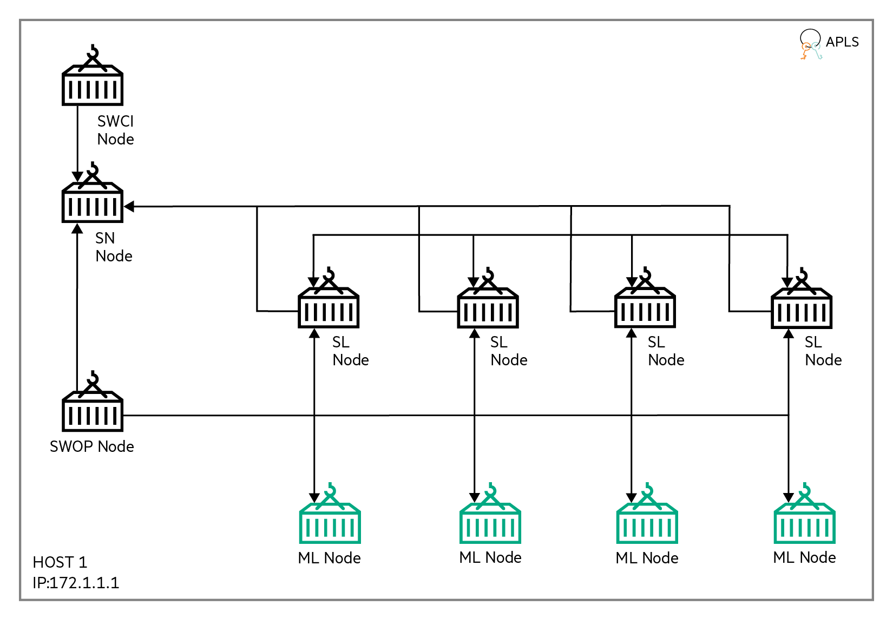

# <a name="GUID-41298B6F-BF19-4873-A5AE-1DA0E1CFB358"/> CPU based MNIST-PYT

This example runs MNIST-PYT[1](#) application with CPU based local training on the Swarm Learning platform. 

The Machine Learning program, after conversion to Swarm Learning for the PyTorch platform, is in `examples/mnist-pyt/cpu-based/model`. The PyTorch-based file is called `mnist_pyt.py`.

This example shows the Swarm training of MNIST model using four ML nodes. ML nodes along with SL nodes are automatically spawned by SWOP nodes - all running on a single host. Swarm training gets initiated by the SWCI node and orchestrated by one SN node running on the same host. This example also shows how private data, private scratch area and shared model can be mounted to ML nodes for Swarm training.

The following image illustrates a cluster setup for the MNIST example:




-   This example uses one SN node. The name of the docker containers representing this node is SN1. SN1 is also the Sentinel Node. SN1 runs on the host 172.1.1.1.

-   Four SL and ML nodes are automatically spawned by SWOP node during training and removed after the training. This example uses one SWOP node that connects to the SN node. The name of the docker container representing this SWOP node is SWOP1. SWOP1 runs on the host 172.1.1.1.

-   Training is initiated by SWCI node \(SWCI1\) that runs on the host 172.1.1.1.

-   This example assumes that License Server already runs on host 172.1.1.1. All Swarm nodes connect to the License Server, on its default port 5814.


## <a name="SECTION_G1M_4RZ_LSB"/> Running the MNIST-PYT example

1.  Navigate to `swarm-learning` folder (that is, parent to examples directory).

    ```
    cd swarm-learning
    ```

2.  Create a temporary workspace directory and copy `mnist-pyt` example.

    ```
    mkdir workspace
    cp -r examples/mnist-pyt/cpu-based/ workspace/mnist-pyt/
    cp -r examples/utils/gen-cert workspace/mnist-pyt/
    ```

3.  Run the gen-cert utility to generate certificates for each Swarm component using the command (`gen-cert -e <EXAMPLE-NAME> -i <HOST-INDEX>`):

    ```
    ./workspace/mnist-pyt/gen-cert -e mnist-pyt -i 1
    ```

4. Create a network called `host-1-net` using docker network create command. This network will be used for SN, SWOP, SWCI, SL and user containers. Please ignore this step if this network is already created.
   
    ```
    docker network create host-1-net
    ```

5. Declare and assign values to the variables like APLS_IP, SN_IP, HOST_IP and SN_API_PORT. The values mentioned here are for illustration purpose only. Use appropriate values as per your swarm network.
   
    ```
    APLS_IP=172.1.1.1
    SN_IP=172.1.1.1
    HOST_IP=172.1.1.1
    SN_API_PORT=30304
    SN_P2P_PORT=30303
    ```

6.  Search and replace all occurrences of placeholders and replace them with appropriate values.

    ```
    sed -i "s+<PROJECT-MODEL>+$(pwd)/workspace/mnist-pyt/model+g" workspace/mnist-pyt/swci/taskdefs/run_mnist_pyt.yaml

    sed -i "s+<SWARM-NETWORK>+host-1-net+g" workspace/mnist-pyt/swop/swop*_profile.yaml
    sed -i "s+<LICENSE-SERVER-ADDRESS>+${APLS_IP}+g" workspace/mnist-pyt/swop/swop*_profile.yaml
    sed -i "s+<PROJECT>+$(pwd)/workspace/mnist-pyt+g" workspace/mnist-pyt/swop/swop*_profile.yaml
    sed -i "s+<PROJECT-CERTS>+$(pwd)/workspace/mnist-pyt/cert+g" workspace/mnist-pyt/swop/swop*_profile.yaml
    sed -i "s+<PROJECT-CACERTS>+$(pwd)/workspace/mnist-pyt/cert/ca/capath+g" workspace/mnist-pyt/swop/swop*_profile.yaml

    ```

7.  Run SN node (SN1 - sentinel node)

    ```
    ./scripts/bin/run-sn -d --rm --name=sn1 --network=host-1-net --host-ip=${HOST_IP} --sentinel --sn-p2p-port=${SN_P2P_PORT} --sn-api-port=${SN_API_PORT}      \
    --key=workspace/mnist-pyt/cert/sn-1-key.pem --cert=workspace/mnist-pyt/cert/sn-1-cert.pem --capath=workspace/mnist-pyt/cert/ca/capath --apls-ip=${APLS_IP}
    ```

   Use the Docker logs command to monitor the Sentinel SN node and wait for the node to finish initializing. The Sentinel node is ready when these messages appear in the log output:
    ```
    swarm.blCnt : INFO : Starting SWARM-API-SERVER on port: 30304
    ```


8. Run SWOP node \(SWOP1\). 

    ```
    ./scripts/bin/run-swop -d --rm --name=swop1 --network=host-1-net --sn-ip=${SN_IP} --sn-api-port=${SN_API_PORT}              \
    --usr-dir=workspace/mnist-pyt/swop --profile-file-name=swop_profile.yaml --key=workspace/mnist-pyt/cert/swop-1-key.pem      \
    --cert=workspace/mnist-pyt/cert/swop-1-cert.pem --capath=workspace/mnist-pyt/cert/ca/capath -e SWOP_KEEP_CONTAINERS=True    \
    -e http_proxy= -e https_proxy= --apls-ip=${APLS_IP}
    ```
<blockquote>
    NOTE: If required, modify proxy, according to environment, either in the above command or in the swop profile file under `workspace/mnist-pyt/cpu-based/swop` folder.
</blockquote>

<blockquote>
   NOTE: `-e SWOP_KEEP_CONTAINERS=True` is an optional argument, by default it would be `False`. 
   SWOP_KEEP_CONTAINERS is set to True so that SWOP doesn't remove stopped SL and ML containers. With out this setting if there is any internal error in SL or ML then SWOP removes them automatically. Refer documentation of SWOP_KEEP_CONTAINERS for more details.
</blockquote>


9. Run SWCI node and observe sequential execution of two tasks – build task (`build_pyt_user_image`) and run task (`run_mnist_pyt`).

    ```
    ./scripts/bin/run-swci -ti --rm --name=swci1 --network=host-1-net --usr-dir=workspace/mnist-pyt/swci                        \
    --init-script-name=swci-init --key=workspace/mnist-pyt/cert/swci-1-key.pem --cert=workspace/mnist-pyt/cert/swci-1-cert.pem  \
    --capath=workspace/mnist-pyt/cert/ca/capath -e http_proxy= -e https_proxy= --apls-ip=${APLS_IP}
    ```

-   `build_pyt_user_image` - builds pytorch based user image.

-   `run_mnist_pyt` - runs Swarm training across for four ML nodes.

<blockquote>
   NOTE: If required, according to the environment, modify SN IP in <code>workspace/mnist-pyt/swci/swci-init</code> file.
</blockquote>


10. Four nodes of Swarm trainings are automatically started when the run task (`run_mnist_pyt`) gets assigned and executed. Open a new terminal and monitor the Docker logs of ML nodes for Swarm training. Swarm training ends with the following log message:

    ```
    SwarmCallback : INFO : All peers and Swarm training rounds finished. Final Swarm model was loaded.
    ```


   Final Swarm model is saved inside each user's specific directory in `workspace/mnist-pyt/<userN>`. All the dynamically spawned SL and ML containers exits after Swarm training if `SWOP_KEEP_CONTAINERS` is not set, otherwise SL and ML containers needs to be removed manually. The SN and SWOP nodes continues to run.

11. To clean up, run the `scripts/bin/stop-swarm` script on all the systems to stop and remove the container nodes of the previous run. If required, backup the container logs. Remove Docker networks (`host-1-net`) and Docker volume (`sl-cli-lib`), and delete the workspace directory.

     


[1](#) [https://yann.lecun.com/exdb/mnist/](#)

