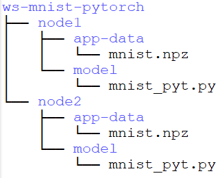

## mnist-pytorch

This example runs decentralized training on MNIST *[[1]](README.md#References)* dataset for digit classification using PyTorch based Swarm Learning framework.

The code for this example has been taken from *[[2]](README.md#References)* and modified to run on a Swarm Learning platform. The data files are in the ``swarm-learning/examples/mnist-pytorch/app-data/`` directory. The model program, after conversion to Swarm Learning, is in ``swarm-learning/examples/mnist-pytorch/model/`` and is called ``mnist_pyt.py``. 

Scripts to run the example are in the ``swarm-learning/examples/mnist-pytorch/bin/`` and ``swarm-learning/swarm-learning/bin/`` directories:
- init-workspace: It creates workspace for the given example by distributing data and models in different directories. It also initializes single node Swarm Network and starts spire server.
- run-sl: It starts Swarm Learning node that runs training.
- del-workspace: It deletes the created workspace and also stops all containers.
  
Following environment variables are required to set in each terminal:
-	APLS_IP: IP address of the host where license server is running (Do NOT use localhost / 127.0.0.1). 
-	EXAMPLE: Name of the quick start example.
-	WORKSPACE_DIR: Path where workspace to be created. Separate model and data directories will be created for each training node inside the example workspace. Default is current directory.
-	TRAINING_NODE: Unique name of each training node prefixed with ‘node’ e.g. ‘node1’ etc.

Before running the example, verify license server is running and valid license is installed. Refer [Installing licenses and starting license server](../../docs/setup.md#installing-licenses-and-starting-license-server).

## Steps to run:
#### 1.	Create workspace and initialize Swarm Learning 
First open a terminal, change directory to ``swarm-learning/examples`` and set the following environment variables. Then run ``init-workspace`` script to create workspace for ``mnist-pytorch`` example and initialize Swarm Learning environment by running Swarm Network and Spire server containers.

   ``APLS_IP=<License Host Server IP>`` 
   #### (Do NOT use localhost / 127.0.0.1)
   
   ``EXAMPLE=mnist-pytorch``

   ``WORKSPACE_DIR=$PWD``

   ``./mnist-pytorch/bin/init-workspace -e $EXAMPLE -i $APLS_IP -d $WORKSPACE_DIR``
   
   Once command completes, two separate folders for each training node will be created under the workspace directory. Data and model files will be distributed among them.
    
   
 
#### 2.	Run decentralized training with different nodes
By default two peer nodes will be created.  So open two new terminals, each representing individual training nodes. 

-	**Node1: Training on Terminal 1 -**
Change directory to ``swarm-learning/examples`` and set environment variables as specified below. Then run Swarm Learning container to start training as shown below. Specify ``--gpu <ID>`` in ``run-sl`` command if system has GPUs. Otherwise training will run on CPU.
   
    ``APLS_IP=<License Host Server IP>``
   
    ``EXAMPLE=mnist-pytorch``

    ``WORKSPACE_DIR=$PWD``

    ``TRAINING_NODE=node1``

    ``../swarm-learning/bin/run-sl --name $TRAINING_NODE-sl --network $EXAMPLE-net --host-ip $TRAINING_NODE-sl --sn-ip node-sn -e MAX_EPOCHS=5 --apls-ip $APLS_IP --serverAddress node-spire -genJoinToken --data-dir $WORKSPACE_DIR/ws-$EXAMPLE/$TRAINING_NODE/app-data --model-dir $WORKSPACE_DIR/ws-$EXAMPLE/$TRAINING_NODE/model --model-program mnist_pyt.py --sl-platform PYT``
  
-	**Node2: Training on Terminal 2 -**
Change directory to ``swarm-learning/examples`` and set environment variables as specified below. Then run Swarm Learning container to start training as shown below. Specify ``--gpu <ID>`` in ``run-sl`` command if system has GPUs. Otherwise training will run on CPU.
   
    ``APLS_IP=<License Host Server IP>``
   
    ``EXAMPLE=mnist-pytorch``

    ``WORKSPACE_DIR=$PWD``

    ``TRAINING_NODE=node2``

    ``../swarm-learning/bin/run-sl --name $TRAINING_NODE-sl --network $EXAMPLE-net --host-ip $TRAINING_NODE-sl --sn-ip node-sn -e MAX_EPOCHS=5 --apls-ip $APLS_IP --serverAddress node-spire -genJoinToken --data-dir $WORKSPACE_DIR/ws-$EXAMPLE/$TRAINING_NODE/app-data --model-dir $WORKSPACE_DIR/ws-$EXAMPLE/$TRAINING_NODE/model --model-program mnist_pyt.py --sl-platform PYT``
   
This training process will continue till training completes ``MAX_EPOCHS``. Once training ends, the final Swarm Learning model will be saved inside the model folder for each node in workspace. 
  
#### 3.	Delete workspace and remove Swarm Learning containers
Go back to the initial terminal where ``init-workspace`` script was run, or open a new terminal, change directory to ``swarm-learning/examples`` and set environment variables as specified in step 1. Run ``del-workspace`` script that will delete the workspace and remove all the containers started for this example. The script should be run as sudo.

   ``sudo ./mnist-pytorch/bin/del-workspace -e $EXAMPLE -d $WORKSPACE_DIR``

  >**NOTE**: User can simply reset the Swarm Learning framework to run the training again and again without executing step 3. Once framework is reset, user can just rerun the training using step 2.
  >
  >For reset, either go back to the initial terminal where ``init-workspace`` script was run or open a new terminal, change directory to ``swarm-learning/examples`` and set environment variables as specified in step 1. Run the following commands that remove the old SL training containers and reset and prepare the framework for retraining -
  >
  >``../swarm-learning/bin/stop-swarm --sl``
  >
  >``../swarm-learning/bin/run-swci --sudo --name node-swci --network $EXAMPLE-net -serverAddress node-spire -genJoinToken --usr-dir $PWD/$EXAMPLE/bin --init-script-name reset.cmd``

## References
[1]	Y. LeCun, C. Cortes and C. J. Burges, "THE MNIST DATABASE," [Online]. Available: [http://yann.lecun.com/exdb/mnist/](http://yann.lecun.com/exdb/mnist/)

[2] [https://www.tensorflow.org/tutorials/quickstart/beginner](https://www.tensorflow.org/tutorials/quickstart/beginner)
