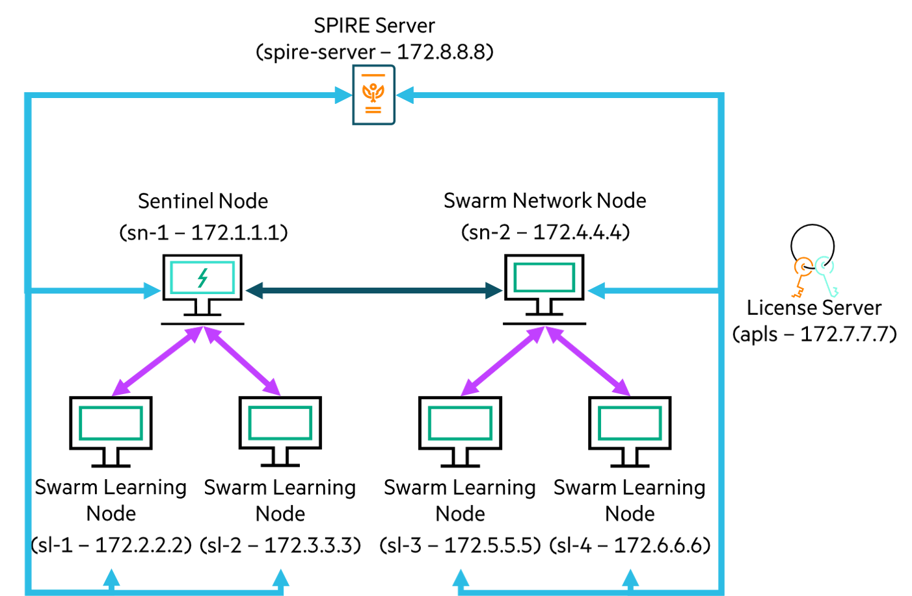

MNIST
========

This example runs MNIST [1] on the Swarm Learning platform. It uses TensorFlow as the backend.

The code for this example has been taken from [2] and modified to run on a Swarm Learning platform.

This example uses one training batch and one test batch. The Machine Learning program, after conversion to Swarm Learning for the TensorFlow-based Keras platform, is in `examples/mnist/model`. The TensorFlow-based file is called `mnist_tf.py`.

This example shows the Swarm training of MNIST model using two Machine Learning (ML) nodes. Machine Learning nodes are automatically spawned by Swarm Operators (SWOP) nodes running on two different hosts. Swarm training is initiated by Swarm Command Interface (SWCI) node and orchestrated by two Swarm Network (SN) nodes running in different hosts. This example also shows how private data and shared model can be mounted to Machine Learning nodes for Swarm training. For details, see the profile files and task definition files placed under `examples/mnist/swop` and `examples/mnist/swci` folders respectively.


## Cluster Setup

The cluster setup for this example uses 2 hosts, as shown in the figure below:  
- host-1: 172.1.1.1  
- host-2: 172.2.2.2  

||
|:--:|
|<b>Figure 1: Cluster setup for the MNIST example</b>|

1. This example uses two Swarm Network (SN) nodes. The names of the docker containers representing these two nodes are **sn1** and **sn2**. sn1 is the Sentinel Node. sn1 runs on host 172.1.1.1. sn2 runs on host 172.2.2.2.
2. Swarm Learning (SL) and Machine Learning (ML) nodes are automatically spawned by Swarm Operators (SWOP) nodes during training and removed after training. Example uses two SWOP nodes – one connects to each SN node. The names of the docker containers representing these two SWOP nodes are **swop1** and **swop2**. swop1 runs on host 172.1.1.1. swop2 runs on host 172.2.2.2.
3. Training is initiated by SWCI node (**swci1**) that runs on host 172.1.1.1
4. Example assumes that License Server already runs on host 172.1.1.1. All Swarm nodes connect to the License Server, on its default port 5814.


## Running the MNIST example

1. *On both host-1 and host-2*:  
   cd to `swarm-learning` folder (i.e. parent to examples directory). 
   

2. *On both host-1 and host-2*:  
   Create a temporary `workspace` directory and copy 	`mnist` example and `gen-cert` utility there.
   ```
   mkdir workspace
   cp -r examples/mnist workspace/
   cp -r examples/utils/gen-cert workspace/mnist/
   ```

3. *On both host-1 and host-2*:  
   Run the `gen-cert` utility to generate certificates for each Swarm component using the command: `gen-cert -e <EXAMPLE-NAME> -i <HOST-INDEX>`  
   *On host-1*:  
   ```
   ./workspace/mnist/gen-cert -e mnist -i 1
   ```  
   *On host-2*:  
   ```
   ./workspace/mnist/gen-cert -e mnist -i 2
   ```

4. *On both host-1 and host-2*:  
   Share the CA certificates between the hosts as follows –  
   *On host-1*:  
   ```
   scp host-2:<PATH>workspace/mnist/cert/ca/capath/ca-2-cert.pem workspace/mnist/cert/ca/capath
   ```  
   *On host-2*:  
   ```
   scp host-1:<PATH>workspace/mnist/cert/ca/capath/ca-1-cert.pem workspace/mnist/cert/ca/capath
   ```
   
5. *On both host-1 and host-2*:  
   Create a docker network for SN, SWOP, SWCI, SL and user containers running in a host  
   *On host-1*:  
   ```
   docker network create host-1-net
   ```  
   *On host-2*:  
   ```
   docker network create host-2-net
   ```

5. *On both host-1 and host-2*:  
   Declare and assign values to the variables like APLS_IP, SN_IP, HOST_IP and SN_API_PORT. The values mentioned here are for understanding purpose only. Use appropriate values as per your swarm network.
   
    ```
    APLS_IP=172.1.1.1
    SN_1_IP=172.1.1.1
    SN_2_IP=172.2.2.2
    HOST_1_IP=172.1.1.1
    HOST_2_IP=172.2.2.2
    SN_API_PORT=30304
    SN_P2P_PORT=30303
    ```

6. *On both host-1 and host-2*:  
   Search and replace all occurrences of placeholders and replace them with appropriate values.
   ```
   sed -i "s+<PROJECT-MODEL>+$(pwd)/workspace/mnist/model+g" workspace/mnist/swci/taskdefs/swarm_mnist_task.yaml
   sed -i "s+<SWARM-NETWORK>+host-1-net+g" workspace/mnist/swop/swop1_profile.yaml
   sed -i "s+<SWARM-NETWORK>+host-2-net+g" workspace/mnist/swop/swop2_profile.yaml
   sed -i "s+<HOST_ADDRESS>+${HOST_1_IP}+g" workspace/mnist/swop/swop1_profile.yaml
   sed -i "s+<HOST_ADDRESS>+${HOST_2_IP}+g" workspace/mnist/swop/swop2_profile.yaml
   sed -i "s+<LICENSE-SERVER-ADDRESS>+${APLS_IP}+g" workspace/mnist/swop/swop*_profile.yaml
   sed -i "s+<PROJECT>+$(pwd)/workspace/mnist+g" workspace/mnist/swop/swop*_profile.yaml
   sed -i "s+<PROJECT-CERTS>+$(pwd)/workspace/mnist/cert+g" workspace/mnist/swop/swop*_profile.yaml
   sed -i "s+<PROJECT-CACERTS>+$(pwd)/workspace/mnist/cert/ca/capath+g" workspace/mnist/swop/swop*_profile.yaml
   ```
   Note: If the swarm installation directory is different for both the hosts then user need to manually modify the <PROJECT-MODEL> value from the swarm_mnist_task.yaml file to the path that is common to both the hosts.  

7. *On host-1*:  
   Run Swarm Network node (sn1) - sentinel node  
   ```
   ./scripts/bin/run-sn -d --rm --name=sn1 --network=host-1-net --host-ip=${HOST_1_IP} --sentinel --sn-p2p-port=${SN_P2P_PORT} --sn-api-port=${SN_API_PORT} \
   --key=workspace/mnist/cert/sn-1-key.pem --cert=workspace/mnist/cert/sn-1-cert.pem --capath=workspace/mnist/cert/ca/capath --apls-ip=${APLS_IP}
   ```
   Use the docker logs command to monitor the Sentinel SN node and wait for the node to finish initializing. The Sentinel node is ready when these messages appear in the log output:  
   `swarm.blCnt : INFO : Starting SWARM-API-SERVER on port: 30304`

8. *On host-2*:  
   Run Swarm Network node (sn2)  
   ```
   ./scripts/bin/run-sn -d --rm --name=sn2 --network=host-2-net --host-ip=${HOST_2_IP} --sentinel-ip=${SN_1_IP} --sn-p2p-port=${SN_P2P_PORT}                \
   --sn-api-port=${SN_API_PORT} --key=workspace/mnist/cert/sn-2-key.pem --cert=workspace/mnist/cert/sn-2-cert.pem --capath=workspace/mnist/cert/ca/capath   \
   --apls-ip=${APLS_IP}
   ```

9.	*On host-1*:  
    Run Swarm Operator node (swop1)  
    
    Note: If required, modify proxy, according to environment, either in the below command or in the swop profile files under `workspace/mnist/swop` folder.  
   ```
   ./scripts/bin/run-swop -d --rm --name=swop1 --network=host-1-net --sn-ip=${SN_1_IP} --sn-api-port=${SN_API_PORT}       \
   --usr-dir=workspace/mnist/swop --profile-file-name=swop1_profile.yaml --key=workspace/mnist/cert/swop-1-key.pem        \
   --cert=workspace/mnist/cert/swop-1-cert.pem --capath=workspace/mnist/cert/ca/capath -e http_proxy= -e https_proxy=     \
   --apls-ip=${APLS_IP}
   ```

10.	*On host-2*:  
    Run Swarm Operator node (swop2)  
    
    Note: If required, modify proxy, according to environment, either in the below command or in the swop profile files under `workspace/mnist/swop` folder.
   ```
   ./scripts/bin/run-swop -d --rm --name=swop2 --network=host-2-net --sn-ip=${SN_2_IP} --sn-api-port=${SN_API_PORT}       \
   --usr-dir=workspace/mnist/swop --profile-file-name=swop2_profile.yaml --key=workspace/mnist/cert/swop-2-key.pem        \
   --cert=workspace/mnist/cert/swop-2-cert.pem --capath=workspace/mnist/cert/ca/capath -e http_proxy= -e https_proxy=     \
   --apls-ip=${APLS_IP}
   ```

11.	*On host-1*:  
    Run Swarm Command Interface node (swci1). It will create, finalize and assign below tasks to task-framework for sequential execution –  
    - user_env_tf_build_task: Builds Tensorflow based docker image for ML node to run model training  
    - swarm_mnist_task: Create containers out of ML image and mount model and data path to run Swarm training  
    
    Note: If required, modify IP, according to environment, in `workspace/mnist/swci/swci-init` file.  
   ```
   ./scripts/bin/run-swci --rm --name=swci1 --network=host-1-net --usr-dir=workspace/mnist/swci --init-script-name=swci-init       \
   --key=workspace/mnist/cert/swci-1-key.pem --cert=workspace/mnist/cert/swci-1-cert.pem --capath=workspace/mnist/cert/ca/capath   \
   -e http_proxy= -e https_proxy= --apls-ip=${APLS_IP}
   ```

12.	*On both host-1 and host-2*:  
    Two node Swarm training is automatically started when the run task (swarm_mnist_task) gets assigned and executed. User can open a new terminal on both host-1 and host-2 and monitor the docker logs of ML nodes for Swarm training. Swarm training will end with the following log message at the end –  
    `SwarmCallback : INFO : All peers and Swarm training rounds finished. Final Swarm model was loaded.`  
    Final Swarm model will be saved inside \<PROJECT\> location which will likely be user's specific as `workspace/mnist/<userN>` directory on both the hosts. All the dynamically spawned SL and ML nodes will exit after Swarm training. The SN and SWOP nodes continue running.

13.	*On both host-1 and host-2*:  
    To clean-up, run the `scripts/bin/stop-swarm` script on all the systems to stop and remove the container nodes of the previous run. If needed, take backup of the container logs. Finally remove docker networks (`host-1-net` and `host-2-net`) and docker volume (`sl-cli-lib`) and delete the `workspace` directory.
        


## References
[1]	Y. LeCun, C. Cortes and C. J. Burges, "THE MNIST DATABASE," [Online]. Available: [http://yann.lecun.com/exdb/mnist/](http://yann.lecun.com/exdb/mnist/)  
[2] [https://www.tensorflow.org/tutorials/quickstart/beginner](https://www.tensorflow.org/tutorials/quickstart/beginner)
