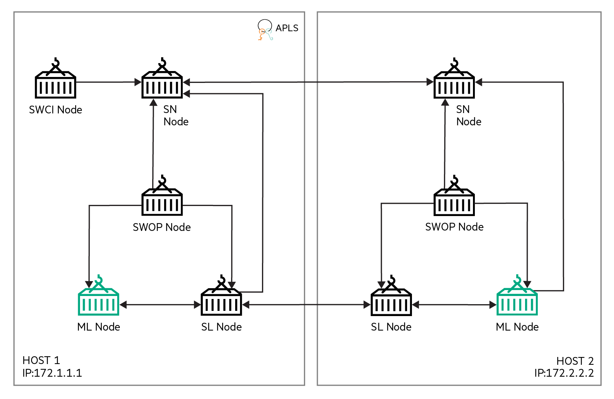

MNIST
========
This example runs MNIST [1] on the Swarm Learning platform.

The code for this example has been taken from [2] and modified to run on a Swarm Learning platform.

This example uses one training batch and one test batch. The files for both these batches are in an archive file, called mnist.npz, in the `swarm-learning/examples/mnist/app-data` directory. The ML program, after conversion to Swarm Learning for the TensorFlow-based Keras and PyTorch platforms, is in `swarm-learning/examples/mnist/model`. The TensorFlow-based file is called `mnist_tf.py`. The PyTorch-based file is called `mnist_pyt.py`.

## Cluster Setup

The cluster setup for this example uses 8 nodes, as shown in the figure below:
||
|:--:|
|<b>Figure 1: Cluster setup for the MNIST example</b>|

1. This example uses two Swarm Network nodes. The names of the docker containers representing these two nodes are **_sn-1_** and _**sn-2**_. _sn-1_ is the Sentinel Node. _sn-1_ runs on host 172.1.1.1. _sn-2_ runs on host 172.4.4.4.
2. Each Swarm Network node has two Swarm Learning nodes connected to it &mdash; Swarm Learning nodes **_sl-1_** and **_sl-2_** connect to **_sn-1_** while **_sl-3_** and **_sl-4_** connect to **_sn-2_**. _sl-1_ runs on host 172.2.2.2. _sl-2_ runs on host 172.3.3.3. _sl-3_ runs on host 172.5.5.5. _sl-4_ runs on host 172.6.6.6.
3. All Swarm Network and Swarm Learning nodes connect to the License Server, **_apls_**, running on host 172.7.7.7.
4. All Swarm Network and Swarm Learning nodes connect to a single SPIRE Server, **_spire-server_**, running on host 172.8.8.8.

## Running the MNIST example

1. Start the Spire Server on 172.8.8.8
   ```bash
   bash ./swarm-learning/bin/run-spire-server --name=spire-server -p 8081:8081
   ```
   
2. Start the Sentinel node on 172.1.1.1
   ```bash
   bash ./swarm-learning/bin/run-sn  \
       --name=sn-1              \
       --host-ip=172.1.1.1      \
       --sentinel-ip=172.1.1.1  \
       --sn-p2p-port=10000      \
       --sn-api-port=11000      \
       --sn-fs-port=12000       \
       --apls-ip 172.7.7.7      \
       -serverAddress 172.8.8.8 \
       -genJoinToken
   ```
   
3. Start the Swarm Network node on 172.4.4.4
   ```bash
   bash ./swarm-learning/bin/run-sn  \
       --name=sn-2              \
       --host-ip=172.4.4.4      \
       --sentinel-ip=172.1.1.1  \
       --sn-p2p-port=13000      \
       --sn-api-port=14000      \
       --sn-fs-port=15000       \
       --sentinel-fs-port=12000 \
       --apls-ip 172.7.7.7      \
       -serverAddress 172.8.8.8 \
       -genJoinToken
   ```
   
4. Start the four Swarm Learning nodes on 172.2.2.2, 172.3.3.3, 172.5.5.5 and 172.6.6.6 respectively. Specify `--sl-platform=PYT` and `--model-program=mnist_pyt.py` for running the program with a PyTorch backend. Specify `--sl-platform=TF` and `--model-program=mnist_tf.py` for running the program with a TensorFlow-based Keras backend.

    - For the PyTorch backend:
    
       a. On 172.2.2.2:
       
       ```bash
       bash ./swarm-learning/bin/run-sl        \
           --name=sl-1                         \
           --sl-platform=PYT                   \
           --host-ip=172.2.2.2                 \
           --sn-ip=172.1.1.1                   \
           --sn-api-port=11000                 \
           --sl-fs-port=16000                  \
           --data-dir=examples/mnist/app-data  \
           --model-dir=examples/mnist/model    \
           --model-program=mnist_pyt.py        \
           --gpu=0                             \
           --apls-ip 172.7.7.7                 \
           -serverAddress 172.8.8.8            \
           -genJoinToken
       ```
       
       
       
        b. On 172.3.3.3:
       
       ```bash
       bash ./swarm-learning/bin/run-sl        \
           --name=sl-2                         \
           --sl-platform=PYT                   \
           --host-ip=172.3.3.3                 \
           --sn-ip=172.1.1.1                   \
           --sn-api-port=11000                 \
           --sl-fs-port=17000                  \
           --data-dir=examples/mnist/app-data  \
           --model-dir=examples/mnist/model    \
           --model-program=mnist_pyt.py        \
           --gpu=3                             \
           --apls-ip 172.7.7.7                 \
           -serverAddress 172.8.8.8            \
           -genJoinToken
       ```
       
       
       
        c. On 172.5.5.5:
       
       ```bash
       bash ./swarm-learning/bin/run-sl        \
           --name=sl-3                         \
           --sl-platform=PYT                   \
           --host-ip=172.5.5.5                 \
           --sn-ip=172.4.4.4                   \
           --sn-api-port=14000                 \
           --sl-fs-port=18000                  \
           --data-dir=examples/mnist/app-data  \
           --model-dir=examples/mnist/model    \
           --model-program=mnist_pyt.py        \
           --gpu=5                             \
           --apls-ip 172.7.7.7                 \
           -serverAddress 172.8.8.8            \
           -genJoinToken
       ```
       
       
       
        d. On 172.6.6.6:
       
       ```bash
       bash ./swarm-learning/bin/run-sl        \
           --name=sl-4                         \
           --sl-platform=PYT                   \
           --host-ip=172.6.6.6                 \
           --sn-ip=172.4.4.4                   \
           --sn-api-port=14000                 \
           --sl-fs-port=19000                  \
           --data-dir=examples/mnist/app-data  \
           --model-dir=examples/mnist/model    \
           --model-program=mnist_pyt.py        \
           --gpu=7                             \
           --apls-ip 172.7.7.7                 \
           -serverAddress 172.8.8.8            \
           -genJoinToken
       ```
       
       
       
    - For the TensorFlow-based Keras backend:
    
        a. On 172.2.2.2:
        
        ```bash
        bash ./swarm-learning/bin/run-sl        \
            --name=sl-1                         \
            --sl-platform=TF                    \
            --host-ip=172.2.2.2                 \
            --sn-ip=172.1.1.1                   \
            --sn-api-port=11000                 \
            --sl-fs-port=16000                  \
            --data-dir=examples/mnist/app-data  \
            --model-dir=examples/mnist/model    \
            --model-program=mnist_tf.py         \
            --gpu=0                             \
            --apls-ip 172.7.7.7                 \
            -serverAddress 172.8.8.8            \
            -genJoinToken
        ```
        
        
        
        b. On 172.3.3.3:
        
        ```bash
        bash ./swarm-learning/bin/run-sl        \
            --name=sl-2                         \
            --sl-platform=TF                    \
            --host-ip=172.3.3.3                 \
            --sn-ip=172.1.1.1                   \
            --sn-api-port=11000                 \
            --sl-fs-port=17000                  \
            --data-dir=examples/mnist/app-data  \
            --model-dir=examples/mnist/model    \
            --model-program=mnist_tf.py         \
            --gpu=3                             \
            --apls-ip 172.7.7.7                 \
            -serverAddress 172.8.8.8            \
            -genJoinToken
        ```
        
        
        
        c. On 172.5.5.5:
        
        ```bash
        bash ./swarm-learning/bin/run-sl        \
            --name=sl-3                         \
            --sl-platform=TF                    \
            --host-ip=172.5.5.5                 \
            --sn-ip=172.4.4.4                   \
            --sn-api-port=14000                 \
            --sl-fs-port=18000                  \
            --data-dir=examples/mnist/app-data  \
            --model-dir=examples/mnist/model    \
            --model-program=mnist_tf.py         \
            --gpu=5                             \
            --apls-ip 172.7.7.7                 \
            -serverAddress 172.8.8.8            \
            -genJoinToken
        ```
        
        
        
        d. On 172.6.6.6:
        
        ```bash
        bash ./swarm-learning/bin/run-sl        \
            --name=sl-4                         \
            --sl-platform=TF                    \
            --host-ip=172.6.6.6                 \
            --sn-ip=172.4.4.4                   \
            --sn-api-port=14000                 \
            --sl-fs-port=19000                  \
            --data-dir=examples/mnist/app-data  \
            --model-dir=examples/mnist/model    \
            --model-program=mnist_tf.py         \
            --gpu=7                             \
            --apls-ip 172.7.7.7                 \
            -serverAddress 172.8.8.8            \
            -genJoinToken
        ```
        
        

## References
[1]	Y. LeCun, C. Cortes and C. J. Burges, "THE MNIST DATABASE," [Online]. Available: [http://yann.lecun.com/exdb/mnist/](http://yann.lecun.com/exdb/mnist/)
[2] [https://www.tensorflow.org/tutorials/quickstart/beginner](https://www.tensorflow.org/tutorials/quickstart/beginner)
