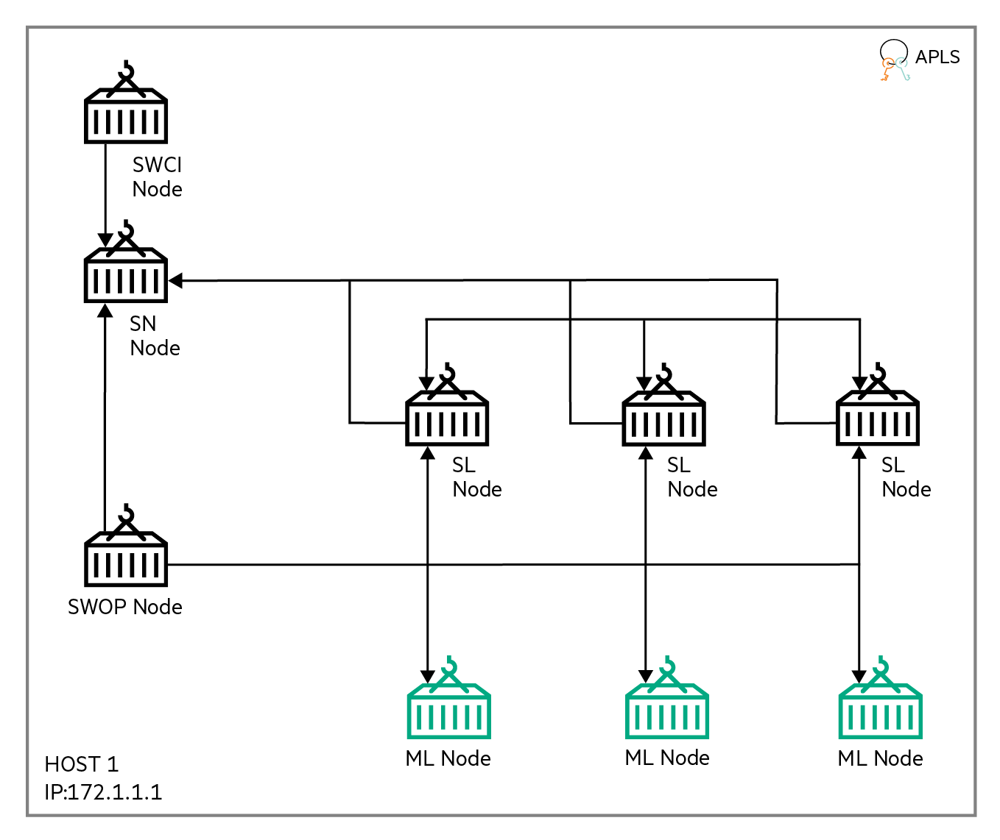

NIH
========

The purpose of this example is to show case Swarm use case with real world NIH dataset [1]. NIH dataset is a well-known health care dataset. NIH dataset has complex xray images, it is a challenging task to meet better metrics on this dataset.

The data processing and model code for this example has been taken from multiple kaggle kernels and modified to run on a Swarm Learning platform.

This example uses node specific biased data and one common test data. The Machine Learning program, after conversion to Swarm Learning for the TensorFlow-based Keras platform, is in `examples/nih/model`. The TensorFlow-based file is called `nih_tf.py`.

This example shows the Swarm training of NIH model using three Machine Learning (ML) nodes. Machine Learning nodes are automatically spawned by Swarm Operator (SWOP) node running on single host. Swarm training is initiated by Swarm Command Interface (SWCI) node and orchestrated by one Swarm Network (SN) node running in single host. This example also shows how private data and shared model can be mounted to Machine Learning nodes for Swarm training. For details, see the profile files and task definition files placed under `examples/nih/swop` and `examples/nih/swci` folders respectively.


## Cluster Setup

The cluster setup for this example uses one host, as shown in the figure below:  
- host-1: 172.1.1.1  

||
|:--:|
|<b>Figure 1: Cluster setup for the NIH example</b>|

1. This example uses one Swarm Network (SN) node. The names of the docker containers representing these two nodes are **sn1** . sn1 is the Sentinel Node. sn1 runs on host 172.1.1.1. 
2. Swarm Learning (SL) and Machine Learning (ML) nodes are automatically spawned by Swarm Operators (SWOP) nodes during training and removed after training. Example one SWOP node named **swop1**. swop1 runs on host 172.1.1.1.
3. Training is initiated by SWCI node (**swci1**) that runs on host 172.1.1.1
4. Example assumes that License Server already runs on host 172.1.1.1. All Swarm nodes connect to the License Server, on its default port 5814.


## Running the NIH example

1. cd to `swarm-learning` folder (i.e. parent to examples directory). 
   

2. Create a temporary `workspace` directory and copy 	`nih` example and `gen-cert` utility there.
   ```
   mkdir workspace
   cp -r examples/nih workspace/
   cp -r examples/utils/gen-cert workspace/nih/
   ```

3. Run the `gen-cert` utility to generate certificates for each Swarm component using the command: `gen-cert -e <EXAMPLE-NAME> -i <HOST-INDEX>`  
 
   ```
   ./workspace/nih/gen-cert -e nih -i 1
   ```  
4. Create train, test data for each node.

      a. Navigate to workspace/nih/data folder
      b. Execute data processing script
      c. Verify Node1, Node2, Node3, Test folders are generated
      d. Come back to swarm-learning folder

   NOTE: nih_nodes_data_processing.py references data_generator.yaml to get the path of NIH data. Path provided in data_generator.yaml should contain images folder (with nih images as .png files) and master sheet of data description (Data_Entry_2017.csv - information about all the images). Refer NIH Chest X-rays for more details. 
   ```
   cd workspace/nih/data
   python3 nih_nodes_data_processing.py

   cd ../../..
   ```  
   
6. Create a docker network for SN, SWOP, SWCI, SL and user containers running in a host  

   ```
   docker network create host-1-net
   ```  

7. Declare and assign values to the variables like APLS_IP, SN_IP, HOST_IP and SN_API_PORT. The values mentioned here are for understanding purpose only. Use appropriate values as per your swarm network.
   
    ```
    APLS_IP=172.1.1.1
    SN_1_IP=172.1.1.1
    HOST_1_IP=172.1.1.1
    SN_API_PORT=30304
    SN_P2P_PORT=30303
    ```

8. Search and replace all occurrences of placeholders and replace them with appropriate values.
   ```
   sed -i "s+<PROJECT-MODEL>+$(pwd)/workspace/nih+g" workspace/nih/swci/taskdefs/swarm_nih_task.yaml
   sed -i "s+<PROJECT-MODEL>+$(pwd)/workspace/nih+g" workspace/nih/swci/taskdefs/swarm_ind_task.yaml
   sed -i "s+<SWARM-NETWORK>+host-1-net+g" workspace/nih/swop/swop1_profile.yaml
   sed -i "s+<HOST_ADDRESS>+${HOST_1_IP}+g" workspace/nih/swop/swop1_profile.yaml
   sed -i "s+<LICENSE-SERVER-ADDRESS>+${APLS_IP}+g" workspace/nih/swop/swop*_profile.yaml
   sed -i "s+<PROJECT>+$(pwd)/workspace/nih+g" workspace/nih/swop/swop*_profile.yaml
   sed -i "s+<PROJECT-CERTS>+$(pwd)/workspace/nih/cert+g" workspace/nih/swop/swop*_profile.yaml
   sed -i "s+<PROJECT-CACERTS>+$(pwd)/workspace/nih/cert/ca/capath+g" workspace/nih/swop/swop*_profile.yaml
   ```
  
9. Create a docker volume and copy SwarmLearning wheel file there
   ```
   docker volume rm sl-cli-lib
   docker volume create sl-cli-lib
   docker container create --name helper -v sl-cli-lib:/data hello-world
   docker cp lib/swarmlearning-client-py3-none-manylinux_2_24_x86_64.whl helper:/data
   docker rm helper
   ```

10. Run Swarm Network node (sn1) - sentinel node  
   ```
   ./scripts/bin/run-sn -d --rm --name=sn1 --network=host-1-net --host-ip=${HOST_1_IP} --sentinel \
   --sn-p2p-port=${SN_P2P_PORT} --sn-api-port=${SN_API_PORT} --key=workspace/nih/cert/sn-1-key.pem \
   --cert=workspace/nih/cert/sn-1-cert.pem --capath=workspace/nih/cert/ca/capath --apls-ip=${APLS_IP}
   ```
   Use the docker logs command to monitor the Sentinel SN node and wait for the node to finish initializing. The Sentinel node is ready when these messages appear in the log output:  
   `swarm.blCnt : INFO : Starting SWARM-API-SERVER on port: 30304`


11.	Run Swarm Operator node (swop1)  
    
    Note: If required, modify proxy, according to environment, either in the below command or in the swop profile files under `workspace/nih/swop` folder.  
   ```
./scripts/bin/run-swop -d --rm --name=swop1 --network=host-1-net --sn-ip=${SN_1_IP} --sn-api-port=${SN_API_PORT}       \
--usr-dir=workspace/nih/swop --profile-file-name=swop1_profile.yaml --key=workspace/nih/cert/swop-1-key.pem        \
--cert=workspace/nih/cert/swop-1-cert.pem --capath=workspace/nih/cert/ca/capath -e http_proxy= -e https_proxy=     \
-e SWOP_KEEP_CONTAINERS=True --apls-ip=${APLS_IP}
   ```

12.	Run Swarm Command Interface node (swci1). It will create, finalize and assign below tasks to task-framework for sequential execution –  
    - user_env_tf_build_task: Builds Tensorflow based docker image for ML node to run model training  
    - swarm_nih_task: Create containers out of ML image and mount model and data path to run Swarm training with nih data.
    - swarm_ind_task: Create containers out of ML image and mount model and data path to run individual training of each node using nih data.  
    
    Note: If required, modify IP, according to environment, in `workspace/nih/swci/swci-init` file.  
   ```
./scripts/bin/run-swci --rm --name=swci1 --network=host-1-net --usr-dir=workspace/nih/swci --init-script-name=swci-init       \
--key=workspace/nih/cert/swci-1-key.pem --cert=workspace/nih/cert/swci-1-cert.pem --capath=workspace/nih/cert/ca/capath   \
-e http_proxy= -e https_proxy= --apls-ip=${APLS_IP}

   ```

13.	Three nodes Swarm training is automatically started when the run task gets assigned and executed. User can open a new terminal and monitor the docker logs of ML nodes for Swarm training. Swarm training will end with the following log message at the end –  
    `SwarmCallback : INFO : All peers and Swarm training rounds finished. Final Swarm model was loaded.`  
    Final Swarm model will be saved inside \<PROJECT\> location which will likely be user's specific as `workspace/nih/<userN>` directory. All the dynamically spawned SL and ML nodes will exit after Swarm training. The SN and SWOP nodes continue running.

14.	To clean-up, run the `scripts/bin/stop-swarm` script on all the systems to stop and remove the container nodes of the previous run. If needed, take backup of the container logs. Finally remove docker networks (`host-1-net` ) and docker volume (`sl-cli-lib`) and delete the `workspace` directory.
        


## References
[1]	Kaggle NIH Chest X-rays : [NIH Chest X-rays](https://www.kaggle.com/datasets/nih-chest-xrays/data)  
[2] [Kaggle kernel referenced in this example ](https://www.kaggle.com/code/adamjgoren/nih-chest-x-ray-multi-classification)
