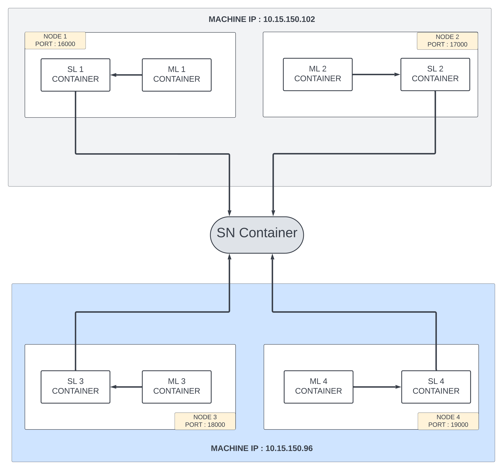

# Swarm Learning In Autonomous Driving: A Privacy Preserving Approach
## Introduction
New cutting-edge models for computer vision and
deep learning have accelerated the development of autonomous
driving technology, but privacy has always been a concern.
Autonomous driving vehicles are equipped with a variety of
sensors and cameras that capture all the data around them, in-
cluding sensitive information such as location-specific landmarks
and personally identifiable information, raising concerns about
privacy breaches. Identifying and obfuscating such data during
preprocessing is an expensive process. This paper puts forth a
Swarm Learning based training approach that offers perfor-
mance on par with that of traditional training approaches while
addressing the privacy component, and the improvements over
other distributed machine learning methods such as Federated
Learning.

Note: This project utilizes Azure VMs and Swarm to run distributed machine learning training on point cloud data.

The below image illustrates the setup for this following example


The model used is [complex yolo v4 model](https://github.com/maudzung/Complex-YOLOv4-Pytorch) using pytorch and the dataset used is the kitti 3d dataset which is publicly available.For more details on model refer [paper](https://arxiv.org/pdf/1803.06199.pdf)


## Data Preparation
Download the 3D KITTI detection dataset from [here](http://www.cvlibs.net/datasets/kitti/eval_object.php?obj_benchmark=3d).

The downloaded data includes:

- Velodyne point clouds _**(29 GB)**_: input data to the Complex-YOLO model
- Training labels of object data set _**(5 MB)**_: input label to the Complex-YOLO model
- Camera calibration matrices of object data set _**(16 MB)**_: for visualization of predictions
- Left color images of object data set _**(12 GB)**_: for visualization of predictions

## Setup
1. Create two hosts/workspace folders on Azure VM 1 and add the code in each folder:
    ```bash
    mkdir workspace_host1
    ```
    ```bash
    mkdir workspace_host2
    ```
2. Similarly, create two workspace folders on VM 2 and add the code in each folder:
    ```bash
    mkdir workspace_host3
    ```
    ```bash
    mkdir workspace_host4
    ```
3. Run the gen-cert utility to generate certificates for each Swarm workspace:
     ```bash
     ./workspace_host1/point_clouds/gen-cert -e point_clouds -i 1
     ```
     ```bash
     ./workspace_host2/point_clouds/gen-cert -e point_clouds -i 2
     ```
     ```bash
     ./workspace_host3/point_clouds/gen-cert -e point_clouds -i 3
     ```
     ```bash
     ./workspace_host4/point_clouds/gen-cert -e point_clouds -i 4
     ```
4. Share the CA certificates among all other hosts using the scp command:
     ```bash
     scp ./workspace_host1/point_clouds/ca.pem <user>@<host2>:/home/<user>/workspace_host2/point_clouds
     ```
     ```bash
     scp ./workspace_host1/point_clouds/ca.pem <user>@<host3>:/home/<user>/workspace_host3/point_clouds
     ```
     ```bash
     scp ./workspace_host1/point_clouds/ca.pem <user>@<host4>:/home/<user>/workspace_host4/point_clouds
     ```
    Similarly, share the certificates among all other hosts using the scp command:
5. Dataset
    - Download the Kitti dataset and equally divide it among the hosts.
    - The dataset is divided into 4 parts and each part is stored in a separate folder on each host.
    - Copy Swarm Learning wheel file inside the build context and build a Docker image for ML that contains an environment to run Swarm training of user models on each VM:
         ```bash
         docker build -t user-ml-env-pc workspace_host1/point_clouds/ml-context
         ```
         ```bash
         docker build -t user-ml-env-pc workspace_host2/point_clouds/ml-context
         ```
         ```bash
         docker build -t user-ml-env-pc workspace_host3/point_clouds/ml-context
         ```
         ```bash
         docker build -t user-ml-env-pc workspace_host4/point_clouds/ml-context
         ```

## Running on Azure VM1
1. Start the SN node:
     ```bash
     ./scripts/bin/run-sn -d --rm --name=sn1 --host-ip=10.15.150.102 --sentinel --sn-api-port=30304 --key=workspace_host1/point_clouds/cert/sn-1-key.pem --cert=workspace_host1/point_clouds/cert/sn-1-cert.pem --capath=workspace_host1/point_clouds/cert/ca/capath --apls-ip=10.15.150.102
     ```
2. Start the SL nodes on each host
     ```bash
     ./scripts/bin/run-sl --name=sl1 --host-ip=10.15.150.102 --sn-ip=10.15.150.102 --sn-api-port=30304 --sl-fs-port=16000 --key=workspace_host1/point_clouds/cert/sl-1-key.pem --cert=workspace_host1/point_clouds/cert/sl-1-cert.pem --capath=workspace_host1/point_clouds/cert/ca/capath --ml-it --ml-image=user-ml-env-pc --ml-name=ml1 --ml-w=/tmp/test --ml-entrypoint=python3 --ml-cmd=model/src/train.py --ml-v=workspace_host1/point_clouds/model:/tmp/test/model --ml-e DATA_DIR=app-data --ml-e MODEL_DIR=model
     ```
    
Note: The SN node are started only on the first VM. The SL nodes are started on all the VMs.

## Running on Azure VM2
1. Start the SL node:
     ```bash
     ./scripts/bin/run-sl --name=sl3 --host-ip=10.15.150.102 --sn-ip=10.15.150.102 --sn-api-port=30304 --sl-fs-port=16000 --key=workspace_host3/point_clouds/cert/sl-3-key.pem --cert=workspace_host3/point_clouds/cert/sl-3-cert.pem --capath=workspace_host3/point_clouds/cert/ca/capath --ml-it --ml-image=user-ml-env-pc --ml-name=ml3 --ml-w=/tmp/test --ml-entrypoint=python3 --ml-cmd=model/src/train.py --ml-v=workspace_host1/point_clouds/model:/tmp/test/model --ml-e DATA_DIR=app-data --ml-e MODEL_DIR=model
     ```
2. Same steps are followed for the other hosts.

## Model Saving
The config file in the src code can be used to change the number of epochs after which the model is saved (currently the model is saved in the `checkpoints` folder after every 10 epochs).

## Model Testing
1. The model can be tested on the test dataset by running the `test.py` file in the `model/src` folder:
    ```bash
    python test.py --gpu_idx 0 --pretrained_path <path>\workspace\point_clouds\model\checkpoints\complexer_yolo\azure\Model_complexer_yolo_epoch_<num>.pth --show_image
    ```
This will run the test script using GPU index 0, specifying the path to the pretrained model, and showing the image output.

## Contact
For any queries, please contact:<br>
    - [Abhishek Mishra](mailto:abhishek@gmail.com)<br>
    - [Joy Jefferson](mailto:joy.jefferson10@gmail.com)

## License
This project is licensed under the MIT License - see the LICENSE file for details


