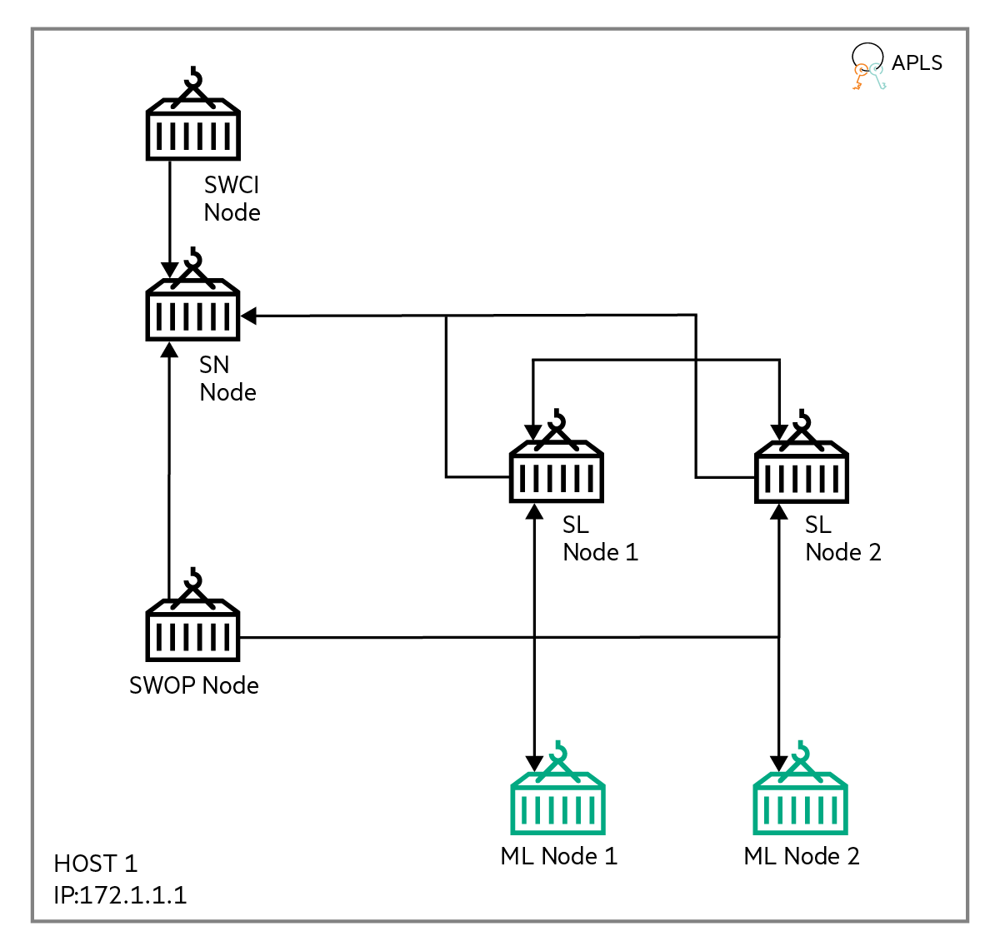

# MNIST using Reverse Proxy

This is single host MNIST example using reverse proxy service parameters with 1 SN node, 1 SWOP node, 1 SWCI node and 2 SL nodes.

The following image illustrates a cluster setup for the Reverse Proxy with MNIST example:

||
|:--:|
|<b>Figure 1: Cluster setup for the Reverse Proxy with MNIST example</b>|

1.  This example uses a SN node. This is a sentinel node and is named as **sn-1** that runs on host 172.1.1.1.

2.  SL and ML nodes are automatically spawned by SWOP node during training.

3.  This example uses a SWOP node that connects to SN node. The name of the docker container representing this SWOP node is **swop-1**. This container also runs on host 172.1.1.1.

4.  Training is initiated by SWCI node \(**swci-1**\) that also runs on host 172.1.1.1.

5.  This example assumes License Server already running on the same host 172.1.1.1. All Swarm nodes connect to the License Server, on its default port 5814.


This example runs Reverse Proxy with MNIST [1] on the Swarm Learning platform with an ML program that uses TensorFlow as the backend. The ML code for this example is taken from [2] and modified to run on a Swarm Learning platform.

As this example runs the MNIST example using reverse proxy, to mimic real-world behavior this example uses BIND9 as the DNS server and NGINX as the reverse proxy server. This example initially builds both the docker images and starts the respective containers with suitable configurations. \(Please refer to the respective docker files\). For user convenience, this example has end to end automated the flow of running mnist example that includes starting of the BIND9 and NGINX containers. Please refer to `run-all` script to know the arguments passed to the respective run scripts of swarm components.

This example uses one training batch and one test batch. The files for both these batches are in an archive file, called mnist.npz. The Machine Learning program, after conversion to Swarm Learning for the TensorFlow-based Keras platform, is in `examples/reverse-proxy/mnist/model`. The TensorFlow-based file is called `mnist_tf.py`.

This example shows the Swarm training of MNIST model using two Machine Learning (ML) nodes. Machine Learning nodes are automatically spawned by Swarm Operators (SWOP) node. Swarm training is initiated by Swarm Command Interface (SWCI) node and orchestrated by a Swarm Network (SN) node. This example also shows how private data and shared model can be mounted to Machine Learning nodes for Swarm training. For details, see the profile files and task definition files placed under `examples/reverse-proxy/mnist/swop` and `examples/reverse-proxy/mnist/swci` folders respectively.

For example if the network created as part of reverse proxy example prerequisite uses subnet as '192.18.0.0' then the IP addresses of bind9 and nginx will likely be '192.18.0.1' and '192.18.0.2' respectively. The corresponding swarm components will be incremented by 1 in the last octect of this ip address as shown below. Please note these are the container IP addresses.

SNo | Container | IP Address |
--- | --- | --- | 
1 | SN-1-IP | 192.18.0.3 | 
2 | SWOP-1-IP | 192.18.0.4 | 
3 | SWCI-1-IP | 192.18.0.5 | 
4 | SL-1-IP | 192.18.0.6 | 
5 | ML-1-IP | 192.18.0.7 | 
6 | SL-2-IP | 192.18.0.8 | 
7 | ML-2-IP | 192.18.0.9 | 

## IP mapping with FQDNs in Bind9 Container
SNo | FQDN | IP Address |
--- | --- | --- | 
1 | api.sn-1.swarm | 172.1.1.1 | 
2 | p2p.sn-1.swarm | 172.1.1.1 | 
3 | fs.sl-1.swarm | 172.1.1.1 | 
4 | fs.sl-2.swarm | 172.1.1.1 | 

## NGINX Configuration
SNo | FQDN | IP with Port |
--- | --- | --- | 
1 | api.sn-1.swarm | 192.18.0.3:30304 | 
2 | p2p.sn-1.swarm | 192.18.0.3:30303 | 
3 | fs.sl-1.swarm | 192.18.0.6:30305 | 
4 | fs.sl-2.swarm | 192.18.0.8:30305 | 

## Running the MNIST example using Reverse Proxy

1.  On host-1, navigate to swarm-learning folder. Ensure the pre-requisites are taken care. If not please refer to the pre-requisites section of reverse proxy examples.

    ``` {#CODEBLOCK_MYT_33W_NVB}
    cd swarm-learning
    ```

2.  Run the `run-all` script from the `swarm-learning` folder with `APLS IP` argument and `Network name`. Assuming as part of reverse proxy examples [pre-requisites](../README.md) the network created is `rp-network`.

    ``` {#CODEBLOCK_LQT_DNY_NVB}
    .\examples\reverse-proxy\mnist\run-all 172.1.1.1 rp-network
    ```

    First argument `APLS_IP` is the ip address of the APLS and is a mandatory parameter. In the above command this argument is passed as current host ip assuming apls is running on the same host. Second argument `Host_IP` is the ip address of the current host and is used for the nginx and dns configurations.

    This script will take care of starting BIND9 container, NGINX container and rest all of the swarm containers in a sequential manner. All of the run commands will now take FQDN's as its service parameter arguments instead of ip and ports.

    **NOTE:** SN-P2P-PORT still needs 30303 port in the host machine, where SN container runs.

3.  On host-1, Swarm training is automatically started when the run task \(`swarm_mnist_task`\) gets assigned and executed. Open a new terminal on host-1 and monitor the docker logs of ML nodes for Swarm training. Swarm training will end with the following log message.

    ``` {#CODEBLOCK_T4Y_2JW_NVB}
    SwarmCallback : INFO : All peers and Swarm training rounds finished. Final Swarm model was loaded.
    ```

    The final Swarm model is saved inside `workspace/reverse-proxy/mnist/model` directory on host-1. All the dynamically spawned SL and ML nodes exits after Swarm training.

4.  On host-1, to clean up, run the `scripts/bin/stop-swarm` script on the host system to stop and remove the swarm container nodes of the previous run. If needed, take a backup of the container logs. As this example builds and starts Bind9 and Nginx, please remove their respective images and containers. Finally, remove docker volume (`sl-cli-lib`) and delete the `workspace` directory..


**Parent topic:**[Examples using reverse proxy](../README.md)

[1]	Y. LeCun, C. Cortes and C. J. Burges, "THE MNIST DATABASE," [Online]. Available: [http://yann.lecun.com/exdb/mnist/](http://yann.lecun.com/exdb/mnist/)  

[2] [https://www.tensorflow.org/tutorials/quickstart/beginner](https://www.tensorflow.org/tutorials/quickstart/beginner)

[3] https://www.isc.org/bind/ and https://bind9.readthedocs.io/

[4] https://www.nginx.com/ and https://nginx.org/en/docs/
