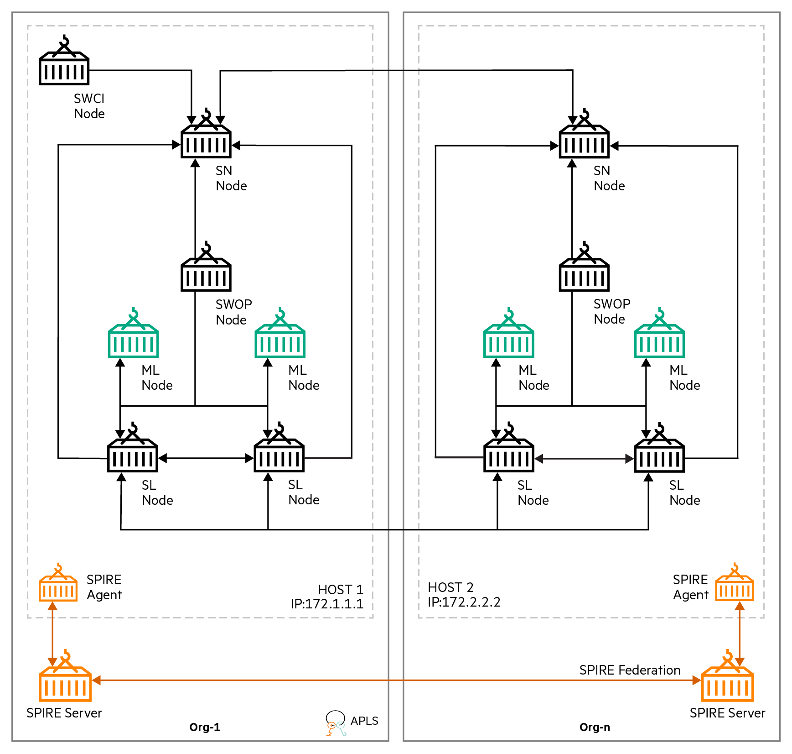

Spire with CIFAR-10
========

This example runs CIFAR-10 [1] example using Spire[2] as a certificate manager on the Swarm Learning platform. It uses TensorFlow as the backend.


This example uses CIFAR-10 dataset distributed along with tensorflow package. The ML program, after conversion to Swarm Learning, is in `swarm-learning/examples/spire/cifar10/model` and is called `cifar10.py`. It contains a tiny ML model for the purpose of showing steps of converting ML code for Swarm Learning. 

For user convenience, this example has automated the flow of running CIFAR-10 example that includes starting of the Spire server and Spire agent containers. Please refer to `run-on-host-1` and `run-on-host-2` scripts and their arguments required to run the respective run scripts of swarm components.

This example shows the Swarm training of CIFAR-10 model using four Machine Learning (ML) nodes. Machine Learning nodes are automatically spawned by Swarm Operators (SWOP) nodes running on two different hosts. Swarm training is initiated by Swarm Command Interface (SWCI) node and orchestrated by two Swarm Network (SN) nodes.

## Cluster Setup

The following image illustrates the cluster setup for the CIFAR-10 example which uses two hosts:  
- host-1: 172.1.1.1
- host-2: 172.2.2.2  


||
|:--:|
|<b>Figure 1: Cluster setup for the CIFAR-10 example with Spire</b>|

1. This example uses two Swarm Network (SN) nodes. The names of the docker containers representing these two nodes are **sn-1** and **sn-2**. Where **sn-1** is the Sentinel Node and it runs on host 172.1.1.1 while **sn-2** is a Non-Sentinel Node that runs on host 172.2.2.2.
2. Swarm Learning (SL) and Machine Learning (ML) nodes are automatically spawned by Swarm Operator (SWOP) nodes during training.
3. This example uses two SWOP nodes - one connects to each SN node. The names of the docker containers representing these SWOP nodes are **swop-1** that runs on host 172.1.1.1 and **swop-2** that runs on host 172.2.2.2.
4. Training is initiated by SWCI node (**swci-1**) that runs on host 172.1.1.1
5. Example assumes that License Server already runs on host 172.1.1.1. All Swarm nodes connect to the License Server, on its default port 5814.


## Pre-requisites for this example
1. Hosts should be able to pull spire-server and spire-agent docker images from the git hub container registry [3].
2. Please make sure the password less SSH setup is done on both the machines. These automated scripts uses SSH and SCP to check and transfer certificate related pem files between the hosts.

## Running the CIFAR-10 example using Spire

1. *On both host-1 and host-2*:</br>
   cd to `swarm-learning` folder (i.e. parent to examples directory). 
   
2. *On host-1*:</br>
   Run the `run-on-host-1` script  from the `swarm-learning` folder with arguments `APLS_IP`, `Host_1_IP`, `Host_2_IP`, `Host_2_USER`, and `Host_2_INSTALL_DIR`.
   - `APLS_IP` is the IP address of the APLS
   - `Host_1_IP` is the IP address of the host-1
   - `Host_2_IP` is the IP address of the host-2
   - `Host_2_USER` is the current user on the host-2 machine and if empty then it uses default user. 
   - `Host_2_INSTALL_DIR` is the location where swarm-learning is installed on host-2(Ex: /home/test2/swarm-learning) and if not passed it will use the default installation directory of swarm which is /opt/hpe/swarm-learning.  
   
   Lets say if `Host_2_USER` is test2 and `Host_2_INSTALL_DIR` is /home/test2/swarm-learning. Run command will looks like below 
   ```
   ./examples/spire/cifar10/run-on-host-1 172.1.1.1 172.1.1.1 172.2.2.2 test2 /home/test2/swarm-learning
   ```
   Above step will create workspace directory, moves files from examples to workspace, create a common path between hosts for ml program, creates volume for the wheel file and shares certificate releated bundle files. It will also starts spire server container, spire agent container and rest of all the swarm containers specific to *host-1* in the sequential manner. 
   
3. *On host-2*:</br>
   Run the `run-on-host-2` script  from the `swarm-learning` folder with arguments `APLS_IP`, `Host_1_IP`, `Host_2_IP`, `Host_1_USER` and `Host_1_INSTALL_DIR`.
   - `APLS_IP` is the IP address of the APLS
   - `Host_1_IP` is the IP address of the host-1
   - `Host_2_IP` is the IP address of the host-2
   - `Host_1_USER` is the current user on the host-1 machine and if empty then it uses default user. 
   - `Host_1_INSTALL_DIR` is the location where swarm-learning is installed on host-1(Ex: /home/test1/swarm-learning) and if not passed it will use the default installation directory of swarm which is /opt/hpe/swarm-learning.
   
   Lets say if Host_1_USER is test1 and `Host_1_INSTALL_DIR` is /home/test1/swarm-learning. Run command will looks like below  
   ```
   ./examples/spire/cifar10/run-on-host-2 172.1.1.1 172.1.1.1 172.2.2.2 test1 /home/test1/swarm-learning
   ```
      Above step will create workspace directory, moves files from examples to workspace, create a common path between hosts for ml program, creates volume for the wheel file and shares certificate releated bundle files. It will also starts spire server container, spire agent container and rest of all the swarm containers specific to *host-2* in the sequential manner. 
      
4. Swarm training is automatically started when the run task (swarm_mnist_task) gets assigned and executed. User can open a new terminal on either host-1 or host-2 to monitor the docker logs of ML nodes for Swarm training. Swarm training will end with the following log message at the end
    - `SwarmCallback : INFO : All peers and Swarm training rounds finished. Final Swarm model was loaded.`  
   Final Swarm model will be saved inside `/tmp/spire/cifar10/model/saved_models` directory on both host-1 and host-2. All the dynamically spawned SL and ML nodes will exit after Swarm training. The SN and SWOP nodes continue running.

5. To clean-up, run the `scripts/bin/stop-swarm` script on the host system to stop and remove the swarm container nodes of the previous run. If needed, take backup of the container logs. As this example builds and starts spire server and spire agent containers, please remove their respective images and containers. Finally remove docker volume (`sl-cli-lib`) and delete the `workspace` directory.
        
**Parent topic:**[Running Swarm Learning with Spire](../../../docs/Install/Running_Swarm_Learning_with_Spire.md)


[1] V.N. a. G. H. Alex Krizhevsky, "CIFAR-10 and CIFAR-100 datasets," [Online]. Available: https://www.cs.toronto.edu/~kriz/cifar.html

[2] https://spiffe.io/docs/latest/spire-about/spire-concepts/ 

[3] https://docs.github.com/en/packages/working-with-a-github-packages-registry/working-with-the-container-registry
