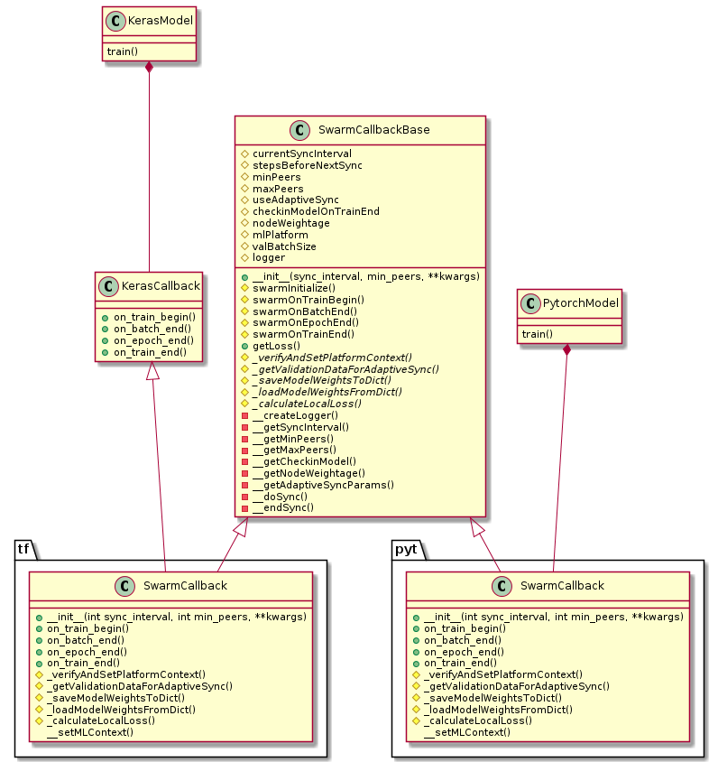

## Introduction
The Swarm Learning client interface is provided as a python wheels package. It consists of Swarm Callback API and SWCI
API.

  - Swarm Callback API - Python3 APIs for the following ML platforms - PyTorch and Keras (based on TensorFlow 2
  backend). Swarm Callback is a custom callback class that consists of a set of functions that can be applied at various
  stages of the ML training process. For more information on Swarm Callback API usage, see How to Swarm enable an
  ML algorithm. 

  - SWCI API - A Python3 SWCI API to perform the SWCI operations programmatically. For more information, see SWCI
  APIs.

### SwarmCallback architecture

| Figure-1: **SwarmCallback &mdash; Class Diagram** |
| :-----------------------------------------------------: |
|                         | 

SwarmCallbackBase Class: This is the base callback class that all platform specific callback classes are derived from. It contains the swarm variables and functionalities that are common to TF, PYT and other ML platforms.

tf.SwarmCallback class: This is the Tensorflow and Keras platform specific implementation of Swarm Callback. This is the main entry point for Swarm framework. User model must instantiate this class and call its different methods at the different phases of training to achieve swarm functionalities.

pyt.SwarmCallback class: This is the Pytorch platform specific implementation of Swarm Callback. This is the main entry point for Swarm framework. User model must instantiate this class and call its different methods at the different phases of training to achieve swarm functionalities.

## Build 
Build depends upon python `build` module so make sure its latest version. Only python 3.x version is supported.

`pip install -U build`

Steps to build client library:

1. Set `SWARM_VER` environment variable to corresponding swarm version
2. Run python -m build command from path of src directory

```
export SWARM_VER=2.0.1
python -m build --wheel -n --outdir `pwd` python-client
```
Above command will generate `swarmlearning-2.0.1-py3-none-manylinux_2_24_x86_64.whl` file in current directory.

## Swarm Client Development
For swarm client extenstions for other ML platforms, always use python virtualenv to install and test whl file. Never install on host machine. 

Command to create virtualenv (do it only once)

`virtualenv swarmvenv`

Activate virtual env with `source swarmvenv/bin/activate`

Install swarm wheel with `pip install <path to swarm wheel file>`.

Newly built wheel file is now installed in virtual environment. This can be used to test the new swarm API code changes. 
